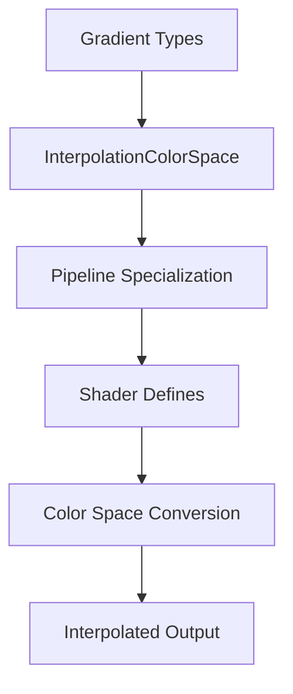

+++
title = "#19330 Color interpolation in OKLab, OKLCH spaces for UI gradients"
date = "2025-06-21T00:00:00"
draft = false
template = "pull_request_page.html"
in_search_index = true

[taxonomies]
list_display = ["show"]

[extra]
current_language = "en"
available_languages = {"en" = { name = "English", url = "/pull_request/bevy/2025-06/pr-19330-en-20250621" }, "zh-cn" = { name = "中文", url = "/pull_request/bevy/2025-06/pr-19330-zh-cn-20250621" }}
labels = ["C-Feature", "A-Rendering", "A-UI", "D-Shaders", "M-Deliberate-Rendering-Change"]
+++

# Technical Analysis of PR #19330: Color interpolation in OKLab, OKLCH spaces for UI gradients

## Basic Information
- **Title**: Color interpolation in OKLab, OKLCH spaces for UI gradients
- **PR Link**: https://github.com/bevyengine/bevy/pull/19330
- **Author**: ickshonpe
- **Status**: MERGED
- **Labels**: C-Feature, A-Rendering, A-UI, S-Ready-For-Final-Review, X-Uncontroversial, D-Shaders, M-Deliberate-Rendering-Change
- **Created**: 2025-05-21T23:59:40Z
- **Merged**: 2025-06-21T15:24:13Z
- **Merged By**: alice-i-cecile

## Description Translation
# Objective

Add support for interpolation in OKLab and OKLCH color spaces for UI gradients.

## Solution
  * New `InterpolationColorSpace` enum with `OkLab`, `OkLch`, `OkLchLong`, `Srgb` and `LinearRgb` variants.
  * Added a color space specialization to the gradients pipeline.
  * Added support for interpolation in OkLCH and OkLAB color spaces to the gradients shader. OKLCH interpolation supports both short and long hue paths. This is mostly based on the conversion functions from `bevy_color` except that interpolation in polar space uses radians.
  * Added `color_space` fields to each gradient type.

## Testing

The `gradients` example has been updated to demonstrate the different color interpolation methods.
Press space to cycle through the different options.

---

## Showcase


## The Story of This Pull Request

### The Problem and Context
Bevy's UI gradient system only supported interpolation in sRGB and linear RGB color spaces. These spaces don't always produce perceptually uniform gradients, particularly when transitioning between hues. The OKLab and OKLCH color spaces provide more perceptually uniform gradients but weren't supported. This limited visual quality for UI elements using gradients.

The key technical constraints were:
1. Maintaining backward compatibility with existing gradient APIs
2. Implementing efficient color space conversions in shaders
3. Supporting both short and long hue paths for polar color spaces
4. Integrating with Bevy's existing gradient pipeline architecture

### The Solution Approach
The solution introduced a new `InterpolationColorSpace` enum to configure gradient color spaces. The approach:
1. Added color space configuration to all gradient types
2. Implemented WGSL functions for OKLab/OKLCH conversions
3. Modified the gradient shader to select interpolation methods using shader defines
4. Added pipeline specialization based on color space
5. Created helper methods for convenient color space configuration

Alternatives considered included implementing color space conversion on CPU, but this was rejected due to performance implications. The shader-based approach maintains rendering performance while providing flexibility.

### The Implementation
The implementation added a `color_space` field to all gradient structs (`LinearGradient`, `RadialGradient`, `ConicGradient`). This field uses the new `InterpolationColorSpace` enum:

```rust
pub enum InterpolationColorSpace {
    OkLab,
    OkLch,
    OkLchLong,
    Srgb,
    LinearRgb,
}
```

The `InColorSpace` trait provides a builder pattern for configuration:

```rust
pub trait InColorSpace: Sized {
    fn in_color_space(self, color_space: InterpolationColorSpace) -> Self;
    
    fn in_oklab(self) -> Self {
        self.in_color_space(InterpolationColorSpace::OkLab)
    }
    // ... other convenience methods ...
}
```

Shader changes implemented color space conversions in `gradient.wgsl`:

```wgsl
fn linear_rgb_to_oklab(c: vec4<f32>) -> vec4<f32> {
    // Conversion math
}

fn mix_linear_rgb_in_oklab_space(a: vec4<f32>, b: vec4<f32>, t: f32) -> vec4<f32> { 
    return oklab_to_linear_rgba(mix(linear_rgb_to_oklab(a), linear_rgb_to_oklab(b), t));
}
```

The interpolation function was updated to support multiple color spaces:

```wgsl
#ifdef IN_SRGB
    return mix_linear_rgb_in_srgb_space(...);
#else ifdef IN_OKLAB
    return mix_linear_rgb_in_oklab_space(...);
// Other cases...
#endif
```

Pipeline specialization was modified to include color space:

```rust
pub struct UiGradientPipelineKey {
    anti_alias: bool,
    color_space: InterpolationColorSpace, // New field
    pub hdr: bool,
}
```

### Technical Insights
Key technical aspects:
1. **Hue Interpolation**: OKLCH uses polar coordinates requiring special handling for hue angles. The implementation provides both short and long paths:
   ```wgsl
   fn lerp_hue(a: f32, b: f32, t: f32) -> f32 {
       // Short path calculation
   }
   
   fn lerp_hue_long(a: f32, b: f32, t: f32) -> f32 {
       // Long path calculation
   }
   ```
2. **Shader Efficiency**: Conditional compilation ensures only necessary code paths are included in the final shader
3. **API Design**: The builder pattern maintains backward compatibility while providing explicit control
4. **Color Space Characteristics**: OKLab provides better perceptual uniformity than RGB spaces, while OKLCH preserves hue consistency

### The Impact
These changes:
1. Improve visual quality of gradients through perceptually uniform spaces
2. Maintain performance by implementing conversions in shaders
3. Provide backward-compatible API extensions
4. Enhance flexibility with multiple interpolation options
5. Update documentation and examples to demonstrate new functionality

The solution demonstrates how to extend rendering pipelines with new color processing techniques while maintaining performance and API consistency.

## Visual Representation



## Key Files Changed

### `crates/bevy_ui/src/gradients.rs`
Added color space configuration to gradient types and implementation of interpolation methods.

```rust
// New enum definition
pub enum InterpolationColorSpace {
    OkLab,
    OkLch,
    // ... other variants ...
}

// Added to gradient structs
pub struct LinearGradient {
    pub color_space: InterpolationColorSpace, // New field
    // ... existing fields ...
}

// Trait implementation
impl InColorSpace for LinearGradient {
    fn in_color_space(mut self, color_space: InterpolationColorSpace) -> Self {
        self.color_space = color_space;
        self
    }
}
```

### `crates/bevy_ui/src/render/gradient.wgsl`
Implemented color space conversion and interpolation functions.

```wgsl
// Before:
fn interpolate_gradient(...) -> vec4<f32> {
    return mix_linear_rgb_in_srgb_space(...);
}

// After:
fn interpolate_gradient(...) -> vec4<f32> {
    #ifdef IN_SRGB
        return mix_linear_rgb_in_srgb_space(...);
    #else ifdef IN_OKLAB
        return mix_linear_rgb_in_oklab_space(...);
    // ... other cases ...
    #endif
}
```

### `examples/ui/gradients.rs`
Added interactive color space cycling to demonstrate functionality.

```rust
// Before: No color space control
LinearGradient::new(angle, stops)

// After: Added UI controls
commands.spawn((
    Button,
    // ...,
    observe(click: move |mut gradients_query| {
        for mut gradient in gradients_query.iter_mut() {
            // Cycle through color spaces
        }
    })
))
```

### `crates/bevy_ui/src/render/gradient.rs`
Updated pipeline specialization to include color space.

```rust
// Before:
UiGradientPipelineKey {
    anti_alias: bool,
    hdr: bool,
}

// After:
UiGradientPipelineKey {
    anti_alias: bool,
    color_space: InterpolationColorSpace, // New
    hdr: bool,
}
```

### `release-content/release-notes/ui_gradients.md`
Updated documentation to reflect new functionality.

```markdown
// Before:
Colors are interpolated between the stops in SRGB space.

// After:
Colors can be interpolated between the stops in OKLab, OKLCH, SRGB and linear RGB color spaces.
```

## Further Reading
1. [OKLab color space explanation](https://bottosson.github.io/posts/oklab/)
2. [Bevy Color Documentation](https://docs.rs/bevy_color/latest/bevy_color/)
3. [WGSL Shading Language Specification](https://www.w3.org/TR/WGSL/)
4. [Perceptually Uniform Color Spaces](https://programmingdesignsystems.com/color/perceptually-uniform-color-spaces/)