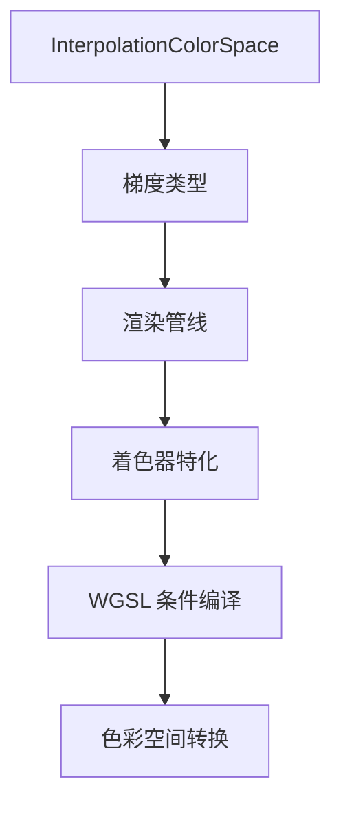

+++
title = "#19330 Color interpolation in OKLab, OKLCH spaces for UI gradients"
date = "2025-06-21T00:00:00"
draft = false
template = "pull_request_page.html"
in_search_index = false

[extra]
current_language = "zh-cn"
available_languages = {"en" = { name = "English", url = "/pull_request/bevy/2025-06/pr-19330-en-20250621" }, "zh-cn" = { name = "中文", url = "/pull_request/bevy/2025-06/pr-19330-zh-cn-20250621" }}
+++

# 在 UI 梯度中实现 OKLab 和 OKLCH 色彩空间插值的技术分析

## 基础信息
- **标题**: Color interpolation in OKLab, OKLCH spaces for UI gradients
- **PR 链接**: https://github.com/bevyengine/bevy/pull/19330
- **作者**: ickshonpe
- **状态**: 已合并
- **标签**: C-Feature, A-Rendering, A-UI, S-Ready-For-Final-Review, X-Uncontroversial, D-Shaders, M-Deliberate-Rendering-Change
- **创建时间**: 2025-05-21T23:59:40Z
- **合并时间**: 2025-06-21T15:24:13Z
- **合并者**: alice-i-cecile

## 描述翻译
### 目标
为 UI 梯度添加在 OKLab 和 OKLCH 色彩空间中进行插值的支持。

### 解决方案
* 新增 `InterpolationColorSpace` 枚举，包含 `OkLab`、`OkLch`、`OkLchLong`、`Srgb` 和 `LinearRgb` 变体
* 为梯度管线添加色彩空间特化处理
* 在梯度着色器中添加对 OKLCH 和 OKLAB 色彩空间插值的支持。OKLCH 插值支持短路径和长路径两种色相插值方式。该实现主要基于 `bevy_color` 的转换函数，但极坐标空间插值使用弧度计算
* 为每种梯度类型添加 `color_space` 字段

### 测试
`gradients` 示例已更新，用于展示不同的色彩插值方法。
按空格键可在不同选项间循环切换。

---

### 效果展示


## 技术实现解析

### 问题背景与需求
在 Bevy UI 系统中，梯度（gradients）渲染原先仅支持 sRGB 色彩空间的线性插值。这种插值方式在感知均匀性（perceptual uniformity）方面存在不足，可能导致色彩过渡不自然。OKLab 和 OKLCH 是现代色彩空间，设计目标就是解决感知均匀性问题，能产生更符合人眼感知的色彩过渡效果。

### 解决方案设计
核心方案是引入色彩空间选择机制：
1. 新增 `InterpolationColorSpace` 枚举定义可用色彩空间
2. 在梯度数据结构中添加 `color_space` 字段
3. 在渲染管线中传递色彩空间选择
4. 在着色器中实现各色彩空间的转换和插值逻辑

技术决策要点：
- 复用 `bevy_color` 的色彩转换函数保持一致性
- 色相插值使用弧度而非角度，简化三角函数计算
- 为 OKLCH 提供长短两种色相插值路径选择
- 通过 WGSL 的条件编译实现运行时高效选择

### 具体实现
在 `gradients.rs` 中新增 `InterpolationColorSpace` 枚举：

```rust
pub enum InterpolationColorSpace {
    OkLab,
    OkLch,
    OkLchLong,
    Srgb,
    LinearRgb,
}
```

所有梯度类型（线性/径向/锥形）都添加了 `color_space` 字段：

```rust
pub struct LinearGradient {
    pub color_space: InterpolationColorSpace,
    // ...
}
```

新增 `InColorSpace` trait 提供流畅接口：

```rust
pub trait InColorSpace {
    fn in_color_space(self, color_space: InterpolationColorSpace) -> Self;
    
    // 便捷方法
    fn in_oklab(self) -> Self { ... }
    fn in_oklch(self) -> Self { ... }
    // ...
}
```

在渲染管线中，扩展 `UiGradientPipelineKey` 包含色彩空间信息：

```rust
pub struct UiGradientPipelineKey {
    anti_alias: bool,
    color_space: InterpolationColorSpace, // 新增字段
    pub hdr: bool,
}
```

着色器 (`gradient.wgsl`) 实现核心转换逻辑：

```wgsl
// OKLab 转换函数
fn linear_rgb_to_oklab(c: vec4<f32>) -> vec4<f32> {
    // ... 具体实现 ...
}

// OKLCH 转换函数
fn linear_rgb_to_oklch(c: vec4<f32>) -> vec4<f32> {
    // ... 具体实现 ...
}

// 色相插值处理
fn lerp_hue(a: f32, b: f32, t: f32) -> f32 {
    let diff = rem_euclid(b - a + PI, TAU) - PI;
    return rem_euclid(a + diff * t, TAU);
}
```

在插值函数中使用条件编译选择色彩空间：

```wgsl
fn interpolate_gradient(...) {
    // ...
#ifdef IN_SRGB
    return mix_linear_rgb_in_srgb_space(...);
#else ifdef IN_OKLAB
    return mix_linear_rgb_in_oklab_space(...);
// ... 其他条件分支 ...
#endif
}
```

### 技术要点
1. **色彩空间特性**：
   - OKLab：三维笛卡尔坐标（L, a, b）
   - OKLCH：柱坐标（Lightness, Chroma, Hue），更符合人眼感知
   - 色相插值提供长短路径选项，满足不同设计需求

2. **性能考量**：
   - 使用编译时条件分支避免运行时开销
   - 复用现有色彩转换函数减少冗余代码
   - 色相计算使用弧度优化三角函数性能

3. **API 设计**：
   - 流畅接口保持代码可读性
   - 默认值保持向后兼容
   - 示例代码展示完整用法

### 影响与改进
1. **视觉效果提升**：
   - OKLab/OKLCH 空间插值产生更自然的色彩过渡
   - 特别在色相变化大的场景效果显著
   
2. **开发者体验**：
   - 新增 5 种插值模式满足专业需求
   - 示例提供直观的交互式演示
   
3. **扩展性**：
   - 架构设计支持未来添加更多色彩空间
   - 渲染管线与数据结构解耦良好

## 组件关系图


## 关键文件变更

### `crates/bevy_ui/src/gradients.rs`
新增色彩空间枚举和梯度字段，提供流畅配置接口

```rust
// 新增枚举定义
pub enum InterpolationColorSpace {
    OkLab,
    OkLch,
    // ...
}

// 在梯度结构中添加字段
pub struct LinearGradient {
    pub color_space: InterpolationColorSpace, // 新增
    // ...
}

// 新增流畅配置接口
pub trait InColorSpace {
    fn in_color_space(self, color_space: InterpolationColorSpace) -> Self;
}
```

### `crates/bevy_ui/src/render/gradient.wgsl`
实现各色彩空间的转换和插值函数

```wgsl
// 新增 OKLab 转换
fn linear_rgb_to_oklab(c: vec4<f32>) -> vec4<f32> {
    // ... 具体实现 ...
}

// 新增色相插值逻辑
fn lerp_hue(a: f32, b: f32, t: f32) -> f32 {
    // ... 计算色相差异 ...
}

// 更新插值函数
fn interpolate_gradient(...) {
    // 条件编译选择色彩空间
#ifdef IN_OKLAB
    // OKLab 插值路径
#endif
}
```

### `examples/ui/gradients.rs`
扩展示例支持色彩空间动态切换

```rust
// 添加色彩空间切换按钮
commands.spawn((
    Button,
    // ... UI 元素 ...
)).observe(|_trigger: On<Pointer<Click>>, 
           mut gradients_query: Query<&mut BackgroundGradient>,
           mut label_query: Query<&mut Text>| {
    // 循环切换色彩空间
    for mut gradients in gradients_query.iter_mut() {
        for gradient in gradients.0.iter_mut() {
            *space = match *space {
                InterpolationColorSpace::OkLab => InterpolationColorSpace::OkLch,
                // ... 状态转移 ...
            }
        }
    }
});

// 添加当前状态标签
commands.spawn((
    Text::new(format!("{:?}", ...)), 
    CurrentColorSpaceLabel
));
```

### `crates/bevy_ui/src/render/gradient.rs`
在渲染管线中传递色彩空间信息

```rust
// 扩展管线Key
pub struct UiGradientPipelineKey {
    color_space: InterpolationColorSpace, // 新增字段
    // ...
}

// 特化时生成着色器宏
let color_space = match key.color_space {
    InterpolationColorSpace::OkLab => "IN_OKLAB",
    // ...
};
```

### `release-content/release-notes/ui_gradients.md`
更新文档说明新特性

```markdown
- 新增 `color_space` 字段指定插值色彩空间
- 支持 OKLab, OKLCH, sRGB 和 linear RGB 空间
- 移除旧版仅支持 sRGB 的限制说明
```

## 扩展阅读
1. [OKLab 色彩空间论文](https://bottosson.github.io/posts/oklab/)
2. [Bevy 色彩系统文档](https://docs.rs/bevy_color/latest/bevy_color/)
3. [WGSL 着色语言规范](https://www.w3.org/TR/WGSL/)
4. [色彩感知均匀性概念](https://en.wikipedia.org/wiki/Color_difference)