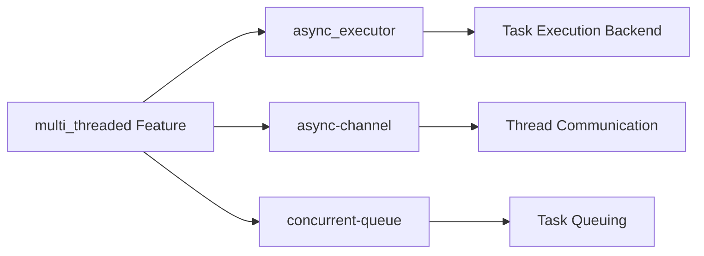

+++
title = "#19334 Added async_executor to the array of features enabled by multi_threaded within bevy_tasks crate to prevent compile-time error when default-features are disabled."
date = "2025-06-10T00:00:00"
draft = false
template = "pull_request_page.html"
in_search_index = true

[taxonomies]
list_display = ["show"]

[extra]
current_language = "en"
available_languages = {"en" = { name = "English", url = "/pull_request/bevy/2025-06/pr-19334-en-20250610" }, "zh-cn" = { name = "中文", url = "/pull_request/bevy/2025-06/pr-19334-zh-cn-20250610" }}
labels = ["C-Bug", "A-ECS", "A-Tasks", "D-Straightforward"]
+++

## Pull Request Analysis: Adding `async_executor` to `multi_threaded` Feature Dependencies

### Basic Information
- **Title**: Added async_executor to the array of features enabled by multi_threaded within bevy_tasks crate to prevent compile-time error when default-features are disabled.
- **PR Link**: https://github.com/bevyengine/bevy/pull/19334
- **Author**: DeveloperMindset123
- **Status**: MERGED
- **Labels**: C-Bug, A-ECS, S-Ready-For-Final-Review, A-Tasks, D-Straightforward
- **Created**: 2025-05-22T03:27:10Z
- **Merged**: 2025-06-10T01:12:56Z
- **Merged By**: alice-i-cecile

### The Story of This Pull Request

#### The Problem and Context
When users enabled the `multi_threaded` feature in `bevy_tasks` while disabling default features (`default-features = false`), they encountered a compile-time error (#19051). The root cause was that the `multi_threaded` feature declaration didn't explicitly enable the `async_executor` feature, which contains essential runtime components for task execution. This violated the principle that features should be self-contained and not require additional manual configuration.

#### The Solution Approach
The initial approach considered was adding a `compiler_error!()` macro to provide a descriptive error message about the missing feature dependency. However, this would have placed the burden on users to manually add both features (`features = ["multi_threaded", "async_executor"]`). The cleaner solution implemented instead modifies the `multi_threaded` feature definition to automatically enable `async_executor` as part of its dependency chain. This maintains the expected behavior where enabling a single feature provides a complete, functional configuration.

#### The Implementation
The change is concise but impactful, modifying the feature declaration in `Cargo.toml` to include `async_executor` as a dependency of the `multi_threaded` feature:

```diff
diff --git a/crates/bevy_tasks/Cargo.toml b/crates/bevy_tasks/Cargo.toml
index 70b3aaf2e896e..ad162a7ef74ff 100644
--- a/crates/bevy_tasks/Cargo.toml
+++ b/crates/bevy_tasks/Cargo.toml
@@ -15,7 +15,12 @@ default = ["std", "async_executor"]
 
 ## Enables multi-threading support.
 ## Without this feature, all tasks will be run on a single thread.
-multi_threaded = ["std", "dep:async-channel", "dep:concurrent-queue"]
+multi_threaded = [
+  "std",
+  "dep:async-channel",
+  "dep:concurrent-queue",
+  "async_executor",
+]
 
 ## Uses `async-executor` as a task execution backend.
 ## This backend is incompatible with `no_std` targets.
```

This modification ensures that whenever `multi_threaded` is enabled, `async_executor` is automatically activated, eliminating the need for users to manually specify both features. The change preserves all existing functionality while fixing the dependency chain.

#### Technical Insights
The solution demonstrates proper Cargo feature management where:
1. Features should encapsulate their dependencies
2. Users shouldn't need to understand internal implementation details
3. Feature flags should work independently when combined with `default-features = false`

The `async_executor` feature provides the actual task execution backend, while `multi_threaded` controls the threading model. These are logically coupled since the multi-threaded executor requires `async_executor` to function. The change formalizes this relationship in the package manifest.

#### Testing Methodology
The author validated the fix through a minimal test project that replicated the exact conditions of the bug:
1. Created an external binary project with `bevy_tasks` dependency configured with `default-features = false` and only `multi_threaded` enabled
2. Verified successful compilation and execution of core examples (`busy_behavior.rs` and `idle_behavior.rs`)
3. Confirmed proper thread pool behavior under load (40 tasks spinning for 100ms)
4. Verified idle behavior when using one thread per logical core

The tests demonstrated that the threads correctly executed all tasks simultaneously with expected timing characteristics, proving the feature dependency now works as intended.

#### The Impact
This change eliminates a configuration pitfall for users who need to disable default features while using multi-threading. It improves the developer experience by:
1. Removing a compile-time error in valid configurations
2. Reducing required feature configuration to a single flag
3. Maintaining backward compatibility
4. Preserving all existing functionality

The solution follows Rust's principle of making correct usage easy and incorrect usage difficult through proper feature encapsulation.

### Visual Representation



### Key Files Changed

**File**: `crates/bevy_tasks/Cargo.toml`  
**Change**: Added `async_executor` to `multi_threaded` feature dependencies  
**Purpose**: Fixes compile errors when using `multi_threaded` without default features  

```toml
## Before:
## Enables multi-threading support.
## Without this feature, all tasks will be run on a single thread.
multi_threaded = ["std", "dep:async-channel", "dep:concurrent-queue"]

## After:
## Enables multi-threading support.
## Without this feature, all tasks will be run on a single thread.
multi_threaded = [
  "std",
  "dep:async-channel",
  "dep:concurrent-queue",
  "async_executor",
]
```

### Further Reading
1. [Cargo Features Documentation](https://doc.rust-lang.org/cargo/reference/features.html)
2. [Bevy Tasks Architecture](https://github.com/bevyengine/bevy/tree/main/crates/bevy_tasks)
3. [async-executor crate](https://crates.io/crates/async-executor)
4. [Rust Feature Best Practices](https://www.ncameron.org/blog/rust-feature-flags/)