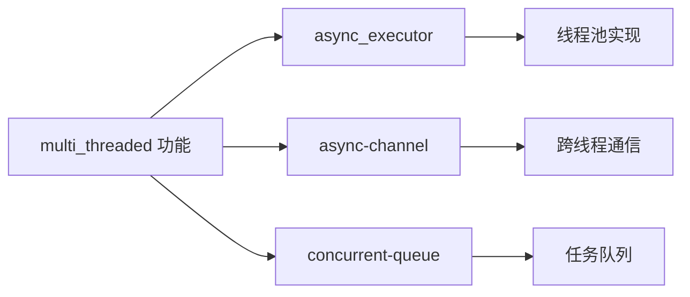

+++
title = "#19334 Added async_executor to the array of features enabled by multi_threaded within bevy_tasks crate to prevent compile-time error when default-features are disabled"
date = "2025-06-10T00:00:00"
draft = false
template = "pull_request_page.html"
in_search_index = false

[extra]
current_language = "zh-cn"
available_languages = {"en" = { name = "English", url = "/pull_request/bevy/2025-06/pr-19334-en-20250610" }, "zh-cn" = { name = "中文", url = "/pull_request/bevy/2025-06/pr-19334-zh-cn-20250610" }}
+++

## 技术报告：PR #19334 分析

### 基本信息
- **标题**: Added async_executor to the array of features enabled by multi_threaded within bevy_tasks crate to prevent compile-time error when default-features are disabled
- **PR链接**: https://github.com/bevyengine/bevy/pull/19334
- **作者**: DeveloperMindset123
- **状态**: 已合并
- **标签**: C-Bug, A-ECS, S-Ready-For-Final-Review, A-Tasks, D-Straightforward
- **创建时间**: 2025-05-22T03:27:10Z
- **合并时间**: 2025-06-10T01:12:56Z
- **合并者**: alice-i-cecile

### 问题描述
当用户在`bevy_tasks` crate中禁用默认功能(default-features)后仅启用`multi_threaded`功能时，会出现编译错误。问题根源在于`multi_threaded`功能隐式依赖`async_executor`实现，但未在功能声明中显式启用它。这导致用户必须手动同时启用两个功能：
```toml
bevy_tasks = { 
  version = "0.13", 
  default-features = false, 
  features = ["multi_threaded", "async_executor"] # 需手动添加async_executor
}
```

### 解决方案
原始方案尝试在代码中使用`compiler_error!()`宏提供错误提示，但最终采用更彻底的解决方式：在`Cargo.toml`中将`async_executor`功能直接添加到`multi_threaded`的功能依赖数组中。修改后：
```toml
multi_threaded = [
  "std",
  "dep:async-channel",
  "dep:concurrent-queue",
  "async_executor", # 新增依赖
]
```
这样当用户启用`multi_threaded`时，`async_executor`会自动启用，不再需要手动声明。

### 技术实现
核心修改集中在`bevy_tasks`的Cargo.toml文件中：
1. **功能依赖修正**：将`async_executor`加入`multi_threaded`的功能数组
2. **依赖关系明确化**：显式声明`multi_threaded`和`async_executor`的依赖关系

修改前后对比：
```toml
# 修改前
multi_threaded = ["std", "dep:async-channel", "dep:concurrent-queue"]

# 修改后
multi_threaded = [
  "std",
  "dep:async-channel",
  "dep:concurrent-queue",
  "async_executor",
]
```

### 测试验证
作者创建了最小化测试项目验证方案：
1. 新建测试项目，配置依赖仅启用`multi_threaded`功能：
```toml
[package]
name = "bevy_tasks_test"
version = "0.1.0"
edition = "2021"

[dependencies]
bevy_tasks = { path = "../../bevy_tasks", default-features = false, features = ["multi_threaded"] }
bevy_platform = "0.16.1"
```
2. 复制`bevy_tasks`示例代码测试多线程行为：
```rust
// busy_behavior.rs 示例核心逻辑
let pool = AsyncComputeTaskPool::get();
let handles = (0..40).map(|_| {
    pool.spawn(async move {
        let duration = Duration::from_millis(100);
        std::thread::sleep(duration);
    })
}).collect::<Vec<_>>();
```
3. 验证结果：
- `busy_behavior`示例成功创建40个任务
- `idle_behavior`示例正确管理单线程空闲状态
- 编译错误消失，功能行为符合预期

### 技术影响
1. **用户体验提升**：消除非常规配置下的编译错误
2. **依赖管理优化**：显式声明隐式依赖关系
3. **配置简化**：用户不再需要手动管理功能组合
4. **跨平台一致性**：作为`#[cfg]`级修改，行为在所有平台保持一致

### 组件关系


### 关键文件变更
`crates/bevy_tasks/Cargo.toml`
```toml
# 修改前
multi_threaded = ["std", "dep:async-channel", "dep:concurrent-queue"]

# 修改后
multi_threaded = [
  "std",
  "dep:async-channel",
  "dep:concurrent-queue",
  "async_executor",
]
```
变更说明：
1. 将`async_executor`加入功能依赖数组
2. 显式声明`multi_threaded`与`async_executor`的依赖关系
3. 修复功能标志的逻辑完整性

### 延伸阅读
1. [Cargo 功能系统文档](https://doc.rust-lang.org/cargo/reference/features.html)
2. [Bevy 任务系统架构](https://github.com/bevyengine/bevy/blob/main/crates/bevy_tasks/src/lib.rs)
3. [相关 issue #19051](https://github.com/bevyengine/bevy/issues/19051)