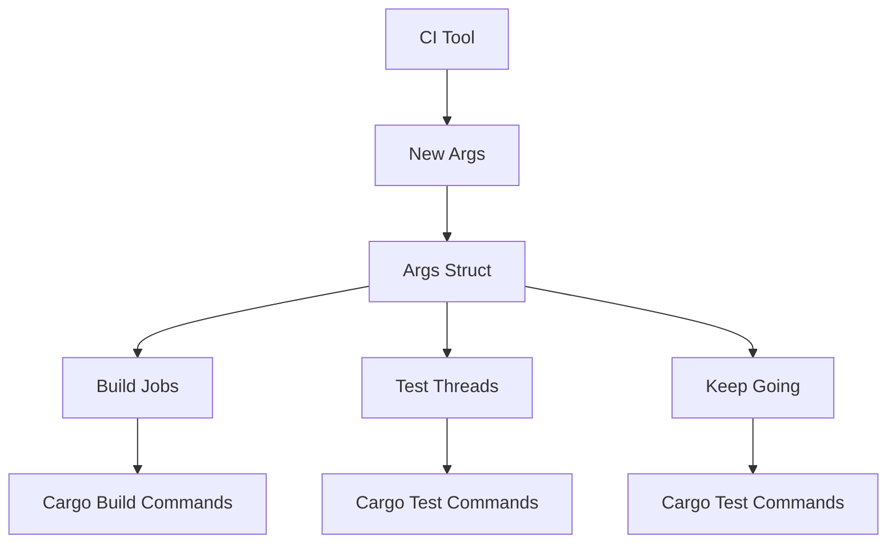

+++
title = "#19359 Allow passing number of thread for building and testing to CI"
date = "2025-06-16T00:00:00"
draft = false
template = "pull_request_page.html"
in_search_index = true

[taxonomies]
list_display = ["show"]

[extra]
current_language = "en"
available_languages = {"en" = { name = "English", url = "/pull_request/bevy/2025-06/pr-19359-en-20250616" }, "zh-cn" = { name = "中文", url = "/pull_request/bevy/2025-06/pr-19359-zh-cn-20250616" }}
labels = ["C-Feature", "A-Build-System", "D-Straightforward"]
+++

# Allow passing number of thread for building and testing to CI

## Basic Information
- **Title**: Allow passing number of thread for building and testing to CI
- **PR Link**: https://github.com/bevyengine/bevy/pull/19359
- **Author**: hukasu
- **Status**: MERGED
- **Labels**: C-Feature, A-Build-System, S-Ready-For-Final-Review, D-Straightforward
- **Created**: 2025-05-24T21:36:21Z
- **Merged**: 2025-06-16T21:39:27Z
- **Merged By**: alice-i-cecile

## Description Translation
# Objective

Fixes #16051
Closes #16145

## Solution

Allow passing `--build-jobs` and `--test-threads` to `ci`
i.e.
```
cargo run -p ci -- --build-jobs 4 --test-threads 4
```

## Testing

running ci locally

## The Story of This Pull Request

The Bevy CI tool (`tools/ci`) lacked control over build and test parallelism, which became problematic for developers working on powerful multi-core machines. When running CI checks locally, users couldn't adjust the number of build jobs or test threads, resulting in either underutilized resources or system overloads during development. This limitation was particularly noticeable during long-running CI workflows where optimized parallelism could significantly reduce iteration time.

To address this, the PR introduces two new command-line arguments: `--build-jobs` for controlling cargo's build parallelism (`--jobs` flag) and `--test-threads` for controlling test runner concurrency. The implementation required refactoring the existing flag-passing mechanism to handle these new parameters cleanly across all CI commands.

The core change replaces the previous bitflags-based `Flag` system with a new `Args` struct that encapsulates all runtime parameters. This struct provides methods to generate the appropriate command-line arguments for cargo:

```rust
// tools/ci/src/args.rs
impl Args {
    pub fn keep_going(&self) -> Option<&'static str> {
        self.keep_going.then_some("--no-fail-fast")
    }

    pub fn build_jobs(&self) -> Option<String> {
        self.build_jobs.map(|jobs| format!("--jobs={jobs}"))
    }

    pub fn test_threads(&self) -> Option<String> {
        self.test_threads.map(|threads| format!("--test-threads={threads}"))
    }
}
```

Each CI command was updated to accept this `Args` struct instead of the previous flags. The command implementations now conditionally include the parallelism arguments in their cargo invocations. For example, the test command now handles both keep-going and parallelism parameters:

```rust
// tools/ci/src/commands/test.rs
cmd!(
    sh,
    "cargo test --workspace --lib --bins --tests --benches {no_fail_fast...} {jobs...} -- {test_threads...}"
)
```

The `xshell` crate's `cmd!` macro elegantly handles the optional arguments through its variable interpolation syntax. If an option is `None`, it simply omits the argument from the final command.

The PR also removed the `bitflags` dependency since the new `Args` struct replaced its functionality. This simplification reduces the tool's dependency footprint while making the configuration system more maintainable and extensible.

These changes enable developers to fine-tune CI performance on their local machines. For example, on a 16-core system, running `cargo run -p ci -- --build-jobs 16 --test-threads 16` can significantly reduce CI execution time by fully utilizing available resources. The implementation maintains backward compatibility - when not specified, cargo uses its default parallelism settings.

## Visual Representation



## Key Files Changed

1. `tools/ci/src/args.rs` (+37/-0)
   - New module defining the `Args` struct and its conversion from the CI configuration
   - Centralizes argument handling for all commands

2. `tools/ci/src/ci.rs` (+45/-41)
   - Added new command-line options to the main CI struct
   - Replaced `Flag` usage with `Args` throughout
   - Before:
     ```rust
     let mut flags = Flag::empty();
     if self.keep_going {
         flags |= Flag::KEEP_GOING;
     }
     command.prepare(sh, flags)
     ```
   - After:
     ```rust
     let args = self.into();
     command.prepare(sh, args)
     ```

3. `tools/ci/src/commands/compile_fail.rs` (+10/-9)
   - Updated to handle both build jobs and test threads
   - Before:
     ```rust
     let no_fail_fast = flags.contains(Flag::KEEP_GOING).then_some(...);
     ```
   - After:
     ```rust
     let no_fail_fast = args.keep_going();
     let jobs = args.build_jobs();
     let test_threads = args.test_threads();
     ```

4. `tools/ci/src/commands/compile.rs` (+9/-8)
   - Propagated args to subcommands
   - Before:
     ```rust
     commands.append(&mut CompileFailCommand::default().prepare(sh, flags));
     ```
   - After:
     ```rust
     commands.append(&mut CompileFailCommand::default().prepare(sh, args));
     ```

5. `tools/ci/src/prepare.rs` (+4/-13)
   - Removed bitflags system and updated trait definition
   - Before:
     ```rust
     bitflags! { ... }
     pub trait Prepare {
         fn prepare<'a>(..., flags: Flag) -> ...;
     }
     ```
   - After:
     ```rust
     pub trait Prepare {
         fn prepare<'a>(..., args: Args) -> ...;
     }
     ```

## Further Reading
1. [Cargo Parallel Execution Documentation](https://doc.rust-lang.org/cargo/commands/cargo-build.html#parallelism) - Official docs for cargo's parallelism options
2. [xshell Command Macro](https://docs.rs/xshell/latest/xshell/macro.cmd.html) - How the `cmd!` macro handles variable interpolation
3. [Bevy CI Documentation](https://github.com/bevyengine/bevy/blob/main/tools/ci/README.md) - Usage instructions for the CI tool