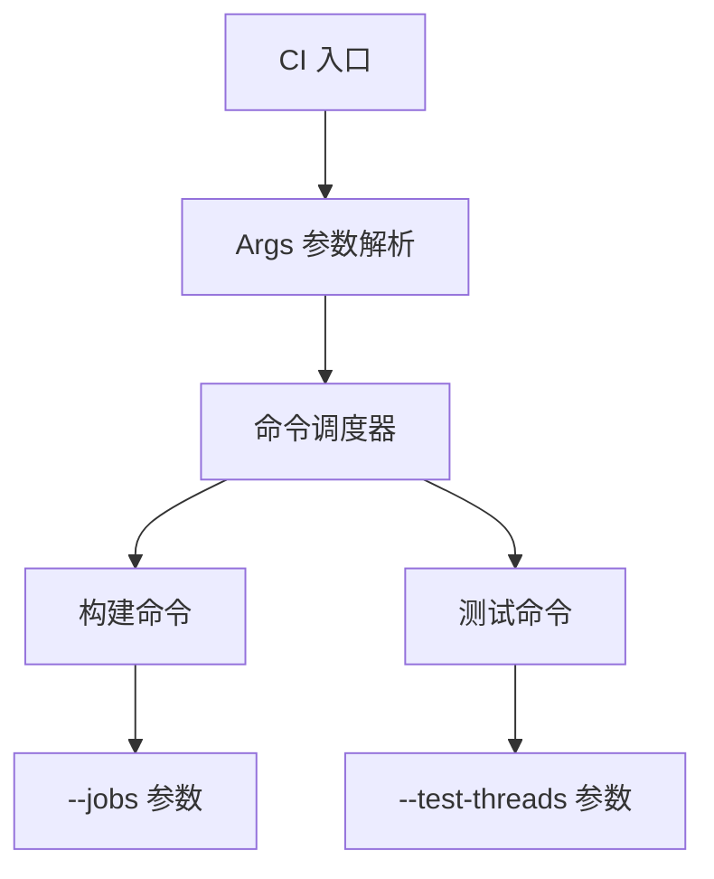

+++
title = "#19359 Allow passing number of thread for building and testing to CI"
date = "2025-06-16T00:00:00"
draft = false
template = "pull_request_page.html"
in_search_index = false

[extra]
current_language = "zh-cn"
available_languages = {"en" = { name = "English", url = "/pull_request/bevy/2025-06/pr-19359-en-20250616" }, "zh-cn" = { name = "中文", url = "/pull_request/bevy/2025-06/pr-19359-zh-cn-20250616" }}
+++

# PR 分析报告: Allow passing number of thread for building and testing to CI

## 基本信息
- **标题**: Allow passing number of thread for building and testing to CI
- **PR 链接**: https://github.com/bevyengine/bevy/pull/19359
- **作者**: hukasu
- **状态**: MERGED
- **标签**: C-Feature, A-Build-System, S-Ready-For-Final-Review, D-Straightforward
- **创建时间**: 2025-05-24T21:36:21Z
- **合并时间**: 2025-06-16T21:39:27Z
- **合并人**: alice-i-cecile

## 描述翻译
### 目标

修复 #16051  
关闭 #16145

### 解决方案

允许向 `ci` 传递 `--build-jobs` 和 `--test-threads` 参数  
例如：
```
cargo run -p ci -- --build-jobs 4 --test-threads 4
```

### 测试

本地运行 CI

## 本 PR 的技术实现

### 问题背景
Bevy 的 CI 工具缺少控制构建和测试并行度的能力。开发者无法调整构建任务数(jobs)和测试线程数(threads)，这限制了在不同硬件配置上优化 CI 执行效率的可能性。具体问题体现在：
1. 无法利用多核机器加速 CI 流程
2. 无法在资源受限环境中限制并行度
3. 相关 issue #16051 和 #16145 明确提出了这个需求

### 解决方案
核心方案是增加两个命令行参数：
1. `--build-jobs`: 控制 cargo 构建的并行任务数
2. `--test-threads`: 控制 cargo 测试的线程数

技术实现要点：
1. 引入新的 `Args` 结构体封装所有运行时参数
2. 重构参数传递机制，替代原有的 bitflags 方案
3. 修改所有构建/测试命令支持新参数

### 实现细节
重构围绕以下关键点展开：

**1. 创建 args.rs 模块**
新模块定义参数结构体和转换逻辑：
```rust
// tools/ci/src/args.rs
pub struct Args {
    keep_going: bool,
    test_threads: Option<usize>,
    build_jobs: Option<usize>,
}

impl Args {
    pub fn build_jobs(&self) -> Option<String> {
        self.build_jobs.map(|jobs| format!("--jobs={jobs}"))
    }
    
    pub fn test_threads(&self) -> Option<String> {
        self.test_threads.map(|threads| format!("--test-threads={threads}"))
    }
}
```

**2. 重构 CI 主入口**
修改 CI 结构体并更新命令调度：
```diff
// tools/ci/src/ci.rs
pub struct CI {
     #[argh(switch)]
-    keep_going: bool,
+    pub(crate) keep_going: bool,
+    
+    #[argh(option)]
+    pub(crate) test_threads: Option<usize>,
+    
+    #[argh(option)]
+    pub(crate) build_jobs: Option<usize>,
 }

 fn prepare<'a>(&self, sh: &'a xshell::Shell) -> Vec<PreparedCommand<'a>> {
-    let mut flags = Flag::empty();
-    if self.keep_going {
-        flags |= Flag::KEEP_GOING;
-    }
+    let args = self.into();
     match &self.command {
-        Some(command) => command.prepare(sh, flags),
+        Some(command) => command.prepare(sh, args),
         None => {
             let mut cmds = vec![];
-            cmds.append(&mut commands::FormatCommand::default().prepare(sh, flags));
+            cmds.append(&mut commands::FormatCommand::default().prepare(sh, args));
             ...
         }
     }
 }
```

**3. 修改 Prepare trait**
统一使用 Args 替换原有的 Flag 系统：
```diff
// tools/ci/src/prepare.rs
-pub trait Prepare {
-    fn prepare<'a>(&self, sh: &'a xshell::Shell, flags: Flag) -> Vec<PreparedCommand<'a>>;
-}
+pub trait Prepare {
+    fn prepare<'a>(&self, sh: &'a xshell::Shell, args: Args) -> Vec<PreparedCommand<'a>>;
+}
```

**4. 更新所有命令实现**
典型修改模式如下（以 test 命令为例）：
```diff
// tools/ci/src/commands/test.rs
impl Prepare for TestCommand {
-    fn prepare<'a>(&self, sh: &'a xshell::Shell, flags: Flag) -> Vec<PreparedCommand<'a>> {
-        let no_fail_fast = ...;
+    fn prepare<'a>(&self, sh: &'a xshell::Shell, args: Args) -> Vec<PreparedCommand<'a>> {
+        let no_fail_fast = args.keep_going();
+        let jobs = args.build_jobs();
+        let test_threads = args.test_threads();
         
         cmd!(
             sh,
-            "cargo test ... {no_fail_fast}"
+            "cargo test ... {no_fail_fast...} {jobs...} -- {test_threads...}"
         )
     }
}
```

### 技术决策
1. **参数封装设计**：
   - 使用 `Option<String>` 返回格式化参数
   - 通过 `...` 语法在 xshell 宏中安全展开

2. **bitflags 移除**：
   - 原有 Flag 系统被 Args 结构体取代
   - 简化了依赖管理（移除 bitflags 依赖）

3. **向后兼容**：
   - 所有修改保持原有命令行为不变
   - 新参数均为可选(optional)

### 影响分析
1. **性能优化**：支持在资源充足的机器上加速 CI 执行
2. **资源控制**：允许在容器/资源受限环境中限制并行度
3. **开发者体验**：提供更灵活的本地测试配置选项

### 潜在改进点
1. 未来可考虑添加默认值逻辑
2. 可增加参数验证（如线程数上限）

## 可视化架构



## 关键文件变更

### 1. tools/ci/src/args.rs (新增)
**变更原因**：集中管理所有 CI 参数和格式化逻辑  
**关键代码**：
```rust
#[derive(Copy, Clone, PartialEq, Eq)]
pub struct Args {
    keep_going: bool,
    test_threads: Option<usize>,
    build_jobs: Option<usize>,
}

impl Args {
    pub fn build_jobs(&self) -> Option<String> {
        self.build_jobs.map(|jobs| format!("--jobs={jobs}"))
    }
}
```

### 2. tools/ci/src/ci.rs
**变更原因**：集成新参数到主入口  
**关键修改**：
```diff
 pub struct CI {
     #[argh(switch)]
-    keep_going: bool,
+    pub(crate) keep_going: bool,
+
+    #[argh(option)]
+    pub(crate) test_threads: Option<usize>,
+
+    #[argh(option)]
+    pub(crate) build_jobs: Option<usize>,
 }

 fn prepare<'a>(&self, sh: &'a xshell::Shell) -> Vec<PreparedCommand<'a>> {
-    let mut flags = Flag::empty();
-    if self.keep_going {
-        flags |= Flag::KEEP_GOING;
-    }
+    let args = self.into();
     match &self.command {
-        Some(command) => command.prepare(sh, flags),
+        Some(command) => command.prepare(sh, args),
```

### 3. tools/ci/src/commands/compile_fail.rs
**变更原因**：为编译失败测试添加并行控制  
**关键修改**：
```diff
 impl Prepare for CompileFailCommand {
-    fn prepare<'a>(&self, sh: &'a xshell::Shell, flags: Flag) -> Vec<PreparedCommand<'a>> {
-        let no_fail_fast = ...;
+    fn prepare<'a>(&self, sh: &'a xshell::Shell, args: Args) -> Vec<PreparedCommand<'a>> {
+        let no_fail_fast = args.keep_going();
+        let jobs = args.build_jobs();
+        let test_threads = args.test_threads();
         
         PreparedCommand::new::<Self>(
-            cmd!(sh, "cargo test ... {no_fail_fast}"),
+            cmd!(sh, "cargo test ... {no_fail_fast...} {jobs...} -- {test_threads...}"),
```

### 4. tools/ci/src/commands/compile.rs
**变更原因**：确保编译命令继承新参数  
**关键修改**：
```diff
 impl Prepare for CompileCommand {
-    fn prepare<'a>(&self, sh: &'a xshell::Shell, flags: Flag) -> Vec<PreparedCommand<'a>> {
+    fn prepare<'a>(&self, sh: &'a xshell::Shell, args: Args) -> Vec<PreparedCommand<'a>> {
         let mut commands = vec![];
-        commands.append(&mut CompileFailCommand::default().prepare(sh, flags));
+        commands.append(&mut CompileFailCommand::default().prepare(sh, args));
```

### 5. tools/ci/src/prepare.rs
**变更原因**：适配新的参数传递机制  
**关键修改**：
```diff
-pub trait Prepare {
-    fn prepare<'a>(&self, sh: &'a xshell::Shell, flags: Flag) -> Vec<PreparedCommand<'a>>;
-}
+pub trait Prepare {
+    fn prepare<'a>(&self, sh: &'a xshell::Shell, args: Args) -> Vec<PreparedCommand<'a>>;
+}
```

## 完整代码变更
```diff
diff --git a/tools/ci/Cargo.toml b/tools/ci/Cargo.toml
index 65d6b7b1be7b2..d42eb55505799 100644
--- a/tools/ci/Cargo.toml
+++ b/tools/ci/Cargo.toml
@@ -8,7 +8,6 @@ license = "MIT OR Apache-2.0"
 [dependencies]
 argh = "0.1"
 xshell = "0.2"
-bitflags = "2.3"
 
 [lints]
 workspace = true
diff --git a/tools/ci/src/args.rs b/tools/ci/src/args.rs
new file mode 100644
index 0000000000000..574d98f192ca3
--- /dev/null
+++ b/tools/ci/src/args.rs
@@ -0,0 +1,37 @@
+use crate::CI;
+
+/// Arguments that are available to CI commands.
+#[derive(Copy, Clone, PartialEq, Eq)]
+pub struct Args {
+    keep_going: bool,
+    test_threads: Option<usize>,
+    build_jobs: Option<usize>,
+}
+
+impl Args {
+    #[inline(always)]
+    pub fn keep_going(&self) -> Option<&'static str> {
+        self.keep_going.then_some("--no-fail-fast")
+    }
+
+    #[inline(always)]
+    pub fn build_jobs(&self) -> Option<String> {
+        self.build_jobs.map(|jobs| format!("--jobs={jobs}"))
+    }
+
+    #[inline(always)]
+    pub fn test_threads(&self) -> Option<String> {
+        self.test_threads
+            .map(|threads| format!("--test-threads={threads}"))
+    }
+}
+
+impl From<&CI> for Args {
+    fn from(value: &CI) -> Self {
+        Args {
+            keep_going: value.keep_going,
+            test_threads: value.test_threads,
+            build_jobs: value.build_jobs,
+        }
+    }
+}
diff --git a/tools/ci/src/ci.rs b/tools/ci/src/ci.rs
index 349e74a5a0183..8b8556d90ac05 100644
--- a/tools/ci/src/ci.rs
+++ b/tools/ci/src/ci.rs
@@ -1,6 +1,7 @@
 use crate::{
+    args::Args,
     commands,
-    prepare::{Flag, Prepare, PreparedCommand},
+    prepare::{Prepare, PreparedCommand},
 };
 use argh::FromArgs;
 
@@ -12,7 +13,15 @@ pub struct CI {
 
     /// continue running commands even if one fails
     #[argh(switch)]
-    keep_going: bool,
+    pub(crate) keep_going: bool,
+
+    /// parallelism of `cargo test`
+    #[argh(option)]
+    pub(crate) test_threads: Option<usize>,
+
+    /// number of build jobs
+    #[argh(option)]
+    pub(crate) build_jobs: Option<usize>,
 }
 
 impl CI {
@@ -22,7 +31,6 @@ impl CI {
     /// This is usually related to differing toolchains and configuration.
     pub fn run(self) {
         let sh = xshell::Shell::new().unwrap();
-
         let prepared_commands = self.prepare(&sh);
 
         let mut failures = vec![];
@@ -59,34 +67,30 @@ impl CI {
     }
 
     fn prepare<'a>(&self, sh: &'a xshell::Shell) -> Vec<PreparedCommand<'a>> {
-        let mut flags = Flag::empty();
-
-        if self.keep_going {
-            flags |= Flag::KEEP_GOING;
-        }
-
+        let args = self.into();
         match &self.command {
-            Some(command) => command.prepare(sh, flags),
+            Some(command) => command.prepare(sh, args),
             None => {
                 // Note that we are running the subcommands directly rather than using any aliases
                 let mut cmds = vec![];
-                cmds.append(&mut commands::FormatCommand::default().prepare(sh, flags));
-                cmds.append(&mut commands::ClippyCommand::default().prepare(sh, flags));
-                cmds.append(&mut commands::TestCommand::default().prepare(sh, flags));
-                cmds.append(&mut commands::TestCheckCommand::default().prepare(sh, flags));
-                cmds.append(&mut commands::IntegrationTestCommand::default().prepare(sh, flags));
+                cmds.append(&mut commands::FormatCommand::default().prepare(sh, args));
+                cmds.append(&mut commands::ClippyCommand::default().prepare(sh, args));
+                cmds.append(&mut commands::TestCommand::default().prepare(sh, args));
+                cmds.append(&mut commands::TestCheckCommand::default().prepare(sh, args));
+                cmds.append(&mut commands::IntegrationTestCommand::default().prepare(sh, args));
                 cmds.append(
-                    &mut commands::IntegrationTestCheckCommand::default().prepare(sh, flags),
+                    &mut commands::IntegrationTestCheckCommand::default().prepare(sh, args),
                 );
                 cmds.append(
-                    &mut commands::IntegrationTestCleanCommand::default().prepare(sh, flags),
+                    &mut commands::IntegrationTestCleanCommand::default().prepare(sh, args),
                 );
-                cmds.append(&mut commands::DocCheckCommand::default().prepare(sh, flags));
-                cmds.append(&mut commands::DocTestCommand::default().prepare(sh, flags));
-                cmds.append(&mut commands::CompileCheckCommand::default().prepare(sh, flags));
-                cmds.append(&mut commands::CompileFailCommand::default().prepare(sh, flags));
-                cmds.append(&mut commands::BenchCheckCommand::default().prepare(sh, flags));
-                cmds.append(&mut commands::ExampleCheckCommand::default().prepare(sh, flags));
+                cmds.append(&mut commands::DocCheckCommand::default().prepare(sh, args));
+                cmds.append(&mut commands::DocTestCommand::default().prepare(sh, args));
+                cmds.append(&mut commands::CompileCheckCommand::default().prepare(sh, args));
+                cmds.append(&mut commands::CompileFailCommand::default().prepare(sh, args));
+                cmds.append(&mut commands::BenchCheckCommand::default().prepare(sh, args));
+                cmds.append(&mut commands::ExampleCheckCommand::default().prepare(sh, args));
+
                 cmds
             }
         }
@@ -118,25 +122,25 @@ enum Commands {
 }
 
 impl Prepare for Commands {
-    fn prepare<'a>(&self, sh: &'a xshell::Shell, flags: Flag) -> Vec<PreparedCommand<'a>> {
+    fn prepare<'a>(&self, sh: &'a xshell::Shell, args: Args) -> Vec<PreparedCommand<'a>> {
         match self {
-            Commands::Lints(subcommand) => subcommand.prepare(sh, flags),
-            Commands::Doc(subcommand) => subcommand.prepare(sh, flags),
-            Commands::Compile(subcommand) => subcommand.prepare(sh, flags),
-
-            Commands::Format(subcommand) => subcommand.prepare(sh, flags),
-            Commands::Clippy(subcommand) => subcommand.prepare(sh, flags),
-            Commands::Test(subcommand) => subcommand.prepare(sh, flags),
-            Commands::TestCheck(subcommand) => subcommand.prepare(sh, flags),
-            Commands::IntegrationTest(subcommand) => subcommand.prepare(sh, flags),
-            Commands::IntegrationTestCheck(subcommand) => subcommand.prepare(sh, flags),
-            Commands::IntegrationTestClean(subcommand) => subcommand.prepare(sh, flags),
-            Commands::DocCheck(subcommand) => subcommand.prepare(sh, flags),
-            Commands::DocTest(subcommand) => subcommand.prepare(sh, flags),
-            Commands::CompileCheck(subcommand) => subcommand.prepare(sh, flags),
-            Commands::CompileFail(subcommand) => subcommand.prepare(sh, flags),
-            Commands::BenchCheck(subcommand) => subcommand.prepare(sh, flags),
-            Commands::ExampleCheck(subcommand) => subcommand.prepare(sh, flags),
+            Commands::Lints(subcommand) => subcommand.prepare(sh, args),
+            Commands::Doc(subcommand) => subcommand.prepare(sh, args),
+            Commands::Compile(subcommand) => subcommand.prepare(sh, args),
+
+            Commands::Format(subcommand) => subcommand.prepare(sh, args),
+            Commands::Clippy(subcommand) => subcommand.prepare(sh, args),
+            Commands::Test(subcommand) => subcommand.prepare(sh, args),
+            Commands::TestCheck(subcommand) => subcommand.prepare(sh, args),
+            Commands::IntegrationTest(subcommand) => subcommand.prepare(sh, args),
+            Commands::IntegrationTestCheck(subcommand) => subcommand.prepare(sh, args),
+            Commands::IntegrationTestClean(subcommand) => subcommand.prepare(sh, args),
+            Commands::DocCheck(subcommand) => subcommand.prepare(sh, args),
+            Commands::DocTest(subcommand) => subcommand.prepare(sh, args),
+            Commands::CompileCheck(subcommand) => subcommand.prepare(sh, args),
+            Commands::CompileFail(subcommand) => subcommand.prepare(sh, args),
+            Commands::BenchCheck(subcommand) => subcommand.prepare(sh, args),
+            Commands::ExampleCheck(subcommand) => subcommand.prepare(sh, args),
         }
     }
 }
diff --git a/tools/ci/src/commands/bench_check.rs b/tools/ci/src/commands/bench_check.rs
index 9e72ab0a64ec3..748f10a730f72 100644
--- a/tools/ci/src/commands/bench_check.rs
+++ b/tools/ci/src/commands/bench_check.rs
@@ -1,4 +1,4 @@
-use crate::{Flag, Prepare, PreparedCommand};
+use crate::{args::Args, Prepare, PreparedCommand};
 use argh::FromArgs;
 use xshell::cmd;
 
@@ -8,11 +8,13 @@ use xshell::cmd;
 pub struct BenchCheckCommand {}
 
 impl Prepare for BenchCheckCommand {
-    fn prepare<'a>(&self, sh: &'a xshell::Shell, _flags: Flag) -> Vec<PreparedCommand<'a>> {
+    fn prepare<'a>(&self, sh: &'a xshell::Shell, args: Args) -> Vec<PreparedCommand<'a>> {
+        let jobs = args.build_jobs();
+
         vec![PreparedCommand::new::<Self>(
             cmd!(
                 sh,
-                "cargo check --benches --target-dir ../target --manifest-path ./benches/Cargo.toml"
+                "cargo check --benches {jobs...} --target-dir ../target --manifest-path ./benches/Cargo.toml"
             ),
             "Failed to check the benches.",
         )]
diff --git a/tools/ci/src/commands/clippy.rs b/tools/ci/src/commands/clippy.rs
index 5e097c05a13fb..7d3d9afb29e2f 100644
--- a/tools/ci/src/commands/clippy.rs
+++ b/tools/ci/src/commands/clippy.rs
@@ -1,4 +1,4 @@
-use crate::{Flag, Prepare, PreparedCommand};
+use crate::{args::Args, Prepare, PreparedCommand};
 use argh::FromArgs;
 use xshell::cmd;
 
@@ -8,11 +8,13 @@ use xshell::cmd;
 pub struct ClippyCommand {}
 
 impl Prepare for ClippyCommand {
-    fn prepare<'a>(&self, sh: &'a xshell::Shell, _flags: Flag) -> Vec<PreparedCommand<'a>> {
+    fn prepare<'a>(&self, sh: &'a xshell::Shell, args: Args) -> Vec<PreparedCommand<'a>> {
+        let jobs = args.build_jobs();
+
         vec![PreparedCommand::new::<Self>(
             cmd!(
                 sh,
-                "cargo clippy --workspace --all-targets --all-features -- -Dwarnings"
+                "cargo clippy --workspace --all-targets --all-features {jobs...} -- -Dwarnings"
             ),
             "Please fix clippy errors in output above.",
         )]
diff --git a/tools/ci/src/commands/compile.rs b/tools/ci/src/commands/compile.rs
index f445aaca57331..622b5b27f07b7 100644
--- a/tools/ci/src/commands/compile.rs
+++ b/tools/ci/src/commands/compile.rs
@@ -1,9 +1,10 @@
 use crate::{
+    args::Args,
     commands::{
         BenchCheckCommand, CompileCheckCommand, CompileFailCommand, ExampleCheckCommand,
         IntegrationTestCheckCommand, TestCheckCommand,
     },
-    Flag, Prepare, PreparedCommand,
+    Prepare, PreparedCommand,
 };
 use argh::FromArgs;
 
@@ -13,14 +14,14 @@ use argh::FromArgs;
 pub struct CompileCommand {}
 
 impl Prepare for CompileCommand {
-    fn prepare<'a>(&self, sh: &'a xshell::Shell, flags: Flag) -> Vec<PreparedCommand<'a>> {
+    fn prepare<'a>(&self, sh: &'a xshell::Shell, args: Args) -> Vec<PreparedCommand<'a>> {
         let mut commands = vec![];
-        commands.append(&mut CompileFailCommand::default().prepare(sh, flags));
-        commands.append(&mut BenchCheckCommand::default().prepare(sh, flags));
-        commands.append(&mut ExampleCheckCommand::default().prepare(sh, flags));
-        commands.append(&mut CompileCheckCommand::default().prepare(sh, flags));
-        commands.append(&mut TestCheckCommand::default().prepare(sh, flags));
-        commands.append(&mut IntegrationTestCheckCommand::default().prepare(sh, flags));
+        commands.append(&mut CompileFailCommand::default().prepare(sh, args));
+        commands.append(&mut BenchCheckCommand::default().prepare(sh, args));
+        commands.append(&mut ExampleCheckCommand::default().prepare(sh, args));
+        commands.append(&mut CompileCheckCommand::default().prepare(sh, args));
+        commands.append(&mut TestCheckCommand::default().prepare(sh, args));
+        commands.append(&mut IntegrationTestCheckCommand::default().prepare(sh, args));
         commands
     }
 }
diff --git a/tools/ci/src/commands/compile_check.rs b/tools/ci/src/commands/compile_check.rs
index 62d8a8da75475..e3628dc381bc5 100644
--- a/tools/ci/src/commands/compile_check.rs
+++ b/tools/ci/src/commands/compile_check.rs
@@ -1,4 +1,4 @@
-use crate::{Flag, Prepare, PreparedCommand};
+use crate::{args::Args, Prepare, PreparedCommand};
 use argh::FromArgs;
 use xshell::cmd;
 
@@ -8,9 +8,11 @@ use xshell::cmd;
 pub struct CompileCheckCommand {}
 
 impl Prepare for CompileCheckCommand {
-    fn prepare<'a>(&self, sh: &'a xshell::Shell, _flags: Flag) -> Vec<PreparedCommand<'a>> {
+    fn prepare<'a>(&self, sh: &'a xshell::Shell, args: Args) -> Vec<PreparedCommand<'a>> {
+        let jobs = args.build_jobs();
+
         vec![PreparedCommand::new::<Self>(
-            cmd!(sh, "cargo check --workspace"),
+            cmd!(sh, "cargo check --workspace {jobs...}"),
             "Please fix compiler errors in output above.",
         )]
     }
diff --git a/tools/ci/src/commands/compile_fail.rs b/tools/ci/src/commands/compile_fail.rs
index 65a91e6d2f039..e2c6e62d944b6 100644
--- a/tools/ci/src/commands/compile_fail.rs
+++ b/tools/ci/src/commands/compile_fail.rs
@@ -1,4 +1,4 @@
-use crate::{Flag, Prepare, PreparedCommand};
+use crate::{args::Args, Prepare, PreparedCommand};
 use argh::FromArgs;
 use xshell::cmd;
 
@@ -8,11 +8,12 @@ use xshell::cmd;
 pub struct CompileFailCommand {}
 
 impl Prepare for CompileFailCommand {
-    fn prepare<'a>(&self, sh: &'a xshell::Shell, flags: Flag) -> Vec<PreparedCommand<'a>> {
-        let no_fail_fast = flags
-            .contains(Flag::KEEP_GOING)
-            .then_some("--no-fail-fast")
-            .unwrap_or_default();
+    fn prepare<'a>(&self, sh: &'a xshell::Shell, args: Args) -> Vec<PreparedCommand<'a>> {
+        let no_fail_fast = args.keep_going();
+        let jobs = args.build_jobs();
+        let test_threads = args.test_threads();
+        let jobs_ref = jobs.as_ref();
+        let test_threads_ref = test_threads.as_ref();
 
         let mut commands = vec![];
 
@@ -21,7 +22,7 @@ impl Prepare for CompileFailCommand {
         // - See crates/bevy_macros_compile_fail_tests/README.md
         commands.push(
             PreparedCommand::new::<Self>(
-                cmd!(sh, "cargo test --target-dir ../../../target {no_fail_fast}"),
+                cmd!(sh, "cargo test --target-dir ../../../target {no_fail_fast...} {jobs_ref...} -- {test_threads_ref...}"),
                 "Compiler errors of the macros compile fail tests seem to be different than expected! Check locally and compare rust versions.",
             )
             .with_subdir("crates/bevy_derive/compile_fail"),
@@ -32,7 +33,7 @@ impl Prepare for CompileFailCommand {
         // - See crates/bevy_ecs_compile_fail_tests/README.md
         commands.push(
             PreparedCommand::new::<Self>(
-                cmd!(sh, "cargo test --target-dir ../../../target {no_fail_fast}"),
+                cmd!(sh, "cargo test --target-dir ../../../target {no_fail_fast...} {jobs_ref...} -- {test_threads_ref...}"),
                 "Compiler errors of the ECS compile fail tests seem to be different than expected! Check locally and compare rust versions.",
             )
             .with_subdir("crates/bevy_ecs/compile_fail"),
@@ -43,7 +44,7 @@ impl Prepare for CompileFailCommand {
         // - See crates/bevy_reflect_compile_fail_tests/README.md
         commands.push(
             PreparedCommand::new::<Self>(
-                cmd!(sh, "cargo test --target-dir ../../../target {no_fail_fast}"),
+                cmd!(sh, "cargo test --target-dir ../../../target {no_fail_fast...} {jobs...} -- {test_threads...}"),
                 "Compiler errors of the Reflect compile fail tests seem to be different than expected! Check locally and compare rust versions.",
             )
             .with_subdir("crates/bevy_reflect/compile_fail"),
diff --git a/tools/ci/src/commands/doc.rs b/tools/ci/src/commands/doc.rs
index fb8074ca8cf48..90fbbd30a592b 100644
--- a/tools/ci/src/commands/doc.rs
+++ b/tools/ci/src/commands/doc.rs
@@ -1,6 +1,7 @@
 use crate::{
+   