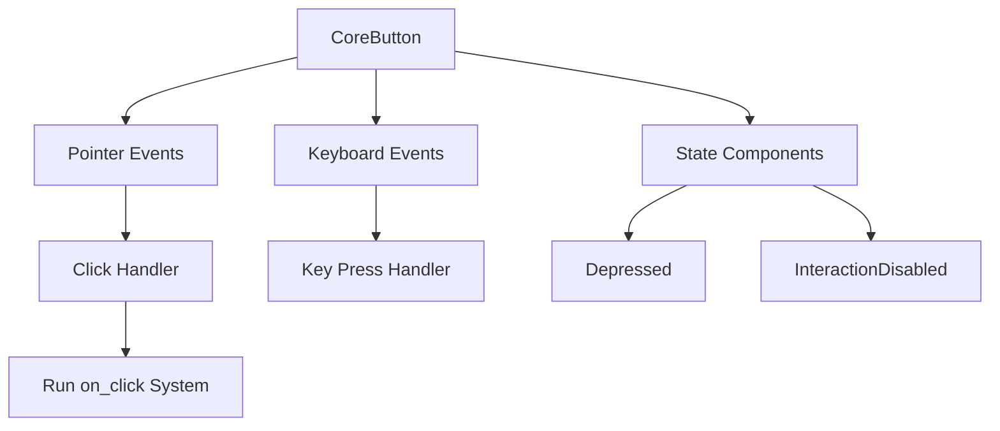

+++
title = "#19366 Core button widget"
date = "2025-06-10T00:00:00"
draft = false
template = "pull_request_page.html"
in_search_index = true

[taxonomies]
list_display = ["show"]

[extra]
current_language = "en"
available_languages = {"en" = { name = "English", url = "/pull_request/bevy/2025-06/pr-19366-en-20250610" }, "zh-cn" = { name = "中文", url = "/pull_request/bevy/2025-06/pr-19366-zh-cn-20250610" }}
labels = ["C-Feature", "A-UI", "X-Blessed"]
+++

# Core button widget

## Basic Information
- **Title**: Core button widget
- **PR Link**: https://github.com/bevyengine/bevy/pull/19366
- **Author**: viridia
- **Status**: MERGED
- **Labels**: C-Feature, A-UI, S-Ready-For-Final-Review, M-Needs-Release-Note, X-Blessed
- **Created**: 2025-05-25T22:40:58Z
- **Merged**: 2025-06-10T16:50:08Z
- **Merged By**: alice-i-cecile

## Description Translation
Part of #19236

### Solution
Adds a new `bevy_core_widgets` crate containing headless widget implementations. This PR adds a single `CoreButton` widget, more widgets to be added later once this is approved.

### Testing
There's an example, ui/core_widgets.

## The Story of This Pull Request

### Problem and Context
Bevy's existing UI button implementation had several limitations. It didn't integrate with newer systems like `bevy_picking`, had limited accessibility support, and wasn't designed for custom styling. Games often require unique, artistically styled UI elements that match their visual theme, but building custom widgets with proper interaction handling and accessibility is complex. 

The solution was to create headless widgets - unstyled components that handle interaction logic while allowing complete visual customization. This approach is common in web development (e.g., Headless UI), but was missing in Bevy's UI system.

### Solution Approach
The implementation introduces a new `bevy_core_widgets` crate starting with a headless button component. Key design decisions:

1. **External state management**: Widgets don't manage their own visual state - apps control appearance through standard ECS components
2. **Event-driven interactions**: Uses Bevy's observer system to handle pointer/keyboard events
3. **One-shot systems**: Allows specifying custom click handlers via `SystemId`
4. **Accessibility integration**: Leverages AccessKit for screen reader support

### Implementation
The `CoreButton` component handles interaction logic while remaining visually neutral. It tracks pressed state using the `Depressed` component and disables interaction via `InteractionDisabled`. The implementation handles:

1. Mouse clicks and touch interactions
2. Keyboard activation (Enter/Space)
3. Visual state changes during press/release
4. Accessibility notifications

```rust
#[derive(Component, Debug)]
#[require(AccessibilityNode(accesskit::Node::new(Role::Button))]
pub struct CoreButton {
    pub on_click: Option<SystemId>,
}
```

Event handling uses Bevy's observer system. This example shows the click handler:

```rust
fn button_on_pointer_click(
    mut trigger: Trigger<Pointer<Click>>,
    mut q_state: Query<(&CoreButton, Has<Depressed>, Has<InteractionDisabled>)>,
    mut commands: Commands,
) {
    if let Ok((bstate, pressed, disabled)) = q_state.get_mut(trigger.target().unwrap()) {
        trigger.propagate(false);
        if pressed && !disabled {
            if let Some(on_click) = bstate.on_click {
                commands.run_system(on_click);
            }
        }
    }
}
```

New interaction state components were added to `bevy_ui`:

```rust
#[derive(Component, Default, Debug)]
pub struct Depressed;

#[derive(Component, Debug, Clone, Copy, Default)]
pub struct InteractionDisabled;
```

### Technical Insights
The implementation demonstrates several advanced Bevy patterns:

1. **Observer-based event handling**: Efficiently routes UI events to specific handlers
2. **External state management**: Avoids two-way data binding by making apps control visual state
3. **Accessibility integration**: Automatically updates AccessKit properties when state changes
4. **System parameterization**: Allows custom click handlers via `SystemId`

### Impact
This PR provides:

1. Foundation for a headless widget ecosystem in Bevy
2. More flexible button implementation with better accessibility
3. Clear separation between interaction logic and visual presentation
4. Examples demonstrating custom styling approaches

## Visual Representation



## Key Files Changed

### `crates/bevy_core_widgets/src/core_button.rs` (+141/-0)
Implements the headless button component and its interaction handlers.

**Key implementation:**
```rust
pub struct CoreButton {
    pub on_click: Option<SystemId>,
}

fn button_on_pointer_click(
    mut trigger: Trigger<Pointer<Click>>,
    mut q_state: Query<(&CoreButton, Has<Depressed>, Has<InteractionDisabled>)>,
    mut commands: Commands,
) {
    // ... event handling logic ...
}
```

### `crates/bevy_ui/src/interaction_states.rs` (+74/-0)
Adds components for tracking UI interaction states.

**New components:**
```rust
#[derive(Component, Debug, Clone, Copy, Default)]
pub struct InteractionDisabled;

#[derive(Component, Default, Debug)]
pub struct Depressed;
```

### `examples/ui/core_widgets.rs` (+233/-0)
Demonstrates using CoreButton with custom styling.

**Styling approach:**
```rust
fn set_button_style(
    disabled: bool,
    hovered: bool,
    depressed: bool,
    color: &mut BackgroundColor,
    border_color: &mut BorderColor,
    text: &mut Text,
) {
    match (disabled, hovered, depressed) {
        (true, _, _) => { /* disabled style */ },
        (false, true, true) => { /* pressed style */ },
        // ... other states ...
    }
}
```

### `crates/bevy_picking/src/hover.rs` (+285/-1)
Adds hover detection components.

**New hover components:**
```rust
#[derive(Component, Copy, Clone, Default, Eq, PartialEq, Debug, Reflect)]
pub struct IsHovered(pub bool);

#[derive(Component, Copy, Clone, Default, Eq, PartialEq, Debug, Reflect)]
pub struct IsDirectlyHovered(pub bool);
```

### `release-content/release-notes/headless-widgets.md` (+90/-0)
Documents the new headless widgets feature.

## Further Reading
1. [Bevy Observers Documentation](https://bevyengine.org/learn/book/observers/)
2. [AccessKit Accessibility Framework](https://accesskit.dev/)
3. [Headless UI Concepts](https://headlessui.dev/)
4. [Bevy UI Styling Guide](https://bevyengine.org/learn/book/ui/styling/)