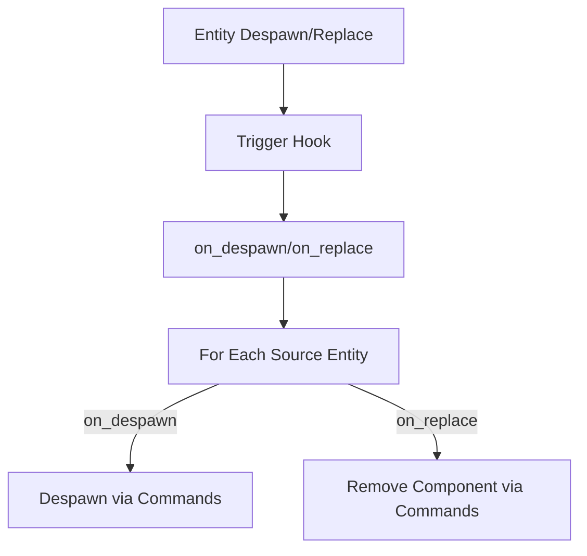

+++
title = "#19378 Simplified `on_replace` and `on_despawn` relationship hooks."
date = "2025-06-02T00:00:00"
draft = false
template = "pull_request_page.html"
in_search_index = true

[taxonomies]
list_display = ["show"]

[extra]
current_language = "en"
available_languages = {"en" = { name = "English", url = "/pull_request/bevy/2025-06/pr-19378-en-20250602" }, "zh-cn" = { name = "中文", url = "/pull_request/bevy/2025-06/pr-19378-zh-cn-20250602" }}
labels = ["A-ECS", "C-Code-Quality", "D-Straightforward"]
+++

### Simplified `on_replace` and `on_despawn` relationship hooks

#### Basic Information
- **Title**: Simplified `on_replace` and `on_despawn` relationship hooks.
- **PR Link**: https://github.com/bevyengine/bevy/pull/19378
- **Author**: AlephCubed
- **Status**: MERGED
- **Labels**: A-ECS, C-Code-Quality, S-Ready-For-Final-Review, D-Straightforward
- **Created**: 2025-05-26T19:42:17Z
- **Merged**: 2025-06-02T22:36:34Z
- **Merged By**: alice-i-cecile

#### Description Translation
Fixes #18364.

#### The Story of This Pull Request
The PR addresses inefficiencies in Bevy's ECS relationship hooks. When entities with `RelationshipTarget` components were modified or despawned, the existing `on_replace` and `on_despawn` hooks performed redundant checks and used low-level command APIs. The original implementation first checked if source entities existed before queueing removal/despawn commands, with explicit error handling for non-existent entities. This approach had two main issues:  
1. The existence check was unnecessary since command operations are inherently safe to call on non-existent entities  
2. The warning logs for missing entities added noise without real value  

The solution simplifies both hooks by leveraging Bevy's command system directly. Instead of manual existence checks and low-level command queueing, we now use standard `Commands` API methods. For `on_replace`, we call `commands.entity(source_entity).remove::<Relationship>()`, and for `on_despawn`, we use `commands.entity(source_entity).despawn()`. These methods automatically handle non-existent entities by no-oping, eliminating the need for manual checks and warnings.  

The implementation removes 27 lines of code while maintaining identical behavior. By using the standard command API:  
- We eliminate potential error cases  
- Reduce cognitive load for maintainers  
- Improve performance by removing redundant entity lookups  
- Align with Bevy's established patterns for entity operations  

The changes also remove an unused import (`entity_command`), cleaning up dependencies. This simplification makes the relationship hook logic more robust and maintainable while fixing issue #18364 where the warnings were deemed unnecessary.

#### Visual Representation


#### Key Files Changed
**File**: `crates/bevy_ecs/src/relationship/mod.rs`  
**Changes**: Simplified relationship hook implementations by removing redundant checks and using standard command API  

Before:
```rust
fn on_replace(mut world: DeferredWorld, HookContext { entity, caller, .. }: HookContext) {
    let (entities, mut commands) = world.entities_and_commands();
    let relationship_target = entities.get(entity).unwrap().get::<Self>().unwrap();
    for source_entity in relationship_target.iter() {
        if entities.get(source_entity).is_ok() {
            commands.queue(
                entity_command::remove::<Self::Relationship>()
                    .with_entity(source_entity)
                    .handle_error_with(ignore),
            );
        } else {
            warn!(
                "{}Tried to despawn non-existent entity {}",
                caller
                    .map(|location| format!("{location}: "))
                    .unwrap_or_default(),
                source_entity
            );
        }
    }
}
```

After:
```rust
fn on_replace(mut world: DeferredWorld, HookContext { entity, .. }: HookContext) {
    let (entities, mut commands) = world.entities_and_commands();
    let relationship_target = entities.get(entity).unwrap().get::<Self>().unwrap();
    for source_entity in relationship_target.iter() {
        commands
            .entity(source_entity)
            .remove::<Self::Relationship>();
    }
}
```

#### Further Reading
1. [Bevy Commands System Documentation](https://docs.rs/bevy_ecs/latest/bevy_ecs/system/struct.Commands.html)  
2. [Entity Relationships in ECS Patterns](https://github.com/SanderMertens/ecs-faq#relationships)  
3. Original Issue: [#18364 - Remove warnings about non-existent entities in relationship hooks](https://github.com/bevyengine/bevy/issues/18364)

#### Full Code Diff
```diff
diff --git a/crates/bevy_ecs/src/relationship/mod.rs b/crates/bevy_ecs/src/relationship/mod.rs
index 3522118fbc820..9ec67ce36a18a 100644
--- a/crates/bevy_ecs/src/relationship/mod.rs
+++ b/crates/bevy_ecs/src/relationship/mod.rs
@@ -14,7 +14,6 @@ use crate::{
     component::{Component, HookContext, Mutable},
     entity::{ComponentCloneCtx, Entity, SourceComponent},
     error::{ignore, CommandWithEntity, HandleError},
-    system::entity_command::{self},
     world::{DeferredWorld, EntityWorldMut},
 };
 use log::warn;
@@ -223,50 +222,24 @@ pub trait RelationshipTarget: Component<Mutability = Mutable> + Sized {
 
     /// The `on_replace` component hook that maintains the [`Relationship`] / [`RelationshipTarget`] connection.
     // note: think of this as "on_drop"
-    fn on_replace(mut world: DeferredWorld, HookContext { entity, caller, .. }: HookContext) {
+    fn on_replace(mut world: DeferredWorld, HookContext { entity, .. }: HookContext) {
         let (entities, mut commands) = world.entities_and_commands();
         let relationship_target = entities.get(entity).unwrap().get::<Self>().unwrap();
         for source_entity in relationship_target.iter() {
-            if entities.get(source_entity).is_ok() {
-                commands.queue(
-                    entity_command::remove::<Self::Relationship>()
-                        .with_entity(source_entity)
-                        .handle_error_with(ignore),
-                );
-            } else {
-                warn!(
-                    "{}Tried to despawn non-existent entity {}",
-                    caller
-                        .map(|location| format!("{location}: "))
-                        .unwrap_or_default(),
-                    source_entity
-                );
-            }
+            commands
+                .entity(source_entity)
+                .remove::<Self::Relationship>();
         }
     }
 
     /// The `on_despawn` component hook that despawns entities stored in an entity's [`RelationshipTarget`] when
     /// that entity is despawned.
     // note: think of this as "on_drop"
-    fn on_despawn(mut world: DeferredWorld, HookContext { entity, caller, .. }: HookContext) {
+    fn on_despawn(mut world: DeferredWorld, HookContext { entity, .. }: HookContext) {
         let (entities, mut commands) = world.entities_and_commands();
         let relationship_target = entities.get(entity).unwrap().get::<Self>().unwrap();
         for source_entity in relationship_target.iter() {
-            if entities.get(source_entity).is_ok() {
-                commands.queue(
-                    entity_command::despawn()
-                        .with_entity(source_entity)
-                        .handle_error_with(ignore),
-                );
-            } else {
-                warn!(
-                    "{}Tried to despawn non-existent entity {}",
-                    caller
-                        .map(|location| format!("{location}: "))
-                        .unwrap_or_default(),
-                    source_entity
-                );
-            }
+            commands.entity(source_entity).despawn();
         }
     }
```