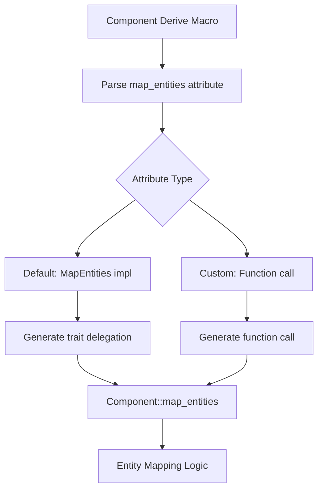

+++
title = "#19414 Let Component::map_entities defer to MapEntities"
date = "2025-06-23T00:00:00"
draft = false
template = "pull_request_page.html"
in_search_index = true

[taxonomies]
list_display = ["show"]

[extra]
current_language = "en"
available_languages = {"en" = { name = "English", url = "/pull_request/bevy/2025-06/pr-19414-en-20250623" }, "zh-cn" = { name = "中文", url = "/pull_request/bevy/2025-06/pr-19414-zh-cn-20250623" }}
labels = ["A-ECS", "C-Usability", "A-Networking", "X-Contentious", "D-Macros"]
+++

### Technical Analysis of PR #19414: Let Component::map_entities defer to MapEntities

## Basic Information
- **Title**: Let Component::map_entities defer to MapEntities
- **PR Link**: https://github.com/bevyengine/bevy/pull/19414
- **Author**: Testare
- **Status**: MERGED
- **Labels**: A-ECS, C-Usability, S-Ready-For-Final-Review, A-Networking, X-Contentious, D-Macros
- **Created**: 2025-05-28T19:13:01Z
- **Merged**: 2025-06-23T21:22:47Z
- **Merged By**: alice-i-cecile

## Description Translation
# Objective

The objective of this PR is to enable Components to use their `MapEntities` implementation for `Component::map_entities`.

With the improvements to the entity mapping system, there is definitely a huge reduction in boilerplate. However, especially since `(Entity)HashMap<..>` doesn't implement `MapEntities` (I presume because the lack of specialization in rust makes `HashMap<Entity|X, Entity|X>` complicated), when somebody has types that contain these hashmaps they can't use this approach.

More so, we can't even depend on the previous implementation, since `Component::map_entities` is used instead of `MapEntities::map_entities`. Outside of implementing `Component `and `Component::map_entities` on these types directly, the only path forward is to create a custom type to wrap the hashmaps and implement map entities on that, or split these components into a wrapper type that implement `Component`, and an inner type that implements `MapEntities`.

## Current Solution
The solution was to allow adding `#[component(map_entities)]` on the component. By default this will defer to the `MapEntities` implementation.

```rust
#[derive(Component)]
#[component(map_entities)]
struct Inventory {
    items: HashMap<Entity, usize>
}

impl MapEntities for Inventory {
    fn map_entities<M: EntityMapper>(&mut self, entity_mapper: &mut M) {
        self.items = self.items
           .drain()
           .map(|(id, count)|(entity_mapper.get_mapped(id), count))
           .collect();
    }
}

```

You can use  `#[component(map_entities = <function path>)]` instead to substitute other code in for components. This function can also include generics, but sso far I haven't been able to find a case where they are needed.

```rust
#[derive(Component)]
#[component(map_entities = map_the_map)]
// Also works #[component(map_entities = map_the_map::<T,_>)]
struct Inventory<T> {
    items: HashMap<Entity, T>
}

fn map_the_map<T, M: EntityMapper>(inv: &mut Inventory<T>, entity_mapper: &mut M) {
    inv.items = inv.items
       .drain()
       .map(|(id, count)|(entity_mapper.get_mapped(id), count))
       .collect();
}

```

The idea is that with the previous changes to MapEntities, MapEntities is implemented more for entity collections than for Components. If you have a component that makes sense as both, `#[component(map_entities)]` would work great, while otherwise a component can use `#[component(map_entities = <function>)]`  to change the behavior of `Component::map_entities` without opening up the component type to be included in other components.


## (Original Solution if you want to follow the PR)

The solution was to allow adding `#[component(entities)]` on the component itself to defer to the `MapEntities` implementation

```rust
#[derive(Component)]
#[component(entities)]
struct Inventory {
    items: HashMap<Entity, usize>
}

impl MapEntities for Inventory {
    fn map_entities<M: EntityMapper>(&mut self, entity_mapper: &mut M) {
        self.items = self.items
           .drain()
           .map(|(id, count)|(entity_mapper.get_mapped(id), count))
           .collect();
    }
}

```

## Testing

I tested this by patching my local changes into my own bevy project. I had a system that loads a scene file and executes some logic with a Component that contains a `HashMap<Entity, UVec2>`, and it panics when Entity is not found from another query. Since the 0.16 update this system has reliably panicked upon attempting to the load the scene.

After patching my code in, I added `#[component(entities)]` to this component, and I was able to successfully load the scene.

Additionally, I wrote a doc test.

## Call-outs
### Relationships
This overrules the default mapping of relationship fields. Anything else seemed more problematic, as you'd have inconsistent behavior between `MapEntities` and `Component`.

## The Story of This Pull Request

### The Entity Mapping Challenge
Entity mapping is crucial in Bevy's ECS for scenarios like scene loading and networking, where entity references need updating when moving between worlds. Before this PR, components containing entity collections like `HashMap<Entity, T>` faced a significant hurdle. While Bevy's `MapEntities` trait provided entity remapping capabilities, standard collections couldn't implement it due to Rust's specialization limitations. 

This forced workarounds:
1. Manually implement `Component::map_entities` for each component
2. Create wrapper types for collections
3. Split components into wrapper + inner types

All solutions added boilerplate and complexity. The core issue was the disconnect between `Component::map_entities` (default no-op) and `MapEntities::map_entities` (customizable mapping logic). There was no straightforward way to connect a component's `MapEntities` implementation to its `Component` behavior.

### Attribute-Driven Solution
The PR introduces a new `#[component(map_entities)]` attribute for the `Component` derive macro. This attribute generates `Component::map_entities` implementations that delegate to either:
1. The type's `MapEntities` implementation (default)
2. A custom function (when using `#[component(map_entities = path)]`)

This approach maintains backward compatibility while solving the entity mapping problem for collection-heavy components. The implementation handles two key cases:

**Case 1: Default delegation**
```rust
#[derive(Component)]
#[component(map_entities)]
struct Inventory {
    items: HashMap<Entity, usize>
}

impl MapEntities for Inventory {
    fn map_entities<M: EntityMapper>(&mut self, mapper: &mut M) {
        // Custom mapping logic
    }
}
```
The generated `Component::map_entities` will call `Inventory::map_entities` from the `MapEntities` implementation.

**Case 2: Custom mapping function**
```rust
#[derive(Component)]
#[component(map_entities = map_the_map)]
struct Inventory<T> {
    items: HashMap<Entity, T>
}

fn map_the_map<T, M: EntityMapper>(inv: &mut Inventory<T>, mapper: &mut M) {
    // Custom mapping logic
}
```
This allows using generic functions for components with type parameters.

### Implementation Mechanics
The solution required modifications across Bevy's ECS macros and component systems:

1. **Attribute Parsing**: Added `MAP_ENTITIES` constant and `MapEntitiesAttributeKind` enum to handle:
   - `#[component(map_entities)]` (default delegation)
   - `#[component(map_entities = path)]` (custom function)

2. **Code Generation**: Updated macro logic to generate appropriate delegation code:
   ```rust
   if let Some(map_entities_override) = map_entities_attr {
       let map_entities_tokens = map_entities_override.to_token_stream(bevy_ecs_path);
       return Some(quote!(
           #map_entities_tokens(#self_ident, mapper)
       ));
   }
   ```
   This generates either a trait method call or function invocation.

3. **Documentation**: Added comprehensive docs showing both usage patterns with practical examples.

### Technical Tradeoffs
The implementation makes a deliberate choice to prioritize consistency over specialization. When both relationship attributes (`entities`) and `map_entities` are present, the latter takes precedence. This ensures components behave consistently whether mapped through `MapEntities` or `Component` traits. The alternative—maintaining separate code paths—would introduce behavioral inconsistencies.

### Validation and Impact
The author validated the solution through:
1. Real-world testing with scene loading systems
2. Documentation tests showing both attribute usages
3. Maintaining existing test coverage

The change significantly reduces boilerplate for components containing entity collections. Users can now directly leverage `MapEntities` implementations through a simple attribute, eliminating wrapper types and manual delegation code. This is particularly valuable for networking and scene systems where entity remapping is frequent.

## Visual Representation



## Key Files Changed

### 1. `crates/bevy_ecs/macros/src/component.rs`
Added attribute parsing and code generation for `map_entities`:
```rust
pub const MAP_ENTITIES: &str = "map_entities";

#[derive(Debug)]
pub(super) enum MapEntitiesAttributeKind {
    Path(ExprPath),
    Default,
}

// Added to Attrs struct:
map_entities: Option<MapEntitiesAttributeKind>,

// In parse_component_attr:
} else if nested.path.is_ident(MAP_ENTITIES) {
    attrs.map_entities = Some(nested.input.parse::<MapEntitiesAttributeKind>()?;
    Ok(())
}

// In map_entities function:
if let Some(map_entities_override) = map_entities_attr {
    let map_entities_tokens = map_entities_override.to_token_stream(bevy_ecs_path);
    return Some(quote!(
        #map_entities_tokens(#self_ident, mapper)
    ));
}
```

### 2. `crates/bevy_ecs/src/component.rs`
Updated documentation with usage examples:
```rust
/// You might need more specialized logic... you can annotate your component with
/// `#[component(map_entities)]`.
///
/// ```
/// #[derive(Component)]
/// #[component(map_entities)]
/// struct Inventory {
///     items: HashMap<Entity, usize>
/// }
/// 
/// impl MapEntities for Inventory {
///   fn map_entities<M: EntityMapper>(&mut self, entity_mapper: &mut M) {
///      // ...
///   }
/// }
/// ```
///
/// Alternatively, you can specify the path to a function...
/// ```
/// #[derive(Component)]
/// #[component(map_entities = map_the_map)]
/// struct Inventory {
///     items: HashMap<Entity, usize>
/// }
/// 
/// fn map_the_map<M: EntityMapper>(inv: &mut Inventory, entity_mapper: &mut M) {
///    // ...
/// }
/// ```
```

### 3. `crates/bevy_ecs/macros/src/lib.rs`
Updated derive macro for consistency:
```rust
let map_entities_impl = map_entities(
    &ast.data,
    &ecs_path,
    Ident::new("self", Span::call_site()),
    false,
    false,
    None,  // Added parameter
);
```

## Further Reading
1. [Bevy ECS Component Documentation](https://docs.rs/bevy_ecs/latest/bevy_ecs/component/trait.Component.html)
2. [Entity Mapping in ECS Systems](https://bevy-cheatbook.github.io/features/scenes.html#entity-mapping)
3. [Rust Attribute Macros](https://doc.rust-lang.org/reference/attributes.html)