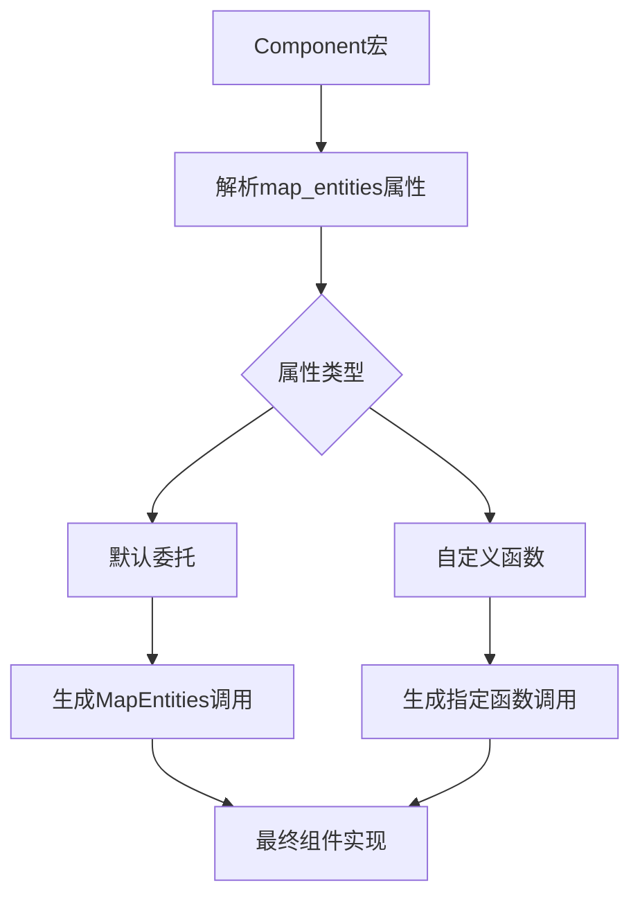

+++
title = "#19414"
date = "2025-06-23T00:00:00"
draft = false
template = "pull_request_page.html"
in_search_index = false

[extra]
current_language = "zh-cn"
available_languages = {"en" = { name = "English", url = "/pull_request/bevy/2025-06/pr-19414-en-20250623" }, "zh-cn" = { name = "中文", url = "/pull_request/bevy/2025-06/pr-19414-zh-cn-20250623" }}
+++

## 技术分析报告：PR #19414 "Let Component::map_entities defer to MapEntities"

### 问题背景
在 Bevy 的 ECS 系统中，实体 ID 映射是场景序列化/反序列化和网络同步的关键机制。当实体 ID 需要重新映射时，系统会调用 `Component::map_entities` 方法。但原始实现存在两个主要问题：

1. **冗余代码**：对于包含 `HashMap<Entity, T>` 的组件，开发者必须手动实现映射逻辑
2. **实现冲突**：`MapEntities` trait 已提供标准映射接口，但 `Component::map_entities` 无法直接利用它

```rust
// 旧实现示例：必须手动实现映射
impl Component for Inventory {
    fn map_entities<M: EntityMapper>(&mut self, mapper: &mut M) {
        let mut new_items = HashMap::new();
        for (entity, count) in self.items.drain() {
            new_items.insert(mapper.get_mapped(entity), count);
        }
        self.items = new_items;
    }
}
```

### 解决方案
PR 引入 `#[component(map_entities)]` 属性宏，允许组件的 `map_entities` 方法直接委托给 `MapEntities` trait 实现：

1. **默认委托**：自动使用类型自身的 `MapEntities` 实现
2. **自定义函数**：支持指定外部映射函数处理特殊逻辑

```rust
// 新用法：通过属性宏委托
#[derive(Component)]
#[component(map_entities)]  // 默认使用 MapEntities 实现
struct Inventory {
    items: HashMap<Entity, usize>
}

impl MapEntities for Inventory {
    fn map_entities<M: EntityMapper>(&mut self, entity_mapper: &mut M) {
        self.items = self.items.drain()
            .map(|(id, count)| (entity_mapper.get_mapped(id), count))
            .collect();
    }
}

// 自定义函数委托
#[derive(Component)]
#[component(map_entities = custom_mapper)]  // 指定自定义函数
struct CustomInventory {
    entities: Vec<Entity>
}

fn custom_mapper<M: EntityMapper>(inv: &mut CustomInventory, mapper: &mut M) {
    for entity in &mut inv.entities {
        *entity = mapper.get_mapped(*entity);
    }
}
```

### 关键技术实现

**1. 属性解析系统 (component.rs)**
```rust
const MAP_ENTITIES: &str = "map_entities";

// 新增属性类型
pub(super) enum MapEntitiesAttributeKind {
    Path(ExprPath),  // 函数路径
    Default,         // 默认委托
}

// 属性解析逻辑
fn parse_component_attr(ast: &DeriveInput) -> Result<Attrs> {
    if nested.path.is_ident(MAP_ENTITIES) {
        attrs.map_entities = Some(nested.input.parse::<MapEntitiesAttributeKind>()?);
        Ok(())
    }
}
```

**2. 代码生成逻辑 (component.rs)**
```rust
let map_entities = map_entities(
    &ast.data,
    &bevy_ecs_path,
    Ident::new("this", Span::call_site()),
    relationship.is_some(),
    relationship_target.is_some(),
    attrs.map_entities  // 传入解析后的属性
).map(|map_entities_impl| quote! {
    fn map_entities<M: #bevy_ecs_path::entity::EntityMapper>(this: &mut Self, mapper: &mut M) {
        use #bevy_ecs_path::entity::MapEntities;
        #map_entities_impl
    }
});
```

**3. 映射执行逻辑**
```rust
match map_entities_attr {
    Some(MapEntitiesAttributeKind::Path(path)) => {
        quote! { #path(#self_ident, mapper) }
    }
    Some(MapEntitiesAttributeKind::Default) => {
        quote! { <Self as #bevy_ecs_path::entity::MapEntities>::map_entities(#self_ident, mapper) }
    }
    None => /* 原有字段级映射逻辑 */
}
```

### 设计决策与权衡
1. **优先级处理**：当同时存在 `map_entities` 属性和关系字段(relationships)时，属性宏优先
2. **泛型支持**：通过函数路径语法支持泛型组件
   ```rust
   #[component(map_entities = generic_mapper::<T>)]
   ```
3. **错误处理**：对无效表达式提供明确错误提示
   ```rust
   Err(syn::Error::new(value.span(), "Not supported..."))
   ```

### 实际影响
1. **减少样板代码**：消除手动实现 `Component::map_entities` 的需要
2. **逻辑一致性**：确保 `MapEntities` 和 `Component` 的映射行为统一
3. **复杂组件支持**：简化包含 `HashMap<Entity, T>` 等结构的组件实现

### 关键文件变更

**1. crates/bevy_ecs/macros/src/component.rs**
```rust
// 新增属性常量
pub const MAP_ENTITIES: &str = "map_entities";

// 新增属性类型
#[derive(Debug)]
pub(super) enum MapEntitiesAttributeKind {
    Path(ExprPath),
    Default,
}

// 属性解析逻辑
if nested.path.is_ident(MAP_ENTITIES) {
    attrs.map_entities = Some(nested.input.parse::<MapEntitiesAttributeKind>()?);
    Ok(())
}

// 代码生成
if let Some(map_entities_override) = map_entities_attr {
    return Some(quote!(#map_entities_tokens(#self_ident, mapper)));
}
```

**2. crates/bevy_ecs/src/component.rs**
```rust
// 文档更新
pub trait Component: Send + Sync + 'static {
    /// You might need more specialized logic... 
    /// #[component(map_entities)] 
    /// struct Inventory { ... }
    
    /// Alternatively... #[component(map_entities = function_path)]
    fn map_entities<E: EntityMapper>(_this: &mut Self, _mapper: &mut E) {}
}
```

**3. crates/bevy_ecs/macros/src/lib.rs**
```rust
// 保持派生宏一致性
let map_entities_impl = map_entities(
    &ast.data,
    &ecs_path,
    Ident::new("self", Span::call_site()),
    false,
    false,
    None,  // 注意此处未使用新特性
);
```

### 关系图


### 经验总结
1. **属性宏扩展**：展示了如何通过过程宏增强派生功能
2. **trait协同**：解决了trait方法与组件方法的协作问题
3. **渐进式改进**：通过可选属性保持向后兼容

### 进一步阅读
1. [Bevy ECS 组件文档](https://bevyengine.org/learn/book/ecs/component/)
2. [实体映射机制详解](https://bevyengine.org/learn/book/ecs/entity-mapping/)
3. [Rust过程宏实践指南](https://doc.rust-lang.org/reference/procedural-macros.html)