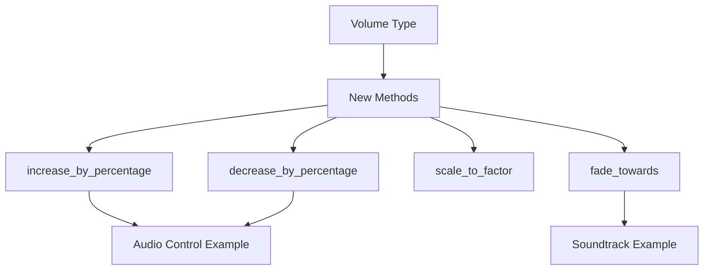

+++
title = "#19423 fix: Ensure linear volume subtraction does not go below zero"
date = "2025-06-05T00:00:00"
draft = false
template = "pull_request_page.html"
in_search_index = true

[taxonomies]
list_display = ["show"]

[extra]
current_language = "en"
available_languages = {"en" = { name = "English", url = "/pull_request/bevy/2025-06/pr-19423-en-20250605" }, "zh-cn" = { name = "中文", url = "/pull_request/bevy/2025-06/pr-19423-zh-cn-20250605" }}
labels = ["D-Trivial", "A-Audio"]
+++

# Technical Analysis of PR #19423: fix: Ensure linear volume subtraction does not go below zero

## Basic Information
- **Title**: fix: Ensure linear volume subtraction does not go below zero 
- **PR Link**: https://github.com/bevyengine/bevy/pull/19423
- **Author**: foxzool
- **Status**: MERGED
- **Labels**: D-Trivial, A-Audio, S-Ready-For-Final-Review, M-Needs-Migration-Guide
- **Created**: 2025-05-29T03:24:50Z
- **Merged**: 2025-06-05T04:21:33Z
- **Merged By**: alice-i-cecile

## Description Translation
fix: [Ensure linear volume subtraction does not go below zero](https://github.com/bevyengine/bevy/issues/19417)

## Solution
- Clamp the result of linear volume subtraction to a minimum of 0.0
- Add a new test case to verify behavior when subtracting beyond zero

## The Story of This Pull Request

The core problem addressed in this PR was that volume subtraction operations could produce negative values, which are invalid in audio systems. Volume levels must remain at or above zero, as negative volumes have no physical meaning in audio processing. The issue (#19417) specifically identified that subtracting volumes could result in negative linear scale values.

Instead of simply clamping subtraction results, the author recognized a deeper architectural issue: arithmetic operations (addition/subtraction) on volume values are fundamentally problematic because audio volumes operate multiplicatively rather than additively. Volumes represent relative scaling factors where 1.0 is unity gain, 0.5 is half volume (-6dB), and 0.0 is silence.

The solution involved completely removing the `Add` and `Sub` trait implementations for the `Volume` type. This prevents misuse of arithmetic operations that don't align with audio volume semantics. To replace these operations, the author introduced four new clearly named methods that better reflect audio manipulation concepts:

1. `increase_by_percentage` - Multiplies volume by (1 + percentage/100)
2. `decrease_by_percentage` - Multiplies volume by (1 - percentage/100) clamped to 0.0
3. `scale_to_factor` - Directly multiplies volume by a scaling factor
4. `fade_towards` - Linearly interpolates between current and target volume

The implementation ensures all operations stay in the linear domain, which maintains audio quality during adjustments. For example, the `decrease_by_percentage` method prevents negative volumes by clamping the result:

```rust
pub fn decrease_by_percentage(&self, percentage: f32) -> Self {
    let factor = 1.0 - (percentage / 100.0).clamp(0.0, 1.0);
    Volume::Linear(self.to_linear() * factor)
}
```

The PR includes comprehensive tests for all new functionality, such as verifying that a 100% decrease results in silence:

```rust
#[test]
fn test_decrease_by_percentage() {
    let volume = Linear(1.0);
    let decreased = volume.decrease_by_percentage(100.0);
    assert_eq!(decreased.to_linear(), 0.0);
}
```

The changes required updates to two audio examples that previously used volume subtraction. The `audio_control` example now uses percentage-based adjustments:

```rust
sink.set_volume(current_volume.increase_by_percentage(10.0));
```

While the `soundtrack` example uses the new fading method:

```rust
audio.set_volume(
    current_volume.fade_towards(Volume::Linear(1.0), time.delta_secs() / FADE_TIME
);
```

Since this is a breaking change (removing public trait implementations), the PR includes a migration guide that clearly explains how to update code that previously used addition or subtraction with volume values.

## Visual Representation



## Key Files Changed

### 1. `crates/bevy_audio/src/volume.rs` (+155/-94)
The core changes to the Volume implementation:
- Removed Add/Sub trait implementations
- Added new volume adjustment methods
- Added comprehensive tests

Key changes:
```rust
// Before:
impl core::ops::Sub<Self> for Volume {
    type Output = Self;

    fn sub(self, rhs: Self) -> Self {
        use Volume::{Decibels, Linear};
        match (self, rhs) {
            (Linear(a), Linear(b)) => Linear(a - b),
            // ... other cases ...
        }
    }
}

// After:
pub fn decrease_by_percentage(&self, percentage: f32) -> Self {
    let factor = 1.0 - (percentage / 100.0).clamp(0.0, 1.0);
    Volume::Linear(self.to_linear() * factor)
}

pub fn fade_towards(&self, target: Volume, factor: f32) -> Self {
    let current_linear = self.to_linear();
    let target_linear = target.to_linear();
    let factor_clamped = factor.clamp(0.0, 1.0);
    let interpolated = current_linear + (target_linear - current_linear) * factor_clamped;
    Volume::Linear(interpolated)
}
```

### 2. `release-content/migration-guides/remove_the_add_sub_impls_on_volume.md` (+25/-0)
New migration guide explaining how to update code:

```markdown
Linear volumes are like percentages, and it does not make sense to add or subtract percentages.
As such, use the new `increase_by_percentage` function instead of addition or subtraction.

```rust
// 0.16
fn audio_system() {
    let linear_a = Volume::Linear(0.5);
    let linear_b = Volume::Linear(0.1);
    let linear_c = linear_a + linear_b;
    let linear_d = linear_a - linear_b;
}

// 0.17
fn audio_system() {
    let linear_a = Volume::Linear(0.5);
    let linear_b = Volume::Linear(0.1);
    let linear_c = linear_a.increase_by_percentage(10.0);
    let linear_d = linear_a.increase_by_percentage(-10.0);
}
```

### 3. `examples/audio/soundtrack.rs` (+6/-2)
Updated fade implementation to use new method:

```rust
// Before:
audio.set_volume(current_volume - Volume::Linear(time.delta_secs() / FADE_TIME));

// After:
audio.set_volume(
    current_volume.fade_towards(Volume::Linear(0.0), time.delta_secs() / FADE_TIME
);
```

### 4. `examples/audio/audio_control.rs` (+3/-3)
Updated volume controls to use percentage-based adjustment:

```rust
// Before:
sink.set_volume(current_volume - Volume::Linear(0.1));

// After:
sink.set_volume(current_volume.increase_by_percentage(-10.0));
```

## Further Reading
1. [Digital Audio Volume Control](https://dsp.stackexchange.com/questions/29919/how-to-control-volume-in-digital-audio-processing)
2. [Decibel Scale Fundamentals](https://www.animations.physics.unsw.edu.au/jw/dB.htm)
3. [Bevy Audio Documentation](https://docs.rs/bevy_audio/latest/bevy_audio/)
4. [Linear vs Logarithmic Audio Scales](https://www.soundonsound.com/techniques/understanding-decibels)