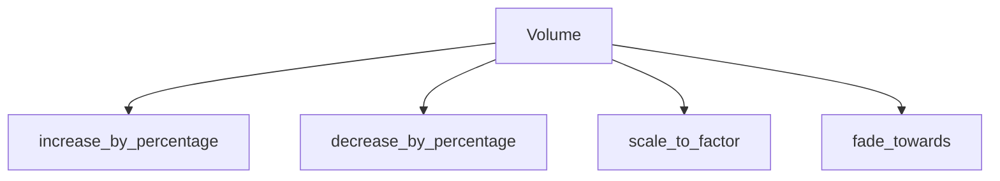

+++
title = "#19423 fix: Ensure linear volume subtraction does not go below zero"
date = "2025-06-05T00:00:00"
draft = false
template = "pull_request_page.html"
in_search_index = false

[extra]
current_language = "zh-cn"
available_languages = {"en" = { name = "English", url = "/pull_request/bevy/2025-06/pr-19423-en-20250605" }, "zh-cn" = { name = "中文", url = "/pull_request/bevy/2025-06/pr-19423-zh-cn-20250605" }}
labels = ["D-Trivial", "A-Audio"]
+++

# 修复：确保线性音量减法不会低于零

## Basic Information
- **Title**: fix: Ensure linear volume subtraction does not go below zero 
- **PR Link**: https://github.com/bevyengine/bevy/pull/19423
- **Author**: foxzool
- **Status**: MERGED
- **Labels**: D-Trivial, A-Audio, S-Ready-For-Final-Review, M-Needs-Migration-Guide
- **Created**: 2025-05-29T03:24:50Z
- **Merged**: 2025-06-05T04:21:33Z
- **Merged By**: alice-i-cecile

## Description Translation
修复: [确保线性音量减法不会低于零](https://github.com/bevyengine/bevy/issues/19417)

## 解决方案
- 将线性音量减法的结果钳制在最小值0.0
- 添加新的测试用例以验证当减法超过零时的行为

## The Story of This Pull Request

### 问题背景
在Bevy音频系统的`Volume`类型实现中，存在一个边界条件处理问题。当开发者对线性音量执行减法操作时，结果可能变为负值。例如：
```rust
let volume = Volume::Linear(0.5) - Volume::Linear(0.6); // 结果为-0.1
```
负音量在音频处理中没有物理意义，可能导致未定义行为或意外静音。问题#[19417](https://github.com/bevyengine/bevy/issues/19417)记录了此行为，特别是在音频淡出场景中可能出现负值音量。

### 解决方案分析
核心问题是`Volume`类型的算术运算实现未考虑线性音量的物理约束。解决方案需满足：
1. 保持API向后兼容性
2. 确保音量值始终≥0
3. 提供直观的音量操作方式

经过评估，PR选择移除原有的`Add`/`Sub` trait实现，因为：
- 线性音量的百分比特性使加减法运算语义不明确
- 直接数值运算容易导致边界错误
- 更符合音频工程实践的操作方式

### 实现细节
PR引入四个新方法来替代原有的算术运算：

1. **按百分比调整音量**：
```rust
pub fn increase_by_percentage(&self, percentage: f32) -> Self {
    let factor = 1.0 + (percentage / 100.0);
    Volume::Linear(self.to_linear() * factor)
}

pub fn decrease_by_percentage(&self, percentage: f32) -> Self {
    let factor = 1.0 - (percentage / 100.0).clamp(0.0, 1.0);
    Volume::Linear(self.to_linear() * factor)
}
```
`decrease_by_percentage`中的`.clamp(0.0, 1.0)`确保减少因子不会导致负值。

2. **基于因子的音量缩放**：
```rust
pub fn scale_to_factor(&self, factor: f32) -> Self {
    Volume::Linear(self.to_linear() * factor)
}
```

3. **音量渐变实现**：
```rust
pub fn fade_towards(&self, target: Volume, factor: f32) -> Self {
    let current_linear = self.to_linear();
    let target_linear = target.to_linear();
    let factor_clamped = factor.clamp(0.0, 1.0);

    let interpolated = current_linear + (target_linear - current_linear) * factor_clamped;
    Volume::Linear(interpolated)
}
```
使用线性插值确保渐变过程平滑且不会越界。

### 测试验证
添加的测试覆盖关键场景：
```rust
#[test]
fn test_decrease_by_percentage() {
    let volume = Linear(1.0);
    let decreased = volume.decrease_by_percentage(100.0);
    assert_eq!(decreased.to_linear(), 0.0); // 100%减少应为静音
}

#[test]
fn test_fade_towards() {
    let current = Linear(1.0);
    let target = Linear(0.0);
    let faded = current.fade_towards(target, 1.0);
    assert_eq!(faded.to_linear(), 0.0); // 100%渐变应达到目标
}
```

### 影响与迁移
1. **示例更新**：
```rust
// 旧方法
sink.set_volume(current_volume - Volume::Linear(0.1));

// 新方法
sink.set_volume(current_volume.decrease_by_percentage(10.0));
```

2. **迁移指南**：
PR包含详细的迁移文档`remove_the_add_sub_impls_on_volume.md`，指导用户替换算术运算符为新的百分比方法。

3. **行为变化**：
- 消除负音量可能性
- 提供更符合音频工程实践的操作语义
- 确保音量调整操作物理意义明确

## Visual Representation



## Key Files Changed

### 1. `crates/bevy_audio/src/volume.rs`
**变更内容**：重构音量操作API，移除算术运算trait实现，增加安全音量操作方法  
**关键代码**：
```rust
// 移除原有算术实现
-impl core::ops::Add<Self> for Volume {...}
-impl core::ops::Sub<Self> for Volume {...}

// 新增百分比操作方法
+pub fn decrease_by_percentage(&self, percentage: f32) -> Self {
+    let factor = 1.0 - (percentage / 100.0).clamp(0.0, 1.0);
+    Volume::Linear(self.to_linear() * factor)
+}

// 新增渐变方法
+pub fn fade_towards(&self, target: Volume, factor: f32) -> Self {
+    let interpolated = ...;
+    Volume::Linear(interpolated)
+}
```

### 2. `examples/audio/audio_control.rs`
**变更内容**：更新音量控制示例使用新API  
**代码对比**：
```rust
// 旧实现
-if keyboard_input.just_pressed(KeyCode::Minus) {
-    sink.set_volume(current_volume - Volume::Linear(0.1));
-}

// 新实现
+} else if keyboard_input.just_pressed(KeyCode::Minus) {
+    sink.set_volume(current_volume.increase_by_percentage(-10.0));
+}
```

### 3. `examples/audio/soundtrack.rs`
**变更内容**：更新淡入淡出实现使用fade_towards方法  
**代码对比**：
```rust
// 旧淡出实现
-audio.set_volume(current_volume - Volume::Linear(time.delta_secs() / FADE_TIME));

// 新淡出实现
+audio.set_volume(
+    current_volume.fade_towards(Volume::Linear(0.0), time.delta_secs() / FADE_TIME),
+);
```

### 4. `release-content/migration-guides/remove_the_add_sub_impls_on_volume.md`
**变更内容**：新增迁移指南文档  
**关键内容**：
```markdown
Linear volumes are like percentages, and it does not make sense to add or subtract percentages.
As such, use the new `increase_by_percentage` function instead of addition or subtraction.

// 迁移示例
-let linear_c = linear_a + linear_b;
+let linear_c = linear_a.increase_by_percentage(10.0);
```

## Further Reading
1. [Digital Audio Level Control](https://www.audiokinetic.com/library/edge/?source=Help&id=digital_audio_level_control)
2. [Decibel (dB) in Audio Engineering](https://www.soundonsound.com/sound-advice/q-what-are-decibels)
3. [Linear Interpolation in Audio Processing](https://dsp.stackexchange.com/questions/17235/why-is-linear-interpolation-of-audio-signal-not-ideal)