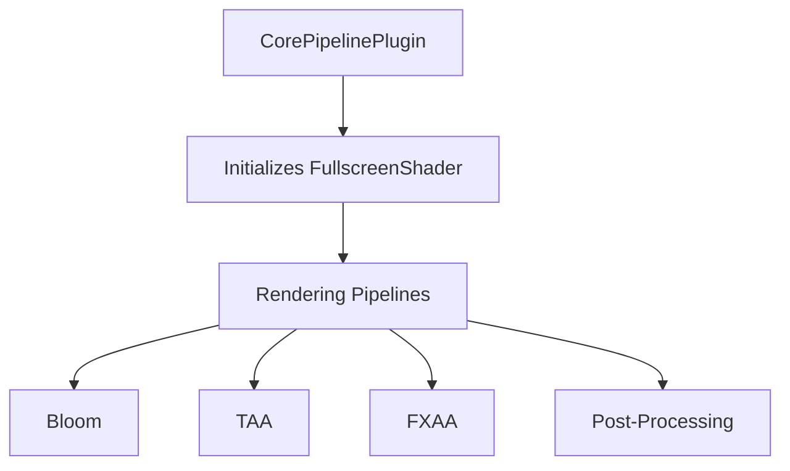

+++
title = "#19426 Replace `FULLSCREEN_SHADER_HANDLE` with a `FullscreenShader` resource."
date = "2025-06-24T00:00:00"
draft = false
template = "pull_request_page.html"
in_search_index = true

[taxonomies]
list_display = ["show"]

[extra]
current_language = "en"
available_languages = {"en" = { name = "English", url = "/pull_request/bevy/2025-06/pr-19426-en-20250624" }, "zh-cn" = { name = "中文", url = "/pull_request/bevy/2025-06/pr-19426-zh-cn-20250624" }}
labels = ["A-Rendering", "A-Assets", "D-Modest"]
+++

# Technical Analysis: PR #19426 - Replace `FULLSCREEN_SHADER_HANDLE` with `FullscreenShader` Resource

## Basic Information
- **Title**: Replace `FULLSCREEN_SHADER_HANDLE` with a `FullscreenShader` resource.
- **PR Link**: https://github.com/bevyengine/bevy/pull/19426
- **Author**: andriyDev
- **Status**: MERGED
- **Labels**: A-Rendering, A-Assets, S-Ready-For-Final-Review, M-Needs-Migration-Guide, D-Modest
- **Created**: 2025-05-29T04:02:10Z
- **Merged**: 2025-06-24T00:20:36Z
- **Merged By**: alice-i-cecile

## Description Translation
# Objective

- Related to #19024.

## Solution

- Remove the `FULLSCREEN_SHADER_HANDLE` `weak_handle` with a resource holding the shader handle.
    - This also changes us from using `load_internal_asset` to `embedded_asset`/`load_embedded_asset`.
- All uses have been migrated to clone the `FullscreenShader` resource and use its `to_vertex_state` method.

## Testing

- `anti_aliasing` example still works.
- `bloom_3d` example still works.

## The Story of This Pull Request

### Problem and Context
Bevy previously used a global weak handle (`FULLSCREEN_SHADER_HANDLE`) for its fullscreen vertex shader. This approach had limitations:
1. Tight coupling with internal asset loading mechanisms (`load_internal_asset`)
2. Inflexible architecture for shader access patterns
3. Limited error handling capabilities

The fullscreen vertex shader is used across multiple rendering pipelines (post-processing, anti-aliasing, bloom, etc.) for fullscreen effects. The existing implementation made it difficult to manage shader dependencies and created unnecessary coupling between rendering systems and asset loading internals.

### Solution Approach
The solution replaces the global weak handle with a dedicated `FullscreenShader` resource that encapsulates both the shader handle and related functionality. Key decisions:
1. Created a resource-based abstraction for better encapsulation
2. Migrated from `load_internal_asset` to `embedded_asset` for better asset system integration
3. Implemented a helper method (`to_vertex_state()`) for common usage patterns
4. Maintained backward compatibility through a migration guide

The resource approach provides better control over shader initialization and usage while maintaining the same rendering functionality.

### Implementation Details
The implementation required coordinated changes across multiple subsystems:

1. **Resource Definition** (new in `fullscreen_vertex_shader/mod.rs`):
```rust
#[derive(Resource, Clone)]
pub struct FullscreenShader(Handle<Shader>);

impl FromWorld for FullscreenShader {
    fn from_world(world: &mut World) -> Self {
        Self(load_embedded_asset!(world, "fullscreen.wgsl"))
    }
}

impl FullscreenShader {
    pub fn to_vertex_state(&self) -> VertexState {
        VertexState {
            shader: self.0.clone(),
            shader_defs: Vec::new(),
            entry_point: "fullscreen_vertex_shader".into(),
            buffers: Vec::new(),
        }
    }
}
```

2. **Initialization** (in `CorePipelinePlugin`):
```rust
fn build(&self, app: &mut App) {
    embedded_asset!(app, "fullscreen_vertex_shader/fullscreen.wgsl");
    app.init_resource::<FullscreenShader>();
}

fn finish(&self, app: &mut App) {
    render_app.init_resource::<FullscreenShader>();
}
```

3. **Pipeline Migration** (example from `bloom/downsampling_pipeline.rs`):
```rust
// Before:
vertex: fullscreen_shader_vertex_state(),

// After:
vertex: self.fullscreen_shader.to_vertex_state(),
```

### Technical Insights
The key technical improvements are:
1. **Decoupled Asset Loading**: Moving to `embedded_asset` better integrates with Bevy's asset system
2. **Resource-based Access**: Provides controlled access to the shader handle
3. **Vertex State Abstraction**: The `to_vertex_state()` method encapsulates common configuration
4. **Initialization Control**: Resources are initialized in both main and render apps

### Impact
These changes:
1. Improve code maintainability by reducing global state
2. Enhance flexibility for future shader variations
3. Provide better integration with Bevy's asset system
4. Require updates to existing pipelines (covered by migration guide)

## Visual Representation



## Key Files Changed

1. `release-content/migration-guides/fullscreen_shader_resource.md` (+68/-0)
   - Added comprehensive migration guide explaining the transition
   - Provides code examples for updating pipeline implementations

2. `crates/bevy_core_pipeline/src/fullscreen_vertex_shader/mod.rs` (+35/-20)
   - Replaced global handle with resource-based implementation
```rust
// Before:
pub const FULLSCREEN_SHADER_HANDLE: Handle<Shader> = ...;
pub fn fullscreen_shader_vertex_state() -> VertexState { ... }

// After:
#[derive(Resource, Clone)]
pub struct FullscreenShader(Handle<Shader>);
impl FullscreenShader { ... }
```

3. `crates/bevy_core_pipeline/src/lib.rs` (+15/-11)
   - Updated plugin to initialize new resource
```rust
// Before:
load_internal_asset!(app, FULLSCREEN_SHADER_HANDLE, ...);

// After:
embedded_asset!(app, "fullscreen_vertex_shader/fullscreen.wgsl");
app.init_resource::<FullscreenShader>();
```

4. `crates/bevy_core_pipeline/src/motion_blur/pipeline.rs` (+15/-8)
   - Updated pipeline to use new resource
```rust
// Before:
vertex: fullscreen_shader_vertex_state(),

// After:
vertex: self.fullscreen_shader.to_vertex_state(),
```

5. `crates/bevy_core_pipeline/src/bloom/downsampling_pipeline.rs` (+10/-6)
   - Similar update pattern as motion blur pipeline
```rust
// Before:
vertex: fullscreen_shader_vertex_state(),

// After:
vertex: self.fullscreen_shader.to_vertex_state(),
```

## Further Reading
1. [Bevy Embedded Assets Documentation](https://docs.rs/bevy/latest/bevy/asset/macro.embedded_asset.html)
2. [Bevy Resource System](https://bevyengine.org/learn/book/getting-started/resources/)
3. [WGSL Shader Language Specification](https://gpuweb.github.io/gpuweb/wgsl/)