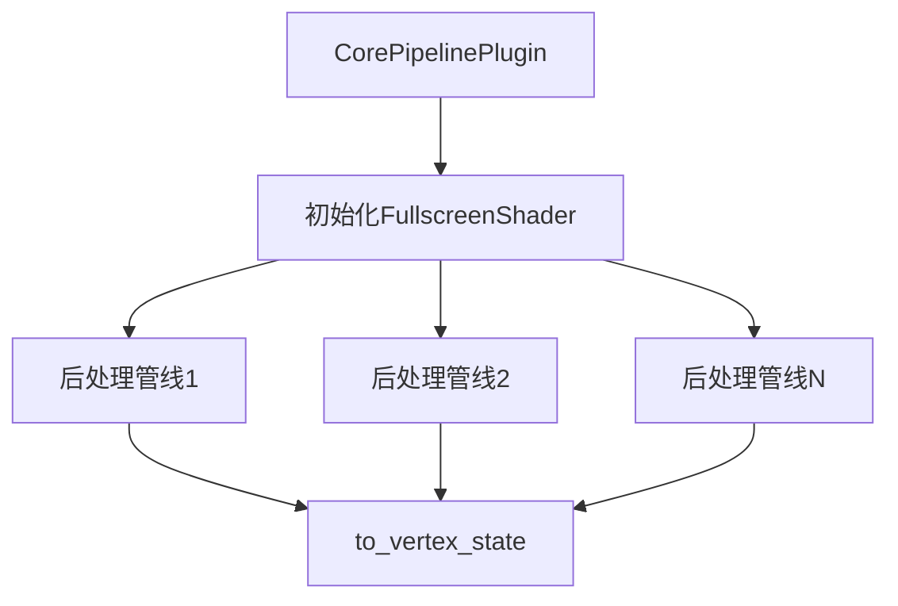

+++
title = "#19426 Replace `FULLSCREEN_SHADER_HANDLE` with a `FullscreenShader` resource."
date = "2025-06-24T00:00:00"
draft = false
template = "pull_request_page.html"
in_search_index = false

[extra]
current_language = "zh-cn"
available_languages = {"en" = { name = "English", url = "/pull_request/bevy/2025-06/pr-19426-en-20250624" }, "zh-cn" = { name = "中文", url = "/pull_request/bevy/2025-06/pr-19426-zh-cn-20250624" }}
+++

# 技术分析报告：将 `FULLSCREEN_SHADER_HANDLE` 替换为 `FullscreenShader` 资源

## 基础信息
- **标题**: Replace `FULLSCREEN_SHADER_HANDLE` with a `FullscreenShader` resource.
- **PR 链接**: https://github.com/bevyengine/bevy/pull/19426
- **作者**: andriyDev
- **状态**: MERGED
- **标签**: A-Rendering, A-Assets, S-Ready-For-Final-Review, M-Needs-Migration-Guide, D-Modest
- **创建时间**: 2025-05-29T04:02:10Z
- **合并时间**: 2025-06-24T00:20:36Z
- **合并者**: alice-i-cecile

## 描述翻译
### 目标
- 关联 #19024

### 解决方案
- 移除 `FULLSCREEN_SHADER_HANDLE` 的 `weak_handle`，改用资源持有 shader 句柄
  - 这同时将我们使用的 `load_internal_asset` 改为 `embedded_asset`/`load_embedded_asset`
- 所有使用点都已迁移为克隆 `FullscreenShader` 资源并使用其 `to_vertex_state` 方法

### 测试
- `anti_aliasing` 示例仍然正常工作
- `bloom_3d` 示例仍然正常工作

## 技术实现分析

### 问题背景
Bevy 渲染管线中多个后处理效果（如抗锯齿、Bloom、景深等）需要共享全屏顶点着色器。原始实现使用全局常量 `FULLSCREEN_SHADER_HANDLE` 作为弱句柄（weak handle）引用该着色器。这种设计存在两个主要问题：

1. **资源管理不透明**：弱句柄在资源系统外部创建，绕过了标准资源管理流程
2. **初始化顺序依赖**：弱句柄在资源系统初始化前创建，可能导致未定义行为

### 解决方案
PR 引入 `FullscreenShader` 资源封装全屏着色器，解决上述问题：

```rust
#[derive(Resource, Clone)]
pub struct FullscreenShader(Handle<Shader>);

impl FullscreenShader {
    pub fn to_vertex_state(&self) -> VertexState {
        VertexState {
            shader: self.0.clone(),
            shader_defs: Vec::new(),
            entry_point: "fullscreen_vertex_shader".into(),
            buffers: Vec::new(),
        }
    }
}
```

关键变更点：
1. 移除全局弱句柄 `FULLSCREEN_SHADER_HANDLE`
2. 将着色器加载方式改为 `embedded_asset`
3. 在 `CorePipelinePlugin` 中初始化资源
4. 所有使用点改为克隆资源并调用 `to_vertex_state`

### 实现细节
**资源初始化** 在插件中完成：
```rust
// crates/bevy_core_pipeline/src/lib.rs
fn build(&self, app: &mut App) {
    embedded_asset!(app, "fullscreen_vertex_shader/fullscreen.wgsl");
    app.init_resource::<FullscreenShader>();
}

fn finish(&self, app: &mut App) {
    render_app.init_resource::<FullscreenShader>();
}
```

**迁移案例** 所有后处理管线适配新模式：
```diff
// Before:
vertex: fullscreen_shader_vertex_state()

// After:
struct MyPipeline {
    fullscreen_shader: FullscreenShader,
}

impl FromWorld for MyPipeline {
    fn from_world(render_world: &mut World) -> Self {
        Self {
            fullscreen_shader: render_world.resource::<FullscreenShader>().clone(),
        }
    }
}

vertex: self.fullscreen_shader.to_vertex_state()
```

### 技术优势
1. **显式资源管理**：通过标准资源系统管理着色器生命周期
2. **初始化安全**：确保着色器在资源系统准备就绪后加载
3. **API 一致性**：与其他资源使用模式保持一致
4. **可扩展性**：为未来添加元数据（如变体）预留空间

### 影响范围
变更影响 18 个文件，主要涉及：
- 抗锯齿效果（FXAA、TAA、CAS）
- Bloom 效果
- 景深（DoF）
- 色调映射（Tonemapping）
- 屏幕空间反射（SSR）
- 自定义后处理示例

## 组件关系图



## 关键文件变更

### 1. 全屏着色器资源实现
**文件**: `crates/bevy_core_pipeline/src/fullscreen_vertex_shader/mod.rs`  
重构全屏着色器为资源类型：
```diff
- pub const FULLSCREEN_SHADER_HANDLE: Handle<Shader> = 
-     weak_handle!("481fb759-d0b1-4175-8319-c439acde30a2");

- pub fn fullscreen_shader_vertex_state() -> VertexState {
-     VertexState {
-         shader: FULLSCREEN_SHADER_HANDLE,
-         ...
-     }
- }

+ #[derive(Resource, Clone)]
+ pub struct FullscreenShader(Handle<Shader>);
+
+ impl FullscreenShader {
+     pub fn to_vertex_state(&self) -> VertexState {
+         VertexState {
+             shader: self.0.clone(),
+             ...
+         }
+     }
+ }
```

### 2. 插件初始化
**文件**: `crates/bevy_core_pipeline/src/lib.rs`  
初始化资源并修改资产加载方式：
```diff
 fn build(&self, app: &mut App) {
-    load_internal_asset!(...);
+    embedded_asset!(app, "fullscreen_vertex_shader/fullscreen.wgsl");
+    app.init_resource::<FullscreenShader>();
 }

 fn finish(&self, app: &mut App) {
+    render_app.init_resource::<FullscreenShader>();
 }
```

### 3. Bloom 管线适配
**文件**: `crates/bevy_core_pipeline/src/bloom/downsampling_pipeline.rs`  
典型迁移案例：
```diff
 pub struct BloomDownsamplingPipeline {
-    pub shader: Handle<Shader>,
+    pub fullscreen_shader: FullscreenShader,
+    pub fragment_shader: Handle<Shader>,
 }

 impl FromWorld for BloomDownsamplingPipeline {
     fn from_world(world: &mut World) -> Self {
         BloomDownsamplingPipeline {
-            shader: load_embedded_asset!(world, "bloom.wgsl"),
+            fullscreen_shader: world.resource::<FullscreenShader>().clone(),
+            fragment_shader: load_embedded_asset!(world, "bloom.wgsl"),
         }
     }
 }

 fn specialize() {
     vertex: self.fullscreen_shader.to_vertex_state()
 }
```

### 4. 迁移指南
**文件**: `release-content/migration-guides/fullscreen_shader_resource.md`  
新增迁移文档：
```markdown
## `FULLSCREEN_SHADER_HANDLE` 替换为 `FullscreenShader`

迁移步骤：
1. 在管线结构中添加字段：`fullscreen_shader: FullscreenShader`
2. 在 FromWorld 实现中克隆资源
3. 替换 `fullscreen_shader_vertex_state()` 为 `self.fullscreen_shader.to_vertex_state()`

示例：
struct MyPipeline {
    fullscreen_shader: FullscreenShader,
}

impl FromWorld for MyPipeline {
    fn from_world(render_world: &mut World) -> Self {
        Self {
            fullscreen_shader: render_world.resource::<FullscreenShader>().clone(),
        }
    }
}
```

## 延伸阅读
1. [Bevy 资源系统文档](https://bevyengine.org/learn/book/next/features/assets)
2. [WGSL 着色器规范](https://gpuweb.github.io/gpuweb/wgsl/)
3. [渲染管线最佳实践](https://github.com/bevyengine/bevy/blob/main/docs/plugins_guidelines.md#rendering-plugins)
4. [嵌入式资源使用示例](https://github.com/bevyengine/bevy/blob/latest/examples/shader/shader_instancing.rs)