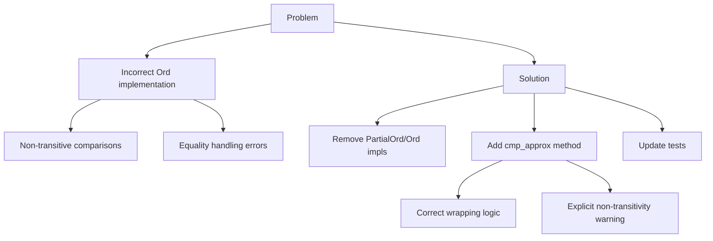

+++
title = "#19432 Replace (`Partial`)`Ord` for `EntityGeneration` with corrected standalone method"
date = "2025-06-07T00:00:00"
draft = false
template = "pull_request_page.html"
in_search_index = true

[taxonomies]
list_display = ["show"]

[extra]
current_language = "en"
available_languages = {"en" = { name = "English", url = "/pull_request/bevy/2025-06/pr-19432-en-20250607" }, "zh-cn" = { name = "中文", url = "/pull_request/bevy/2025-06/pr-19432-zh-cn-20250607" }}
labels = ["C-Bug", "A-ECS"]
+++

# Replace (`Partial`)`Ord` for `EntityGeneration` with corrected standalone method

## Basic Information
- **Title**: Replace (`Partial`)`Ord` for `EntityGeneration` with corrected standalone method
- **PR Link**: https://github.com/bevyengine/bevy/pull/19432
- **Author**: urben1680
- **Status**: MERGED
- **Labels**: C-Bug, A-ECS, S-Ready-For-Final-Review
- **Created**: 2025-05-29T16:17:12Z
- **Merged**: 2025-06-07T22:46:26Z
- **Merged By**: alice-i-cecile

## Description Translation
# Objective

#19421 implemented `Ord` for `EntityGeneration` along the lines of [the impl from slotmap](https://docs.rs/slotmap/latest/src/slotmap/util.rs.html#8):
```rs
/// Returns if a is an older version than b, taking into account wrapping of
/// versions.
pub fn is_older_version(a: u32, b: u32) -> bool {
    let diff = a.wrapping_sub(b);
    diff >= (1 << 31)
}
```

But that PR and the slotmap impl are different:

**slotmap impl**
- if `(1u32 << 31)` is greater than `a.wrapping_sub(b)`, then `a` is older than `b`
- if `(1u32 << 31)` is equal to `a.wrapping_sub(b)`, then `a` is older than `b`
- if `(1u32 << 31)` is less than `a.wrapping_sub(b)`, then `a` is equal or newer than `b`

**previous PR impl**
- if `(1u32 << 31)` is greater than `a.wrapping_sub(b)`, then `a` is older than `b`
- if `(1u32 << 31)` is equal to `a.wrapping_sub(b)`, then `a` is equal to `b` :warning: 
- if `(1u32 << 31)` is less than `a.wrapping_sub(b)`, then `a` is newer than `b` :warning: 

This ordering is also not transitive, therefore it should not implement `PartialOrd`.

## Solution

Fix the impl in a standalone method, remove the `Partialord`/`Ord` implementation.

## Testing

Given the first impl was wrong and got past reviews, I think a new unit test is justified.

## The Story of This Pull Request

This PR addresses a critical issue in Bevy's ECS implementation where the `PartialOrd` and `Ord` implementations for `EntityGeneration` were fundamentally flawed. The problem stemmed from an incorrect comparison algorithm that didn't properly handle generation counter wrapping, leading to inconsistent ordering results. 

The original implementation (#19421) attempted to adapt a version comparison approach from the slotmap crate, but introduced two key errors:
1. It incorrectly handled equality cases when the difference between generations was exactly `1 << 31`
2. The comparison logic was non-transitive, violating the mathematical properties required for total ordering

These issues manifested as incorrect ordering results in specific edge cases, particularly when comparing generations with large differences. The non-transitivity was especially problematic since it could lead to inconsistent sorting results when comparing multiple generations.

The solution involves:
1. Removing the `PartialOrd` and `Ord` implementations entirely since they provided incorrect guarantees
2. Introducing a new `cmp_approx()` method with corrected comparison logic
3. Adding comprehensive tests to verify the new behavior

The new `cmp_approx()` method uses a three-way comparison that properly handles wrapping:
```rust
match self.0.wrapping_sub(other.0) {
    0 => Ordering::Equal,
    1..Self::DIFF_MAX => Ordering::Greater,
    _ => Ordering::Less,
}
```
This aligns with the slotmap's approach while fixing the equality handling. The method is explicitly documented as approximate since it remains non-transitive for large generation differences - a necessary trade-off given the wrapping behavior of 32-bit counters.

All existing tests that relied on generation comparisons were updated to use `cmp_approx().is_gt()` instead of the `>` operator. The PR also adds a new dedicated test `entity_generation_is_approximately_ordered()` that verifies the comparison logic across various edge cases, including:
- Direct successor comparisons
- Comparisons across the wrapping boundary
- Equal generation checks

The documentation was significantly expanded to clearly explain:
- The limitations of the approximate comparison
- Why total ordering is impossible with wrapping counters
- Concrete examples of both correct and incorrect comparison results

## Visual Representation



## Key Files Changed

### `crates/bevy_ecs/src/entity/mod.rs`
- Removed `PartialOrd` and `Ord` implementations due to incorrect behavior
- Added `DIFF_MAX` constant for comparison threshold
- Implemented `cmp_approx()` method with correct wrapping logic
- Added detailed documentation about comparison limitations
- Introduced comprehensive test for generation ordering

**Key Changes:**
```rust
// Before:
impl PartialOrd for EntityGeneration {
    fn partial_cmp(&self, other: &Self) -> Option<core::cmp::Ordering> {
        Some(self.cmp(other))
    }
}

impl Ord for EntityGeneration {
    fn cmp(&self, other: &Self) -> core::cmp::Ordering {
        let diff = self.0.wrapping_sub(other.0);
        (1u32 << 31).cmp(&diff)
    }
}

// After:
impl EntityGeneration {
    const DIFF_MAX: u32 = 1u32 << 31;

    pub const fn cmp_approx(&self, other: &Self) -> core::cmp::Ordering {
        use core::cmp::Ordering;
        match self.0.wrapping_sub(other.0) {
            0 => Ordering::Equal,
            1..Self::DIFF_MAX => Ordering::Greater,
            _ => Ordering::Less,
        }
    }
}
```

### `crates/bevy_ecs/src/entity/map_entities.rs`
- Updated test assertions to use `cmp_approx()` instead of relational operators
- Maintained test intent while using the new comparison method

**Key Changes:**
```rust
// Before:
assert!(entity.generation() > dead_ref.generation());

// After:
assert!(entity
    .generation()
    .cmp_approx(&dead_ref.generation())
    .is_gt());
```

## Further Reading
- [Slotmap's version comparison implementation](https://docs.rs/slotmap/latest/src/slotmap/util.rs.html#8)
- [Rust Ord trait documentation](https://doc.rust-lang.org/std/cmp/trait.Ord.html)
- [Transitive relation definition](https://en.wikipedia.org/wiki/Transitive_relation)
- [Integer overflow and wrapping semantics](https://doc.rust-lang.org/book/ch03-02-data-types.html#integer-overflow)