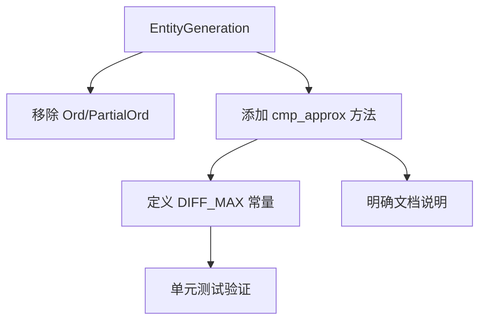

+++
title = "#19432 Replace (`Partial`)`Ord` for `EntityGeneration` with corrected standalone method"
date = "2025-06-07T00:00:00"
draft = false
template = "pull_request_page.html"
in_search_index = false

[extra]
current_language = "zh-cn"
available_languages = {"en" = { name = "English", url = "/pull_request/bevy/2025-06/pr-19432-en-20250607" }, "zh-cn" = { name = "中文", url = "/pull_request/bevy/2025-06/pr-19432-zh-cn-20250607" }}
+++

## 基本资讯
- **标题**: Replace (`Partial`)`Ord` for `EntityGeneration` with corrected standalone method
- **PR 链接**: https://github.com/bevyengine/bevy/pull/19432
- **作者**: urben1680
- **状态**: 已合并
- **标签**: C-Bug, A-ECS, S-Ready-For-Final-Review
- **创建时间**: 2025-05-29T16:17:12Z
- **合并时间**: 2025-06-07T22:46:26Z
- **合并者**: alice-i-cecile

## 描述翻译
### Objective(目标)
#19421 基于 [slotmap 的实现](https://docs.rs/slotmap/latest/src/slotmap/util.rs.html#8) 为 `EntityGeneration` 实现了 `Ord`：
```rs
/// 返回 a 是否是比 b 更旧的版本，考虑版本回绕
pub fn is_older_version(a: u32, b: u32) -> bool {
    let diff = a.wrapping_sub(b);
    diff >= (1 << 31)
}
```

但该 PR 和 slotmap 的实现不同：

**slotmap 实现**
- 如果 `(1u32 << 31)` 大于 `a.wrapping_sub(b)`，则 `a` 比 `b` 旧
- 如果 `(1u32 << 31)` 等于 `a.wrapping_sub(b)`，则 `a` 比 `b` 旧
- 如果 `(1u32 << 31)` 小于 `a.wrapping_sub(b)`，则 `a` 等于或新于 `b`

**先前 PR 实现**
- 如果 `(1u32 << 31)` 大于 `a.wrapping_sub(b)`，则 `a` 比 `b` 旧
- 如果 `(1u32 << 31)` 等于 `a.wrapping_sub(b)`，则 `a` 等于 `b` :warning: 
- 如果 `(1u32 << 31)` 小于 `a.wrapping_sub(b)`，则 `a` 新于 `b` :warning: 

此排序不满足传递性(transitive)，因此不应实现 `PartialOrd`。

### Solution(解决方案)
在独立方法中修复实现，移除 `Partialord`/`Ord` 实现。

### Testing(测试)
鉴于初始实现有误但通过了评审，新增单元测试是合理的。

## 技术分析报告

### 问题背景
在 ECS 实体管理中，`EntityGeneration` 用于追踪实体版本的代际编号。PR #19421 尝试基于 slotmap 的实现为其添加排序能力，但存在关键差异：
1. 边界条件处理错误：当差值等于 `1 << 31` 时错误返回相等
2. 排序逻辑不满足传递性要求
3. 错误实现了 `Ord`/`PartialOrd` trait

```rust
// 问题实现
impl Ord for EntityGeneration {
    fn cmp(&self, other: &Self) -> core::cmp::Ordering {
        let diff = self.0.wrapping_sub(other.0);
        (1u32 << 31).cmp(&diff)  // 错误处理边界条件
    }
}
```

### 解决方案
开发者采取了以下修复措施：
1. 完全移除 `PartialOrd` 和 `Ord` trait 实现
2. 引入独立方法 `cmp_approx()` 提供近似排序
3. 明确定义排序的局限性
4. 添加针对性单元测试

```rust
// 修复后的实现
impl EntityGeneration {
    const DIFF_MAX: u32 = 1u32 << 31;

    #[inline]
    pub const fn cmp_approx(&self, other: &Self) -> core::cmp::Ordering {
        use core::cmp::Ordering;
        match self.0.wrapping_sub(other.0) {
            0 => Ordering::Equal,
            1..Self::DIFF_MAX => Ordering::Greater,  // 正确处理差值范围
            _ => Ordering::Less,
        }
    }
}
```

### 技术决策
1. **移除 trait 实现**：由于代际编号回绕(wrapping)特性，全局排序在数学上不可能实现
2. **明确命名 `cmp_approx`**：强调其近似排序特性，防止误用
3. **常量 DIFF_MAX**：明确定义有效比较范围 (2³¹)
4. **文档强化**：通过示例代码明确说明有效范围和局限性

```rust
/// 示例说明非传递性限制
/// ```should_panic
/// let later_generation = ...;
/// let much_later_generation = ...;
/// assert_eq!(FIRST.cmp_approx(&later_generation), Ordering::Less);
/// assert_eq!(later_generation.cmp_approx(&much_later_generation), Ordering::Less);
/// assert_eq!(FIRST.cmp_approx(&much_later_generation), Ordering::Less); // 此断言会失败!
/// ```
```

### 影响分析
1. **正确性提升**：修复了边界条件判断错误
2. **API 安全**：防止了误用非传递性排序
3. **测试覆盖**：新增测试验证多代际场景
4. **调用点更新**：所有依赖点更新为显式方法调用

```rust
// 调用点更新示例
assert!(entity.generation()
    .cmp_approx(&dead_ref.generation())
    .is_gt());
```

### 技术洞察
1. **代际回绕处理**：32 位代际编号在溢出时回绕是核心挑战
2. **近似排序范围**：有效比较窗口为 [current, current + 2³¹ -1]
3. **非传递性本质**：超出 DIFF_MAX 时排序结果不可靠
4. **显式优于隐式**：独立方法比 trait 实现更能表达语义约束

## 关键文件变更

### crates/bevy_ecs/src/entity/mod.rs
1. 移除 `PartialOrd` 和 `Ord` trait 实现
2. 添加 `cmp_approx` 方法和相关文档
3. 定义常量 `DIFF_MAX = 1u32 << 31`
4. 添加单元测试 `entity_generation_is_approximately_ordered`

```diff
 impl EntityGeneration {
+    const DIFF_MAX: u32 = 1u32 << 31;
-impl PartialOrd for EntityGeneration {
-    fn partial_cmp(&self, other: &Self) -> Option<core::cmp::Ordering> {
-        Some(self.cmp(other))
-    }
-}
-
-impl Ord for EntityGeneration {
-    fn cmp(&self, other: &Self) -> core::cmp::Ordering {
-        let diff = self.0.wrapping_sub(other.0);
-        (1u32 << 31).cmp(&diff)
+
+    #[inline]
+    pub const fn cmp_approx(&self, other: &Self) -> core::cmp::Ordering {
+        use core::cmp::Ordering;
+        match self.0.wrapping_sub(other.0) {
+            0 => Ordering::Equal,
+            1..Self::DIFF_MAX => Ordering::Greater,
+            _ => Ordering::Less,
+        }
     }
 }
```

### crates/bevy_ecs/src/entity/map_entities.rs
1. 更新测试用例使用 `cmp_approx()`
2. 替换原来的代际比较操作符

```diff
-        assert!(entity.generation() > dead_ref.generation());
+        assert!(entity
+            .generation()
+            .cmp_approx(&dead_ref.generation())
+            .is_gt());
```

## 图示关系



## 延伸阅读
1. [实体组件系统模式](https://en.wikipedia.org/wiki/Entity_component_system)
2. [Rust 的 trait 设计指南](https://rust-lang.github.io/api-guidelines/interoperability.html)
3. [整数溢出语义](https://doc.rust-lang.org/book/ch03-02-data-types.html#integer-overflow)
4. [Slotmap 代际索引设计](https://docs.rs/slotmap/latest/slotmap/#indices)