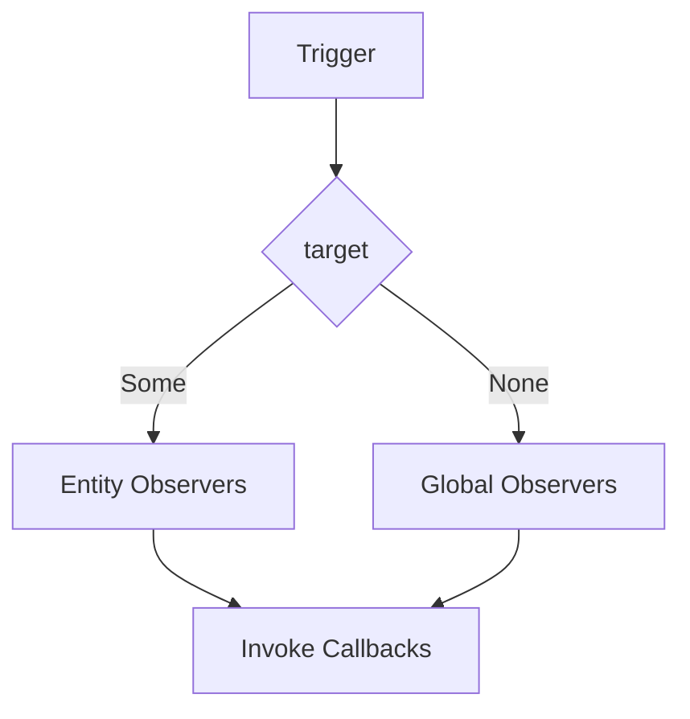

+++
title = "#19440 Remove entity placeholder from observers"
date = "2025-06-09T00:00:00"
draft = false
template = "pull_request_page.html"
in_search_index = false

[extra]
current_language = "zh-cn"
available_languages = {"en" = { name = "English", url = "/pull_request/bevy/2025-06/pr-19440-en-20250609" }, "zh-cn" = { name = "中文", url = "/pull_request/bevy/2025-06/pr-19440-zh-cn-20250609" }}
labels = ["A-ECS", "C-Code-Quality", "D-Straightforward"]
+++

# Remove entity placeholder from observers

## Basic Information
- **Title**: Remove entity placeholder from observers
- **PR Link**: https://github.com/bevyengine/bevy/pull/19440
- **Author**: ElliottjPierce
- **Status**: MERGED
- **Labels**: A-ECS, C-Code-Quality, S-Ready-For-Final-Review, M-Needs-Migration-Guide, D-Straightforward
- **Created**: 2025-05-30T16:01:38Z
- **Merged**: 2025-06-09T19:58:03Z
- **Merged By**: alice-i-cecile

## Description Translation
### 目标
`Entity::PLACEHOLDER` 作为一个魔法值(magic number)，虽然理论上可能永远不会真实存在，但确实有可能出现。同时 `Entity` 类型有内存布局优化(niche)，使用 `PLACEHOLDER` 本质上是用逻辑风险换取安全风险的 `MaybeUninit` 替代方案。

Bevy 通常建议避免使用 `PLACEHOLDER`，但内部仍大量使用。本 PR 开始移除其内部使用，从观察者系统(observers)入手。

### 解决方案
将所有触发器目标(trigger target)相关类型从 `Entity` 改为 `Option<Entity>`

将提供小型迁移指南。

### 测试
通过 CI

### 后续工作
该修改将大量代码从：
```rust
trigger.target()
```
改为：
```rust
trigger.target().unwrap()
```

额外的 panic 并不比之前更糟糕；只是比将 placeholder 传递给其他逻辑后再 panic 更早触发。

但这有些烦人。未来考虑添加 `TriggerMode` 或类似机制到 `Event` 类型，以限制事件可使用的目标类型。例如 `Removed` 等事件总是带目标触发，可为它们提供直接获取 `Some` 的快捷方式。

## The Story of This Pull Request

### 问题背景
Bevy 的观察者系统使用 `Entity::PLACEHOLDER` 表示全局触发器(global triggers)，但存在两个核心问题：
1. `PLACEHOLDER` 作为魔法值(0xFFFFFFFF)可能与真实实体冲突
2. `Entity` 类型本身有内存优化(niche)，使用魔法值违反类型安全约定

实体 ID 使用非零优化(non-zero optimization)，0 是非法值。`PLACEHOLDER` 使用全 1 的位模式，虽在实践中不可能生成，但理论上存在冲突风险。这种设计相当于用 `MaybeUninit` 的逻辑风险替代内存安全风险。

### 解决方案
将触发器目标类型统一改为 `Option<Entity>`：
- `Some(entity)` 表示实体关联的触发器
- `None` 表示全局触发器

这消除了魔法值的使用，使空目标状态显式化。修改涉及三个层面：
1. 观察者触发数据结构(`ObserverTrigger`)
2. 触发器访问接口(`Trigger::target()`)
3. 观察者调用逻辑(`Observers::invoke()`)

### 实现细节
**核心结构变更**：
```rust
// crates/bevy_ecs/src/observer/mod.rs
pub struct ObserverTrigger {
    pub target: Option<Entity>, // 从 Entity 改为 Option<Entity>
}
```

**接口变更**：
```rust
impl<'w, E, B: Bundle> Trigger<'w, E, B> {
    pub fn target(&self) -> Option<Entity> { // 返回类型改为 Option
        self.trigger.target
    }
}
```

**调用逻辑调整**：
```rust
// crates/bevy_ecs/src/observer/mod.rs
if let Some(target_entity) = target {
    // 仅当目标存在时处理实体观察者
    if let Some(map) = observers.entity_observers.get(&target_entity) {
        map.iter().for_each(&mut trigger_observer);
    }
}
```

**传播逻辑优化**：
```rust
// crates/bevy_ecs/src/world/deferred_world.rs
let Some(mut target) = target else { return }; // 提前处理None情况
loop {
    // 观察者调用...
    if !propagate { return } // 简化控制流
}
```

### 影响分析
1. **正确性提升**：消除魔法值使用，避免潜在ID冲突
2. **代码清晰度**：空目标状态显式表达，减少隐式约定
3. **用户影响**：所有观察者回调需调整：
   - 检查 `target()` 返回的 `Option`
   - 或使用 `unwrap()` 明确处理缺失情况
4. **性能**：无显著变化，`Option<Entity>` 与原始 `Entity` 内存布局相同

### 迁移策略
1. 原检查 `Entity::PLACEHOLDER` 的代码改为检查 `None`
2. 原直接使用目标实体的代码改为 `unwrap()` 或 `if let`
3. 全局触发器回调现在收到 `None` 而非占位符

## Visual Representation



## Key Files Changed

### `crates/bevy_ecs/src/observer/mod.rs` (+17/-17)
**变更描述**：重构观察者核心逻辑，用 `Option<Entity>` 替代 `Entity::PLACEHOLDER`  
**关键代码**：
```rust
// Before:
pub fn target(&self) -> Entity {
    self.trigger.target
}

// After:
pub fn target(&self) -> Option<Entity> {
    self.trigger.target
}
```
**关联性**：定义观察者触发器的核心接口变更

### `crates/bevy_ecs/src/world/deferred_world.rs` (+26/-15)
**变更描述**：优化触发器传播逻辑，明确处理空目标  
**关键代码**：
```rust
// 新增None的提前返回
let Some(mut target) = target else { return };

// 重构传播循环
loop {
    // 调用观察者...
    if !propagate { return }
}
```
**关联性**：确保实体触发器传播仅在目标存在时进行

### `examples/ecs/observers.rs` (+9/-5)
**变更描述**：更新示例代码适配新接口  
**关键代码**：
```rust
// Before:
index.map.entry(tile).or_default().insert(trigger.target());

// After:
index.map.entry(tile).or_default().insert(trigger.target().unwrap());
```
**关联性**：演示正确迁移模式

### `crates/bevy_ecs/src/bundle.rs` (+8/-8)
**变更描述**：更新组件操作时的观察者触发调用  
**关键代码**：
```rust
// 所有触发调用点添加Some包装
deferred_world.trigger_observers(ON_ADD, Some(entity), ...);
```
**关联性**：确保组件变更正确触发关联观察者

### `crates/bevy_ecs/src/world/entity_ref.rs` (+7/-5)
**变更描述**：更新实体操作时的观察者触发  
**关键代码**：
```rust
// 反生成时触发逻辑
deferred_world.trigger_observers(ON_DESPAWN, Some(self.entity), ...);
```
**关联性**：保证实体生命周期事件正确触发观察者

## Further Reading
1. [Rust 的 Option 类型文档](https://doc.rust-lang.org/std/option/enum.Option.html)
2. [Bevy ECS 观察者系统介绍](https://bevyengine.org/learn/book/events/observers/)
3. [实体 ID 内存布局优化](https://github.com/rust-lang/rust/issues/102091)