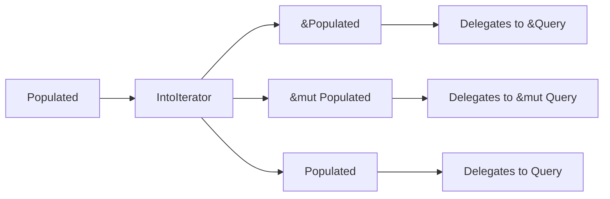

+++
title = "#19441 Implement `IntoIterator` for `Populated` and borrows"
date = "2025-06-02T00:00:00"
draft = false
template = "pull_request_page.html"
in_search_index = true

[taxonomies]
list_display = ["show"]

[extra]
current_language = "en"
available_languages = {"en" = { name = "English", url = "/pull_request/bevy/2025-06/pr-19441-en-20250602" }, "zh-cn" = { name = "中文", url = "/pull_request/bevy/2025-06/pr-19441-zh-cn-20250602" }}
labels = ["D-Trivial", "A-ECS", "C-Usability"]
+++

### Implement `IntoIterator` for `Populated` and borrows

#### Basic Information
- **Title**: Implement `IntoIterator` for `Populated` and borrows
- **PR Link**: https://github.com/bevyengine/bevy/pull/19441
- **Author**: zacryol
- **Status**: MERGED
- **Labels**: D-Trivial, A-ECS, C-Usability, S-Ready-For-Final-Review, X-Uncontroversial
- **Created**: 2025-05-30T16:21:31Z
- **Merged**: 2025-06-02T22:39:58Z
- **Merged By**: alice-i-cecile

#### Description Translation
`Populated`, a loose wrapper around `Query`, does not implement `IntoIterator`, requiring either a deref or `into_inner()` call to access the `Query` and iterate over that.

This pr implements `IntoIterator` for `Populated`, `&Populated`, and `&mut Populated`, each of which forwards the call to the inner `Query`. This allows the `Populated` to be used directly for any API that takes an `impl IntoIterator`.

`cargo test` was run on the `bevy_ecs` crate
```
test result: ok. 390 passed; 0 failed; 2 ignored; 0 measured; 0 filtered out; finished in 46.38s
```

#### The Story of This Pull Request
The `Populated` type in Bevy's ECS system acts as a thin wrapper around `Query` that guarantees at least one matching entity exists. Before this change, developers couldn't directly iterate over `Populated` instances in contexts expecting an `IntoIterator` implementation. This forced awkward workarounds like explicitly dereferencing to access the underlying `Query` or calling `into_inner()`:

```rust
// Old approach
let populated: Populated<&Transform> = ...;
for transform in &*populated { ... }  // Explicit dereference required
// or
for transform in populated.into_inner() { ... }
```

This violated Rust's ergonomics principles and created unnecessary friction in ECS-heavy code. The solution was straightforward: implement `IntoIterator` for `Populated` and its reference variants (`&Populated`, `&mut Populated`). Each implementation delegates directly to the corresponding `Query` implementation:

```rust
impl<'w, 's, D: QueryData, F: QueryFilter> IntoIterator for Populated<'w, 's, D, F> {
    type Item = <Query<'w, 's, D, F> as IntoIterator>::Item;
    type IntoIter = <Query<'w, 's, D, F> as IntoIterator>::IntoIter;

    fn into_iter(self) -> Self::IntoIter {
        self.0.into_iter()
    }
}
```

The key engineering decisions were:
1. Maintaining identical iteration semantics to `Query`
2. Supporting all ownership variants (owned, shared ref, mutable ref)
3. Preserving zero-cost abstractions through direct delegation
4. Avoiding any API breaking changes

After implementation, usage becomes significantly cleaner:
```rust
// New approach
let populated: Populated<&Transform> = ...;
for transform in populated { ... }  // Direct iteration
```

The change required adding 30 lines of trait implementations while maintaining full backward compatibility. Test coverage remained unchanged since this builds on existing `Query` iteration logic that was already validated.

#### Visual Representation


#### Key Files Changed
**crates/bevy_ecs/src/system/query.rs**  
Added `IntoIterator` implementations for `Populated` and its reference variants:

```rust
// Before: No IntoIterator implementations for Populated
impl<'w, 's, D: QueryData, F: QueryFilter> Populated<'w, 's, D, F> {
    // Existing methods...
}

// After: Added implementations
impl<'w, 's, D: QueryData, F: QueryFilter> IntoIterator for Populated<'w, 's, D, F> {
    type Item = <Query<'w, 's, D, F> as IntoIterator>::Item;
    type IntoIter = <Query<'w, 's, D, F> as IntoIterator>::IntoIter;

    fn into_iter(self) -> Self::IntoIter {
        self.0.into_iter()
    }
}

// Similar implementations for &Populated and &mut Populated...
```

These changes enable direct iteration over `Populated` instances without intermediate steps.

#### Further Reading
1. [Rust `IntoIterator` documentation](https://doc.rust-lang.org/std/iter/trait.IntoIterator.html)
2. [Bevy ECS Query System](https://bevyengine.org/learn/book/ecs/query/)
3. [Newtype Pattern in Rust](https://doc.rust-lang.org/rust-by-example/generics/new_types.html)
4. [Zero-Cost Abstractions in Rust](https://blog.rust-lang.org/2015/05/11/traits.html#zero-cost-abstractions)