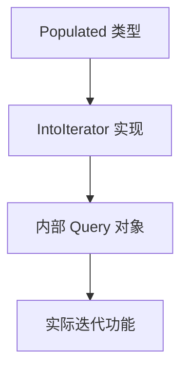

+++
title = "#19441 Implement `IntoIterator` for `Populated` and borrows"
date = "2025-06-02T00:00:00"
draft = false
template = "pull_request_page.html"
in_search_index = false

[extra]
current_language = "zh-cn"
available_languages = {"en" = { name = "English", url = "/pull_request/bevy/2025-06/pr-19441-en-20250602" }, "zh-cn" = { name = "中文", url = "/pull_request/bevy/2025-06/pr-19441-zh-cn-20250602" }}
+++

## 标题
实现 `Populated` 及其引用的 `IntoIterator` 支持

## 基本信息
- **标题**: Implement `IntoIterator` for `Populated` and borrows
- **PR 链接**: https://github.com/bevyengine/bevy/pull/19441
- **作者**: zacryol
- **状态**: MERGED
- **标签**: D-Trivial, A-ECS, C-Usability, S-Ready-For-Final-Review, X-Uncontroversial
- **创建时间**: 2025-05-30T16:21:31Z
- **合并时间**: 2025-06-02T22:39:58Z
- **合并者**: alice-i-cecile

## 描述翻译
### 目标
`Populated` 作为 `Query` 的轻量级包装器，没有实现 `IntoIterator` 接口。开发者需要先通过解引用或调用 `into_inner()` 方法访问内部的 `Query` 才能进行迭代操作。

### 解决方案
本 PR 为 `Populated`、`&Populated` 和 `&mut Populated` 实现了 `IntoIterator` 接口，每个实现都将迭代调用转发给内部的 `Query`。这使得 `Populated` 能直接用于任何接受 `impl IntoIterator` 参数的 API。

### 测试
在 `bevy_ecs` crate 上运行了 `cargo test`：
```
test result: ok. 390 passed; 0 failed; 2 ignored; 0 measured; 0 filtered out; finished in 46.38s
```

## PR 技术分析

### 问题背景
在 Bevy 的 ECS 系统中，`Populated` 结构体用于包装 `Query` 并保证查询结果非空。但原始实现存在一个可用性缺陷：开发者无法直接迭代 `Populated` 实例。典型的使用模式需要额外步骤：
```rust
// 旧用法示例
for item in populated_query.into_inner() { ... }
// 或
for item in &*populated_query { ... }
```
这种设计违背了 Rust 的迭代习惯用法，增加了不必要的认知负担和样板代码。特别是在需要将 `Populated` 传递给接受 `impl IntoIterator` 参数的函数时，问题更加明显。

### 解决方案实现
核心改动是为 `Populated` 及其引用类型添加了 `IntoIterator` trait 实现。这些实现将迭代操作直接委托给内部的 `Query` 对象，保持了零开销抽象的原则：
```rust
// 直接为 Populated 实现
impl<'w, 's, D: QueryData, F: QueryFilter> IntoIterator for Populated<'w, 's, D, F> {
    type Item = <Query<'w, 's, D, F> as IntoIterator>::Item;
    type IntoIter = <Query<'w, 's, D, F> as IntoIterator>::IntoIter;

    fn into_iter(self) -> Self::IntoIter {
        self.0.into_iter()  // 直接转发到内部 Query
    }
}

// 为不可变引用实现
impl<'a, 'w, 's, D: QueryData, F: QueryFilter> IntoIterator for &'a Populated<'w, 's, D, F> {
    type Item = <&'a Query<'w, 's, D, F> as IntoIterator>::Item;
    type IntoIter = <&'a Query<'w, 's, D, F> as IntoIterator>::IntoIter;

    fn into_iter(self) -> Self::IntoIter {
        self.deref().into_iter()  // 通过解引用访问内部 Query
    }
}

// 为可变引用实现
impl<'a, 'w, 's, D: QueryData, F: QueryFilter> IntoIterator for &'a mut Populated<'w, 's, D, F> {
    type Item = <&'a mut Query<'w, 's, D, F> as IntoIterator>::Item;
    type IntoIter = <&'a mut Query<'w, 's, D, F> as IntoIterator>::IntoIter;

    fn into_iter(self) -> Self::IntoIter {
        self.deref_mut().into_iter()  // 通过可变解引用访问
    }
}
```

### 技术细节
1. **生命周期处理**：  
   实现中正确处理了 `'w` (world 生命周期)、`'s` (system 生命周期) 和 `'a` (引用生命周期) 的交互，确保内存安全。

2. **类型关联**：  
   `Item` 和 `IntoIter` 类型直接代理自底层 `Query` 的迭代器类型，保持类型系统一致性。

3. **Deref 模式**：  
   引用版本的实现通过 `deref()` 和 `deref_mut()` 访问内部数据，符合 Rust 的智能指针惯例。

4. **零成本抽象**：  
   由于是直接方法转发，编译器可完全内联这些调用，运行时开销为零。

### 影响分析
1. **API 简化**：  
   现在可直接使用标准迭代模式：
   ```rust
   // 新用法示例
   for item in populated_query { ... }
   ```
   
2. **生态兼容性**：  
   可与任何接受 `impl IntoIterator` 参数的 Rust 生态库无缝集成。

3. **一致性提升**：  
   使 `Populated` 的行为与常规 `Query` 保持一致，减少特殊处理。

4. **向后兼容**：  
   完全兼容现有代码，原有 `into_inner()` 和 deref 用法仍有效。

## 关键文件变更
### `crates/bevy_ecs/src/system/query.rs`
**变更说明**：  
为 `Populated` 及其引用类型添加 `IntoIterator` trait 实现，实现迭代功能委托。

**代码变更**：
```diff
@@ -2627,6 +2627,36 @@ impl<'w, 's, D: QueryData, F: QueryFilter> Populated<'w, 's, D, F> {
     }
 }
 
+impl<'w, 's, D: QueryData, F: QueryFilter> IntoIterator for Populated<'w, 's, D, F> {
+    type Item = <Query<'w, 's, D, F> as IntoIterator>::Item;
+
+    type IntoIter = <Query<'w, 's, D, F> as IntoIterator>::IntoIter;
+
+    fn into_iter(self) -> Self::IntoIter {
+        self.0.into_iter()
+    }
+}
+
+impl<'a, 'w, 's, D: QueryData, F: QueryFilter> IntoIterator for &'a Populated<'w, 's, D, F> {
+    type Item = <&'a Query<'w, 's, D, F> as IntoIterator>::Item;
+
+    type IntoIter = <&'a Query<'w, 's, D, F> as IntoIterator>::IntoIter;
+
+    fn into_iter(self) -> Self::IntoIter {
+        self.deref().into_iter()
+    }
+}
+
+impl<'a, 'w, 's, D: QueryData, F: QueryFilter> IntoIterator for &'a mut Populated<'w, 's, D, F> {
+    type Item = <&'a mut Query<'w, 's, D, F> as IntoIterator>::Item;
+
+    type IntoIter = <&'a mut Query<'w, 's, D, F> as IntoIterator>::IntoIter;
+
+    fn into_iter(self) -> Self::IntoIter {
+        self.deref_mut().into_iter()
+    }
+}
+
 #[cfg(test)]
 mod tests {
     use crate::{prelude::*, query::QueryEntityError};
```

## 组件关系


## 延伸阅读
1. [Rust 官方文档 - IntoIterator](https://doc.rust-lang.org/std/iter/trait.IntoIterator.html)  
2. [Bevy ECS 查询系统设计](https://bevyengine.org/learn/book/getting-started/query/)  
3. [Rust 解引用模式详解](https://doc.rust-lang.org/book/ch15-02-deref.html)  
4. [零成本抽象原则](https://blog.rust-lang.org/2015/05/11/traits.html)