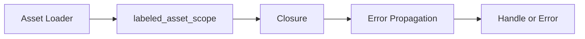

+++
title = "#19449 Allow returning an error from `labeled_asset_scope`."
date = "2025-06-04T00:00:00"
draft = false
template = "pull_request_page.html"
in_search_index = true

[taxonomies]
list_display = ["show"]

[extra]
current_language = "en"
available_languages = {"en" = { name = "English", url = "/pull_request/bevy/2025-06/pr-19449-en-20250604" }, "zh-cn" = { name = "中文", url = "/pull_request/bevy/2025-06/pr-19449-zh-cn-20250604" }}
labels = ["A-Assets", "C-Usability", "D-Straightforward"]
+++

# Analysis of PR #19449: Allow returning an error from `labeled_asset_scope`

## Basic Information
- **Title**: Allow returning an error from `labeled_asset_scope`.
- **PR Link**: https://github.com/bevyengine/bevy/pull/19449
- **Author**: andriyDev
- **Status**: MERGED
- **Labels**: A-Assets, C-Usability, S-Ready-For-Final-Review, M-Needs-Migration-Guide, X-Uncontroversial, D-Straightforward
- **Created**: 2025-05-31T17:51:25Z
- **Merged**: 2025-06-04T00:20:41Z
- **Merged By**: alice-i-cecile

## Description Translation
# Objective

- `LoadContext::labeled_asset_scope` cannot return errors back to the asset loader. This means users that need errors need to fall back to using the raw `begin_labeled_asset` and `add_loaded_labeled_asset`, which is more error-prone.

## Solution

- Allow returning a (generic) error from `labeled_asset_scope`.
- This has the unfortunate side effect that closures which don't return any errors need to A) return Ok at the end, B) need to specify an error type (e.g., `()`).

---

## Showcase

```rust
// impl AssetLoader for MyLoader
let handle = load_context.labeled_asset_scope("MySubasset", |mut load_context| {
  if !some_precondition {
    return Err(ThingsDontMakeSenseError);
  }
  let handle = load_context.add_labeled_asset("MySubasset/Other", SomeOtherThing(456));
  Ok(Something{ id: 123, handle })
})?;
```

## The Story of This Pull Request

The core issue addressed in this PR stems from the limitation in Bevy's asset system where `LoadContext::labeled_asset_scope` couldn't propagate errors back to the caller. This created a significant usability gap for asset loader implementations that needed to handle error conditions during asset creation. Developers were forced to use lower-level methods like `begin_labeled_asset` and `add_loaded_labeled_asset`, which are more error-prone due to requiring manual context management and lacking the scoped convenience of `labeled_asset_scope`.

The solution modifies `labeled_asset_scope` to return a generic `Result<Handle<A>, E>` instead of directly returning `Handle<A>`. This allows the closure to return errors that propagate up through the asset loader system. The implementation adds an error type parameter `E` to the method signature and changes the closure's return type from `A` to `Result<A, E>`. The key technical change is the addition of the `?` operator to propagate errors from the closure:

```rust
let asset = load(&mut context)?;
```

This modification maintains the existing workflow while adding error propagation capabilities. The trade-off is that non-error cases now require explicit `Ok()` wrapping and error type specification (typically `()`). The `add_labeled_asset` method was updated accordingly to use the new error-handling approach while maintaining its previous functionality.

The PR demonstrates the new pattern in Bevy's GLTF loader, where all `labeled_asset_scope` calls were updated to return `Ok(StandardMaterial)` and handle the `Result` with `.unwrap()`. This change affects a substantial portion of the material loading code but doesn't alter its fundamental logic. The migration guide provides clear instructions for updating existing code to the new pattern.

## Visual Representation



## Key Files Changed

### 1. `crates/bevy_asset/src/loader.rs`

**Changes**: Modified `labeled_asset_scope` to support error propagation and updated `add_labeled_asset` to use the new pattern.

**Code Snippets**:

Before:
```rust
pub fn labeled_asset_scope<A: Asset>(
    &mut self,
    label: String,
    load: impl FnOnce(&mut LoadContext) -> A,
) -> Handle<A> {
    let mut context = self.begin_labeled_asset();
    let asset = load(&mut context);
    let loaded_asset = context.finish(asset);
    self.add_loaded_labeled_asset(label, loaded_asset)
}
```

After:
```rust
pub fn labeled_asset_scope<A: Asset, E>(
    &mut self,
    label: String,
    load: impl FnOnce(&mut LoadContext) -> Result<A, E>,
) -> Result<Handle<A>, E> {
    let mut context = self.begin_labeled_asset();
    let asset = load(&mut context)?;
    let loaded_asset = context.finish(asset);
    Ok(self.add_loaded_labeled_asset(label, loaded_asset))
}
```

### 2. `crates/bevy_gltf/src/loader/mod.rs`

**Changes**: Updated all `labeled_asset_scope` calls to use error propagation pattern.

**Code Snippets**:

Before:
```rust
load_context.labeled_asset_scope(material_label.to_string(), |load_context| {
    // ... material creation logic ...
    StandardMaterial { ... }
})
```

After:
```rust
load_context
    .labeled_asset_scope::<_, ()>(material_label.to_string(), |load_context| {
        // ... material creation logic ...
        Ok(StandardMaterial { ... })
    })
    .unwrap()
```

### 3. `release-content/migration-guides/labeled_asset_scope_errors.md`

**Changes**: Added migration guide explaining the change and required updates.

**Code Snippets**:
```markdown
`labeled_asset_scope` now returns a user-specified error type based on their closure. Previously,
users would need to fall back to `begin_labeled_asset` and `add_loaded_labeled_asset` to handle
errors, which is more error-prone. Consider migrating to use `labeled_asset_scope` if this was you!

However, `labeled_asset_scope` closures that don't return errors now needs to A) return Ok, and B)
specify an error type.

If your code previously looked like this:

```rust
labeled_asset_scope(label, |mut load_context| {
  let my_asset = ...;

  my_asset
});
```

You can migrate it to:

```rust
labeled_asset_scope::<_, ()>(label, |mut load_context| {
  let my_asset = ...;

  Ok(my_asset)
}).unwrap();
```

## Further Reading
- [Bevy Asset System Documentation](https://bevyengine.org/learn/book/assets/)
- [Rust Error Handling](https://doc.rust-lang.org/book/ch09-00-error-handling.html)
- [GLTF Material Specification](https://registry.khronos.org/glTF/specs/2.0/glTF-2.0.html#materials)