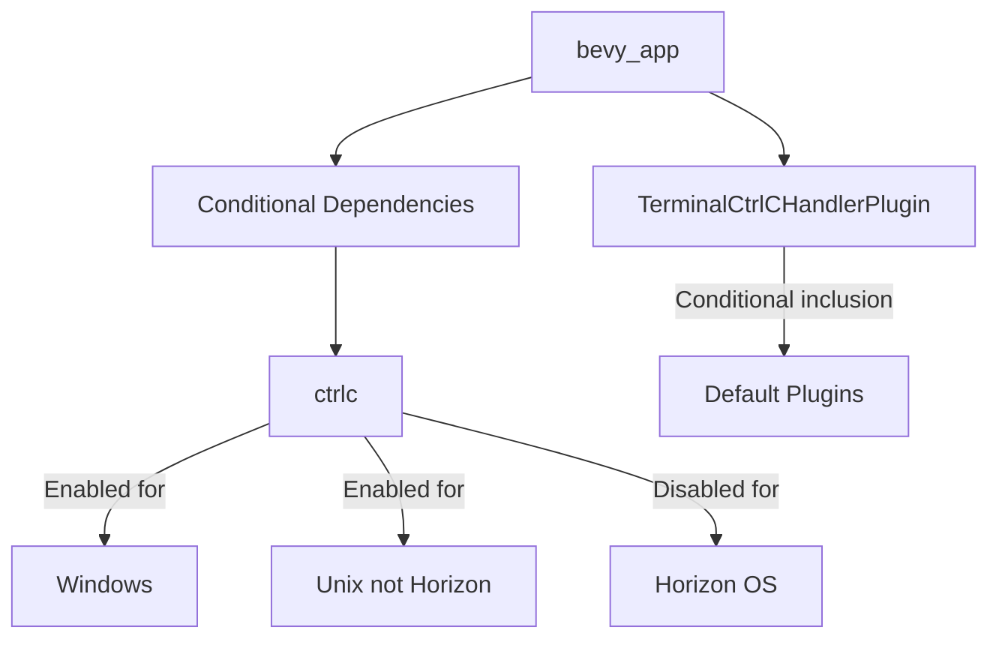

+++
title = "#19453 Exclude `ctrlc` from `bevy_app` for the Nintendo 3DS"
date = "2025-06-02T00:00:00"
draft = false
template = "pull_request_page.html"
in_search_index = true

[taxonomies]
list_display = ["show"]

[extra]
current_language = "en"
available_languages = {"en" = { name = "English", url = "/pull_request/bevy/2025-06/pr-19453-en-20250602" }, "zh-cn" = { name = "中文", url = "/pull_request/bevy/2025-06/pr-19453-zh-cn-20250602" }}
labels = ["A-ECS", "D-Straightforward", "C-Machine-Specific"]
+++

## Exclude `ctrlc` from `bevy_app` for the Nintendo 3DS

### Basic Information
- **Title**: Exclude `ctrlc` from `bevy_app` for the Nintendo 3DS
- **PR Link**: https://github.com/bevyengine/bevy/pull/19453
- **Author**: selvmaya
- **Status**: MERGED
- **Labels**: A-ECS, S-Ready-For-Final-Review, D-Straightforward, C-Machine-Specific
- **Created**: 2025-05-31T20:53:31Z
- **Merged**: 2025-06-02T22:39:58Z
- **Merged By**: alice-i-cecile

### Description Translation
#### Background/motivation

The Nintendo 3DS is supported by the tier 3 rust target [armv6k-nintendo-3ds](https://doc.rust-lang.org/rustc/platform-support/armv6k-nintendo-3ds.html#armv6k-nintendo-3ds). Bevy does not officially support the device, but as more of bevy becomes `no_std` compatible, more targets are being partially supported (e.g. GBA - https://github.com/bevyengine/bevy/discussions/10680, https://github.com/bushrat011899/bevy_mod_gba) officially or not.

The Nintendo 3DS runs Horizon as its OS which is [unix-based](https://github.com/rust-lang/rust/blob/4d08223c054cf5a56d9761ca925fd46ffebe7115/compiler/rustc_target/src/spec/targets/armv6k_nintendo_3ds.rs#L34), and the above target (at least partially) supports rust std. It makes sense that you would want to use it, since the 3DS supports things like filesystem reads and the system clock.

#### Problem

Unlike standard unix targets, armv6k-nintendo-3ds is not one that can use/build the the `ctrlc` dependency in `bevy_app` which is enabled by the bevy `std` cargo feature.

Without the `std` feature flag, scheduled systems panic without providing another way for bevy to tick using the `Instant` type (like you might for a [GBA](https://github.com/bushrat011899/bevy_mod_gba/blob/72d8bbf47b33a0ab2f825d80e9ed0b6e5268bf1e/src/time.rs#L36)).

<details>

<summary>Example</summary>

```
    Finished `dev` profile [optimized + debuginfo] target(s) in 1m 39s
Building smdh: /home/maya/repos/hyperspace-dj/target/armv6k-nintendo-3ds/debug/hyperspace-dj.smdh
Building 3dsx: /home/maya/repos/hyperspace-dj/target/armv6k-nintendo-3ds/debug/hyperspace-dj.3dsx
Adding RomFS from /home/maya/repos/hyperspace-dj/romfs
Running 3dslink
Sending hyperspace-dj.3dsx, 7172344 bytes
2777346 sent (38.72%), 233 blocks
starting server
server active ...
hii we'are about the to start the bevy app

thread 'main' panicked at /home/maya/repos/bevy/crates/bevy_platform/src/time/fallback.rs:177:13:
An elapsed time getter has not been provided to `Instant`. Please use `Instant::set_elapsed(...)` before calling `Instant::now()`
note: run with `RUST_BACKTRACE=1` environment variable to display a backtrace
```

</details>

#### Solution

This PR simply excludes the `ctrlc` dependency and its uses in `bevy_app` for the 3DS target (`horizon`) with an addition to its existing feature flags.

After this fix, we can use the `std` feature, and regular scheduled systems no longer panic because of missing `Instant` (system clock) support.

#### Testing

I compiled and ran a binary with the modified version of bevy, using `no_default_features` and feature flags `default_no_std` and `std`  on a physical 3DS (classic) using homebrew and `cargo-3ds`.

Toolchain: [armv6k-nintendo-3ds](https://doc.rust-lang.org/rustc/platform-support/armv6k-nintendo-3ds.html#armv6k-nintendo-3ds) (nightly-2025-03-31)
Project reference: https://codeberg.org/pollyglot/hyperspace-dj/commit/440fc1018468885eed4c10c163f6bf3eefc64cb1

#### Considerations

It could be that we don't want to add specific exceptions inside bevy to support specific hardware with weird quirks inside general bevy code, but it's not obvious to me what we should use instead of an exception to (pre-existing) target cfg: every change here is merely an addition to a cfg that already checks for both the target family and the `std` flag.

It is not clear to me if this PR is exhaustive enough to be considered an adequate solution for the larger goal of partially supporting the 3DS, but it seems to be a step in the right direction because it at least lets trivial App::run setups with scheduled systems work.

### The Story of This Pull Request

The Nintendo 3DS presents unique challenges for Bevy due to its Horizon OS, which is Unix-based but lacks full compatibility with standard libraries. This PR addresses a specific build failure that occurs when targeting the `armv6k-nintendo-3ds` platform. The core issue stems from the `ctrlc` dependency, which provides Ctrl-C signal handling but fails to build for the 3DS target.

Without this fix, Bevy applications using the `std` feature would panic during initialization due to missing system clock support. The panic occurs because scheduled systems rely on `Instant` for timing, which requires the `std` feature. However, enabling `std` pulls in `ctrlc`, which doesn't compile for Horizon OS. This creates a catch-22 where developers can't use either the `std` or `no_std` paths successfully.

The solution modifies the conditional compilation flags to exclude `ctrlc` specifically for the Horizon target while preserving existing behavior for other platforms. This is implemented by adding `not(target_os = "horizon")` to the existing Unix platform checks. The changes ensure that:
1. `ctrlc` is no longer included in dependencies for 3DS builds
2. The terminal control handler module is excluded from compilation
3. The Ctrl-C handler plugin is not included in default plugins

These changes are minimal and surgical, affecting only platform-specific configuration without modifying core functionality. The implementation maintains existing behavior for all other platforms while enabling basic Bevy functionality on the 3DS. Testing confirmed that with these changes, scheduled systems work correctly using the system clock without panics.

This approach represents a practical compromise - it enables functionality for a niche platform without significant architectural changes. The solution leverages Rust's conditional compilation system to target specific platform quirks, demonstrating how to handle platform-specific dependencies in a multi-target codebase.

### Visual Representation



### Key Files Changed

#### `crates/bevy_app/Cargo.toml`
Modified the dependency condition to exclude Horizon OS from `ctrlc` inclusion while preserving existing behavior for other Unix-like systems and Windows.

```diff
- [target.'cfg(any(unix, windows))'.dependencies]
+ [target.'cfg(any(all(unix, not(target_os = "horizon")), windows))'.dependencies]
ctrlc = { version = "3.4.4", optional = true }
```

#### `crates/bevy_app/src/lib.rs`
Updated conditional compilation guards for the terminal control module to match the new dependency condition.

```diff
- #[cfg(all(any(unix, windows), feature = "std"))]
+ #[cfg(all(any(all(unix, not(target_os = "horizon")), windows), feature = "std"))]
mod terminal_ctrl_c_handler;
```

#### `crates/bevy_internal/src/default_plugins.rs`
Modified the plugin inclusion condition to exclude Horizon OS from the Ctrl-C handler plugin.

```diff
#[custom(cfg(any(unix, windows)))]
+ #[custom(cfg(any(all(unix, not(target_os = "horizon")), windows)))]
bevy_app:::TerminalCtrlCHandlerPlugin,
```

### Further Reading
1. [Rust Platform Support: armv6k-nintendo-3ds](https://doc.rust-lang.org/rustc/platform-support/armv6k-nintendo-3ds.html)
2. [Bevy's `no_std` Support Discussion](https://github.com/bevyengine/bevy/discussions/10680)
3. [Conditional Compilation in Rust](https://doc.rust-lang.org/reference/conditional-compilation.html)
4. [Bevy on GBA Implementation](https://github.com/bushrat011899/bevy_mod_gba)