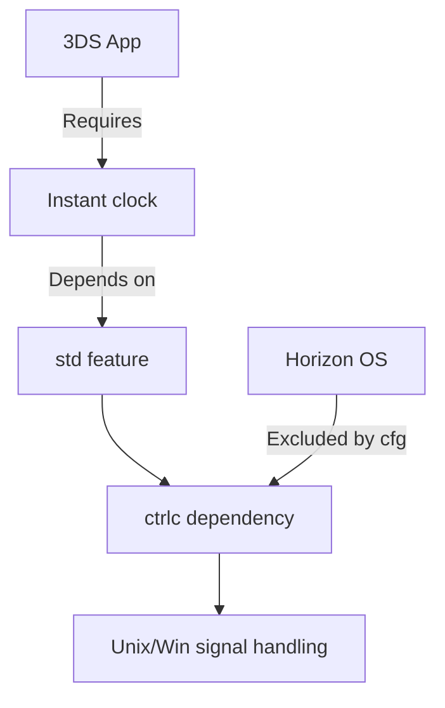

+++
title = "#19453 Exclude `ctrlc` from `bevy_app` for the Nintendo 3DS"
date = "2025-06-02T00:00:00"
draft = false
template = "pull_request_page.html"
in_search_index = false

[extra]
current_language = "zh-cn"
available_languages = {"en" = { name = "English", url = "/pull_request/bevy/2025-06/pr-19453-en-20250602" }, "zh-cn" = { name = "中文", url = "/pull_request/bevy/2025-06/pr-19453-zh-cn-20250602" }}
labels = ["A-ECS", "D-Straightforward", "C-Machine-Specific"]
+++

# PR #19453 分析：在 Nintendo 3DS 平台排除 `ctrlc` 依赖

## Basic Information
- **Title**: Exclude `ctrlc` from `bevy_app` for the Nintendo 3DS
- **PR Link**: https://github.com/bevyengine/bevy/pull/19453
- **Author**: selvmaya
- **Status**: MERGED
- **Labels**: A-ECS, S-Ready-For-Final-Review, D-Straightforward, C-Machine-Specific
- **Created**: 2025-05-31T20:53:31Z
- **Merged**: 2025-06-02T22:39:58Z
- **Merged By**: alice-i-cecile

## Description Translation
### 背景/动机 (Background/motivation)

Nintendo 3DS 由 Rust 的 tier 3 目标 [armv6k-nintendo-3ds](https://doc.rust-lang.org/rustc/platform-support/armv6k-nintendo-3ds.html#armv6k-nintendo-3ds) 支持。Bevy 并不官方支持该设备，但随着 Bevy 逐渐兼容 `no_std`，越来越多的目标得到部分支持（例如 GBA - https://github.com/bevyengine/bevy/discussions/10680, https://github.com/bushrat011899/bevy_mod_gba），无论是官方还是非官方。

Nintendo 3DS 运行 Horizon 作为其操作系统，该系统基于 [Unix](https://github.com/rust-lang/rust/blob/4d08223c054cf5a56d9761ca925fd46ffebe7115/compiler/rustc_target/src/spec/targets/armv6k_nintendo_3ds.rs#L34)，并且上述目标（至少部分）支持 Rust 标准库。使用标准库是有意义的，因为 3DS 支持文件系统读取和系统时钟等功能。

### 问题 (Problem)

与标准的 Unix 目标不同，`armv6k-nintendo-3ds` 无法使用/构建 `bevy_app` 中的 `ctrlc` 依赖项，该依赖项由 Bevy 的 `std` Cargo 特性启用。

在没有 `std` 特性标志的情况下，调度系统会崩溃，因为没有提供另一种方式让 Bevy 使用 `Instant` 类型进行计时（就像你在 [GBA](https://github.com/bushrat011899/bevy_mod_gba/blob/72d8bbf47b33a0ab2f825d80e9ed0b6e5268bf1e/src/time.rs#L36) 上可能做的那样）。

<details>

<summary>示例 (Example)</summary>

```
    Finished `dev` profile [optimized + debuginfo] target(s) in 1m 39s
Building smdh: /home/maya/repos/hyperspace-dj/target/armv6k-nintendo-3ds/debug/hyperspace-dj.smdh
Building 3dsx: /home/maya/repos/hyperspace-dj/target/armv6k-nintendo-3ds/debug/hyperspace-dj.3dsx
Adding RomFS from /home/maya/repos/hyperspace-dj/romfs
Running 3dslink
Sending hyperspace-dj.3dsx, 7172344 bytes
2777346 sent (38.72%), 233 blocks
starting server
server active ...
hii we'are about the to start the bevy app

thread 'main' panicked at /home/maya/repos/bevy/crates/bevy_platform/src/time/fallback.rs:177:13:
An elapsed time getter has not been provided to `Instant`. Please use `Instant::set_elapsed(...)` before calling `Instant::now()`
note: run with `RUST_BACKTRACE=1` environment variable to display a backtrace
```

</details>

### 解决方案 (Solution)

本 PR 仅通过在其现有特性标志中添加一项，将 `ctrlc` 依赖项及其在 `bevy_app` 中的使用排除在 3DS 目标（`horizon`）之外。

修复后，我们可以使用 `std` 特性，并且常规的调度系统不再因缺少 `Instant`（系统时钟）支持而崩溃。

### 测试 (Testing)

我使用修改后的 bevy 版本，在物理 3DS（经典款）上使用自制软件和 `cargo-3ds`，编译并运行了一个二进制文件，使用了 `no_default_features` 和特性标志 `default_no_std` 以及 `std`。

工具链：[armv6k-nintendo-3ds](https://doc.rust-lang.org/rustc/platform-support/armv6k-nintendo-3ds.html#armv6k-nintendo-3ds) (nightly-2025-03-31)
项目参考：https://codeberg.org/pollyglot/hyperspace-dj/commit/440fc1018468885eed4c10c163f6bf3eefc64cb1

### 考虑因素 (Considerations)

可能我们不想在 bevy 内部添加特定异常来支持具有特殊行为的特定硬件，但除了在目标配置中使用异常（已有）之外，我不清楚应该使用什么替代方案：这里的每一个更改仅仅是对已经检查目标家族和`std`标志的配置的补充。

目前尚不清楚这个 PR 是否足够全面，足以被视为对更大目标（部分支持 3DS）的充分解决方案，但它似乎是朝着正确方向迈出的一步，因为它至少让带有调度系统的简单 App::run 设置能够工作。

## The Story of This Pull Request

### 问题和背景
开发者尝试在 Nintendo 3DS 上运行 Bevy 应用时遇到了运行时崩溃。具体错误是调度系统因缺少 `Instant` 时间支持而 panic。根本原因是 3DS 的 Horizon OS 虽基于 Unix，但不支持 `ctrlc` 库，而该库由 Bevy 的 `std` 特性引入。

这个问题在技术上是矛盾的：3DS 需要 `std` 特性来启用系统时钟（支持 `Instant`），但 `std` 特性又引入了不兼容的 `ctrlc` 依赖。错误信息显示：
```
An elapsed time getter has not been provided to `Instant`
```
表明时间系统初始化失败，导致调度器无法运作。

### 解决方案
解决方案是修改条件编译，在 3DS 目标（通过 `target_os = "horizon"` 标识）上排除 `ctrlc` 依赖。具体实现是在现有条件编译规则中添加特例：
```rust
all(unix, not(target_os = "horizon"))
```
这样既保留了 Unix 和 Windows 平台的原有行为，又排除了 Horizon 平台。

### 实现细节
修改涉及三个文件：
1. **Cargo.toml**：调整依赖的目标条件
2. **lib.rs**：修改模块导入条件
3. **default_plugins.rs**：调整插件启用条件

所有修改都使用相同的条件表达式，确保逻辑一致性。这种模式匹配方法避免了平台检测代码重复，同时保持对其他平台行为的零影响。

### 技术考量
这个修改展示了条件编译在跨平台支持中的实际应用：
1. 使用 `cfg` 宏精确控制平台特定代码
2. 通过布尔逻辑组合条件（`all`/`any`/`not`）
3. 保持向后兼容性 - 只排除特定目标
4. 最小化变更范围（仅修改 3 个文件，共 4 行）

### 影响
这个 PR 解决了在 3DS 上使用 `std` 特性时的启动崩溃问题。经过测试验证，修改后应用能正常启动并运行调度系统。虽然不构成官方支持，但为社区在嵌入式设备上使用 Bevy 提供了可行路径。

## Visual Representation



## Key Files Changed

### 1. `crates/bevy_app/Cargo.toml`
**修改原因**：排除 3DS 目标上的 `ctrlc` 依赖
```diff
- [target.'cfg(any(unix, windows))'.dependencies]
+ [target.'cfg(any(all(unix, not(target_os = "horizon")), windows))'.dependencies]
ctrlc = { version = "3.4.4", optional = true }
```

### 2. `crates/bevy_app/src/lib.rs`
**修改原因**：条件排除信号处理模块
```diff
- #[cfg(all(any(unix, windows), feature = "std"))]
+ #[cfg(all(any(all(unix, not(target_os = "horizon")), windows), feature = "std"))]
mod terminal_ctrl_c_handler;

- #[cfg(all(any(unix, windows), feature = "std"))]
+ #[cfg(all(any(all(unix, not(target_os = "horizon")), windows), feature = "std"))]
pub use terminal_ctrl_c_handler::*;
```

### 3. `crates/bevy_internal/src/default_plugins.rs`
**修改原因**：防止在 3DS 添加不兼容插件
```diff
#[cfg(feature = "std")]
- #[custom(cfg(any(unix, windows)))]
+ #[custom(cfg(any(all(unix, not(target_os = "horizon")), windows)))]
bevy_app:::TerminalCtrlCHandlerPlugin,
```

## Further Reading
1. [Rust 条件编译文档](https://doc.rust-lang.org/reference/conditional-compilation.html) - 理解 `cfg` 机制
2. [Bevy 平台支持讨论](https://github.com/bevyengine/bevy/discussions/10680) - 社区嵌入式平台实践
3. [Rust 对 Nintendo 3DS 支持](https://doc.rust-lang.org/rustc/platform-support/armv6k-nintendo-3ds.html) - 目标平台技术细节
4. [ctrlc crate 文档](https://docs.rs/ctrlc/latest/ctrlc/) - 被排除依赖的功能