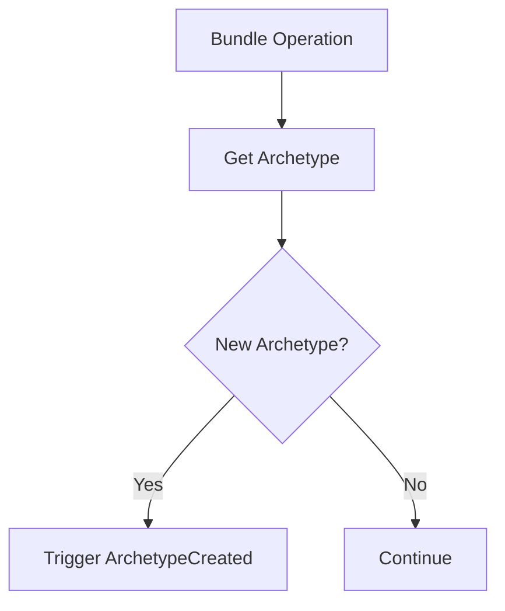

+++
title = "#19455 Trigger ArchetypeCreated event when new archetype is created"
date = "2025-06-02T00:00:00"
draft = false
template = "pull_request_page.html"
in_search_index = true

[taxonomies]
list_display = ["show"]

[extra]
current_language = "en"
available_languages = {"en" = { name = "English", url = "/pull_request/bevy/2025-06/pr-19455-en-20250602" }, "zh-cn" = { name = "中文", url = "/pull_request/bevy/2025-06/pr-19455-zh-cn-20250602" }}
labels = ["A-ECS", "D-Modest"]
+++

## Trigger ArchetypeCreated event when new archetype is created

### Basic Information
- **Title**: Trigger ArchetypeCreated event when new archetype is created
- **PR Link**: https://github.com/bevyengine/bevy/pull/19455
- **Author**: re0312
- **Status**: MERGED
- **Labels**: A-ECS, S-Ready-For-Final-Review, D-Modest
- **Created**: 2025-06-01T02:39:09Z
- **Merged**: 2025-06-02T22:50:02Z
- **Merged By**: alice-i-cecile

### Description
- Part 1 of #19454.
- Split from PR #18860(authored by @notmd) for better review and limit implementation impact. so all credit for this work belongs to @notmd.

## Solution
- Trigger `ArchetypeCreated` when new archetype is created

## The Story of This Pull Request

### The Problem and Context
Bevy's ECS relies on archetypes to group entities with identical component compositions. Currently, there's no built-in mechanism to detect when new archetypes are created during runtime operations like adding/removing components. This information is crucial for upcoming features like "Query as Entities" (#19454) which require reacting to archetype creation events. Without this foundational change, systems can't efficiently track or initialize state for newly created archetypes.

### The Solution Approach
We introduce an `ArchetypeCreated` event that triggers whenever a new archetype is created. The implementation required modifying archetype creation logic to return a boolean flag indicating whether creation occurred, then propagating this information through bundle operations. The key insight was modifying `Archetypes::get_id_or_insert` to return both the archetype ID and a creation flag, then handling event triggering at the bundle operation level.

### The Implementation
We first define the event in `archetype.rs`:
```rust
#[derive(Event)]
#[expect(dead_code, reason = "Prepare for the upcoming Query as Entities")]
pub(crate) struct ArchetypeCreated(pub ArchetypeId);
```

The core change modifies `Archetypes::get_id_or_insert` to return a creation flag:
```rust
pub(crate) fn get_id_or_insert(
    &mut self,
    components: &Components,
    observers: &Observers,
    table_id: TableId,
    table_components: Vec<ComponentId>,
    sparse_set_components: Vec<ComponentId>,
) -> (ArchetypeId, bool) {
    match self.by_components.entry(archetype_identity) {
        Entry::Occupied(occupied) => (*occupied.get(), false),
        Entry::Vacant(vacant) => {
            // ... archetype creation logic ...
            vacant.insert(id);
            (id, true)
        }
    }
}
```

We then propagate this flag through bundle operations. For insertion:
```rust
let (new_archetype_id, is_new_created) = bundle_info.insert_bundle_into_archetype(
    &mut world.archetypes,
    &mut world.storages,
    &world.components,
    &world.observers,
    archetype_id,
);

if is_new_created {
    inserter
        .world
        .into_deferred()
        .trigger(ArchetypeCreated(new_archetype_id));
}
```

Similar modifications were made for removal and spawning operations. The event is triggered through deferred systems to ensure proper sequencing during structural changes.

### Technical Insights
- **Event Triggering**: Events are triggered via `into_deferred().trigger()` to ensure they're processed during the deferred phase when archetype changes are safe to handle
- **Idempotency**: The creation flag prevents duplicate events when reusing existing archetypes
- **Minimal Overhead**: The boolean check adds negligible overhead since archetype creation is infrequent compared to component operations
- **Testability**: Added comprehensive test validates event triggering during spawn/insert/remove operations

### The Impact
- Enables systems to react to archetype creation events
- Provides foundation for "Query as Entities" feature
- Maintains existing performance characteristics
- Adds 13 lines to bundle operations for event triggering
- Introduces no breaking changes to public APIs

## Visual Representation



## Key Files Changed

### `crates/bevy_ecs/src/archetype.rs` (+19/-9)
Added event definition and modified archetype creation logic to return creation status.

Key changes:
```rust
// Before: 
pub(crate) fn get_id_or_insert(...) -> ArchetypeId { ... }

// After:
pub(crate) fn get_id_or_insert(...) -> (ArchetypeId, bool) {
    match self.by_components.entry(archetype_identity) {
        Entry::Occupied(occupied) => (*occupied.get(), false),
        Entry::Vacant(vacant) => {
            // ... creation logic ...
            (id, true)
        }
    }
}
```

### `crates/bevy_ecs/src/bundle.rs` (+74/-25)
Modified bundle operations to handle creation flags and trigger events.

Key changes:
```rust
// Insert operation
let (new_archetype_id, is_new_created) = ...;
if is_new_created {
    world.into_deferred().trigger(ArchetypeCreated(new_archetype_id));
}

// Test case
#[test]
fn new_archetype_created() {
    let mut world = World::new();
    world.add_observer(|_: Trigger<ArchetypeCreated>, mut count: ResMut<Count>| {
        count.0 += 1;
    });
    
    // Operations that should trigger events
    assert_eq!(world.resource::<Count>().0, 3);
}
```

## Further Reading
1. [Bevy ECS Architecture](https://bevyengine.org/learn/book/plugins/ecs/)
2. [Entity Component System Pattern](https://en.wikipedia.org/wiki/Entity_component_system)
3. [Original PR #18860](https://github.com/bevyengine/bevy/pull/18860) (implementation basis)
4. [Tracking Issue #19454](https://github.com/bevyengine/bevy/issues/19454) (use case)