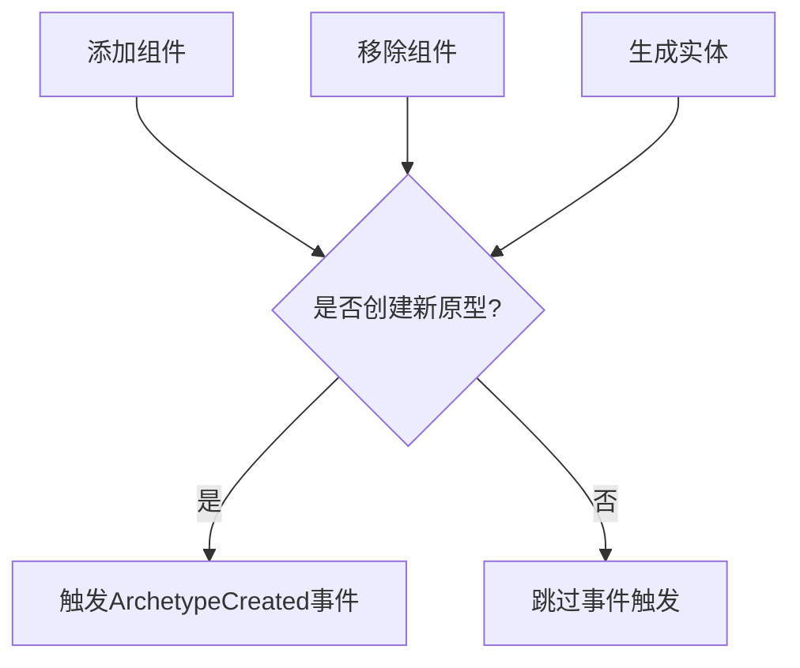

+++
title = "#19455 Trigger ArchetypeCreated event when new archetype is created"
date = "2025-06-02T00:00:00"
draft = false
template = "pull_request_page.html"
in_search_index = false

[extra]
current_language = "zh-cn"
available_languages = {"en" = { name = "English", url = "/pull_request/bevy/2025-06/pr-19455-en-20250602" }, "zh-cn" = { name = "中文", url = "/pull_request/bevy/2025-06/pr-19455-zh-cn-20250602" }}
+++

## 触发新建原型时发布 ArchetypeCreated 事件

### 基本信息
- **标题**: Trigger ArchetypeCreated event when new archetype is created
- **PR链接**: https://github.com/bevyengine/bevy/pull/19455
- **作者**: re0312
- **状态**: 已合并
- **标签**: A-ECS, S-Ready-For-Final-Review, D-Modest
- **创建时间**: 2025-06-01T02:39:09Z
- **合并时间**: 2025-06-02T22:50:02Z
- **合并者**: alice-i-cecile

### 描述
- Part 1 of #19454 .
- Split from PR #18860(authored by @notmd)  for better review and limit implementation impact. so all credit for this work belongs to @notmd .

## Solution

- Trigger `ArchetypeCreated ` when new archetype is createed

---

### 问题与背景
在 Bevy 的 ECS 架构中，原型(archetype)是核心数据结构，用于分组具有相同组件组合的实体。当实体添加或移除组件时，系统会动态创建新的原型。然而，现有架构缺乏原生机制来追踪原型创建事件，这限制了系统对新原型的响应能力。具体来说：
1. 无法在原型创建时执行初始化逻辑
2. 无法动态追踪原型生命周期
3. 阻碍了 #19454 等功能的实现

### 解决方案
引入 `ArchetypeCreated` 事件，在以下操作中触发：
1. 实体生成(spawn)时创建新原型
2. 添加组件导致新原型创建
3. 移除组件导致新原型创建

核心修改点：
- 重构原型创建接口返回是否新建的标志
- 在三个关键操作点添加事件触发逻辑
- 添加测试验证事件触发机制

### 实现细节
#### 1. 定义事件类型
在 `archetype.rs` 中添加事件定义：
```rust
#[derive(Event)]
#[expect(dead_code, reason = "Prepare for the upcoming Query as Entities")]
pub(crate) struct ArchetypeCreated(pub ArchetypeId);
```
该事件携带新建原型的ID作为参数。

#### 2. 重构原型创建接口
修改 `Archetypes::get_id_or_insert` 返回是否新建的标志：
```rust
// 修改前
pub(crate) unsafe fn get_id_or_insert(...) -> ArchetypeId {
    *self.by_components.entry(...).or_insert_with_key(...)
}

// 修改后
pub(crate) unsafe fn get_id_or_insert(...) -> (ArchetypeId, bool) {
    match self.by_components.entry(...) {
        Entry::Occupied(occupied) => (*occupied.get(), false),
        Entry::Vacant(vacant) => {
            // 创建新原型逻辑
            vacant.insert(id);
            (id, true)
        }
    }
}
```

#### 3. 添加事件触发点
在三个关键操作点检查新建标志并触发事件：

**实体生成时** (`BundleSpawner::new`):
```rust
let (new_archetype_id, is_new_created) = ...;
let spawner = Self { ... };
if is_new_created {
    spawner.world.trigger(ArchetypeCreated(new_archetype_id));
}
```

**添加组件时** (`BundleInserter::new`):
```rust
let (new_archetype_id, is_new_created) = ...;
let inserter = ...;
if is_new_created {
    inserter.world.trigger(ArchetypeCreated(new_archetype_id));
}
```

**移除组件时** (`BundleRemover::new`):
```rust
let (new_archetype_id, is_new_created) = ...;
let remover = ...;
if is_new_created {
    remover.world.trigger(ArchetypeCreated(new_archetype_id));
}
```

### 技术考量
1. **性能优化**：仅在真正新建原型时触发事件，避免不必要的开销
2. **原子性**：事件触发与原型创建保持原子操作
3. **扩展性**：为后续查询优化(#19454)奠定基础
4. **兼容性**：不影响现有API的调用方式

### 测试验证
添加测试用例验证事件触发机制：
```rust
#[test]
fn new_archetype_created() {
    let mut world = World::new();
    #[derive(Resource, Default)]
    struct Count(u32);
    world.init_resource::<Count>();
    world.add_observer(|_t: Trigger<ArchetypeCreated>, mut count: ResMut<Count>| {
        count.0 += 1;
    });

    let mut e = world.spawn((A, B));
    e.insert(C);
    e.remove::<A>();
    e.insert(A);
    e.insert(A);

    assert_eq!(world.resource::<Count>().0, 3);
}
```
该测试验证了三种触发场景：
1. 初始生成实体 (A, B)
2. 添加组件 C
3. 移除组件 A

### 影响分析
1. **功能增强**：支持原型生命周期追踪
2. **架构扩展**：为查询优化提供基础设施
3. **性能影响**：仅在新原型创建时有微小开销
4. **维护性**：保持代码结构清晰，逻辑集中

### 关键文件变更

#### `crates/bevy_ecs/src/archetype.rs`
- 添加 `ArchetypeCreated` 事件定义
- 修改原型创建接口返回新建标志

```diff
+#[derive(Event)]
+#[expect(dead_code, reason = "Prepare for the upcoming Query as Entities")]
+pub(crate) struct ArchetypeCreated(pub ArchetypeId);
+
 pub(crate) unsafe fn get_id_or_insert(
     ...
-) -> ArchetypeId {
-    *self.by_components.entry(...).or_insert_with_key(...)
+) -> (ArchetypeId, bool) {
+    match self.by_components.entry(...) {
+        Entry::Occupied(occupied) => (*occupied.get(), false),
+        Entry::Vacant(vacant) => {
+            // 创建逻辑
+            (id, true)
+        }
+    }
 }
```

#### `crates/bevy_ecs/src/bundle.rs`
- 在三个关键操作点添加事件触发
- 修改接口返回新建标志

```diff
 impl BundleInfo {
-    pub(crate) unsafe fn insert_bundle_into_archetype(...) -> ArchetypeId {
+    pub(crate) unsafe fn insert_bundle_into_archetype(...) -> (ArchetypeId, bool) {
         if let Some(id) = cached_id {
-            return id;
+            return (id, false);
         }
-        let new_id = archetypes.get_id_or_insert(...);
+        let (new_id, is_new) = archetypes.get_id_or_insert(...);
         // 缓存逻辑
-        new_id
+        (new_id, is_new)
     }
 }
 
 impl<'w> BundleInserter<'w> {
     fn new(...) -> Self {
-        let new_id = bundle_info.insert_bundle_into_archetype(...);
+        let (new_id, is_new) = bundle_info.insert_bundle_into_archetype(...);
         let inserter = ...;
+        if is_new {
+            inserter.world.trigger(ArchetypeCreated(new_id));
+        }
         inserter
     }
 }
```

### 图示关系


### 延伸阅读
1. [Bevy ECS 架构文档](https://bevyengine.org/learn/book/plugins/ecs/)
2. [原型模式详解](https://www.gamedeveloper.com/programming/entity-component-system)
3. [事件系统设计模式](https://gameprogrammingpatterns.com/event-queue.html)

该实现为ECS系统提供了关键的可观测性扩展，使系统能够响应原型级别的变化，同时保持高性能和低开销的设计原则。