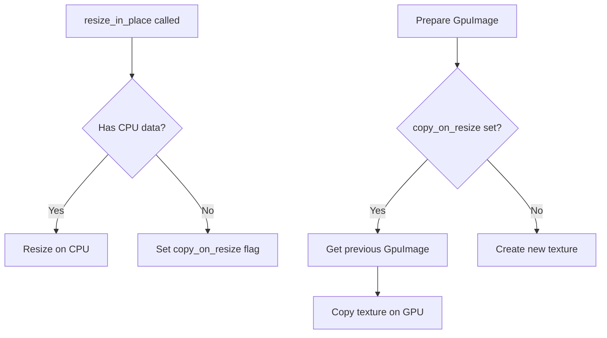

+++
title = "#19462 Allow images to be resized on the GPU without losing data"
date = "2025-06-24T00:00:00"
draft = false
template = "pull_request_page.html"
in_search_index = true

[taxonomies]
list_display = ["show"]

[extra]
current_language = "en"
available_languages = {"en" = { name = "English", url = "/pull_request/bevy/2025-06/pr-19462-en-20250624" }, "zh-cn" = { name = "中文", url = "/pull_request/bevy/2025-06/pr-19462-zh-cn-20250624" }}
labels = ["C-Bug", "C-Feature", "A-Rendering"]
+++

## Analysis of PR #19462: Allow images to be resized on the GPU without losing data

### Basic Information
- **Title**: Allow images to be resized on the GPU without losing data
- **PR Link**: https://github.com/bevyengine/bevy/pull/19462
- **Author**: tychedelia
- **Status**: MERGED
- **Labels**: C-Bug, C-Feature, A-Rendering, S-Ready-For-Final-Review, M-Needs-Migration-Guide
- **Created**: 2025-06-02T04:07:59Z
- **Merged**: 2025-06-24T06:40:45Z
- **Merged By**: mockersf

### The Story of This Pull Request

#### The Problem and Context
Before this PR, resizing images using `resize_in_place()` required CPU-side image data to copy into new GPU allocations. This caused issues for GPU-only images (images without CPU data) created through compute shaders or other GPU operations. When these images were resized, their contents would disappear since there was no CPU data to copy to the new texture. This limitation prevented fully GPU-driven workflows where images are created and manipulated entirely on the GPU.

#### The Solution Approach
The solution introduces a new GPU-to-GPU copy path for resized images without CPU data. Key decisions:
1. Added a `copy_on_resize` flag to `Image` assets to trigger GPU copying
2. Modified `RenderAsset::prepare_asset()` to accept the previous asset state
3. Implemented GPU texture copying when both conditions are met:
   - Image has `copy_on_resize` set
   - Previous GPU texture exists
4. Removed CPU-only restriction from `resize_in_place()`

#### The Implementation
The implementation required coordinated changes across multiple subsystems:

1. **Image resizing logic** (`bevy_image/src/image.rs`):
   - Added `copy_on_resize` field to `Image` struct
   - Modified `resize_in_place()` to handle GPU-only images:
     ```rust
     pub fn resize_in_place(&mut self, new_size: Extent3d) {
         // ...
         let Some(ref mut data) = self.data else {
             self.copy_on_resize = true;  // Set GPU copy flag
             return;
         };
         // ... existing CPU resize logic
     }
     ```
   - Removed `ResizeError::ImageWithoutData` since resizing without CPU data is now valid

2. **RenderAsset system** (`bevy_render/src/render_asset.rs`):
   - Modified `prepare_asset` signature to accept previous asset state:
     ```rust
     fn prepare_asset(
         source_asset: Self::SourceAsset,
         asset_id: AssetId<Self::SourceAsset>,
         param: &mut SystemParamItem<Self::Param>,
         previous_asset: Option<&Self>,  // New parameter
     ) -> Result<Self, PrepareAssetError<Self::SourceAsset>>;
     ```
   - Updated asset preparation system to pass previous asset state

3. **GPU image handling** (`bevy_render/src/texture/gpu_image.rs`):
   - Implemented GPU-to-GPU copying when `copy_on_resize` is detected:
     ```rust
     if image.copy_on_resize {
         if let Some(previous) = previous_asset {
             let mut command_encoder = render_device.create_command_encoder(...);
             command_encoder.copy_texture_to_texture(
                 previous.texture.as_image_copy(),
                 new_texture.as_image_copy(),
                 copy_size
             );
             render_queue.submit([command_encoder.finish()]);
         }
     }
     ```

4. **System-wide updates**:
   - Updated all 14 `RenderAsset` implementations to accept new `previous_asset` parameter
   - Added `copy_on_resize: false` to image creation points throughout the codebase
   - Enabled `COPY_SRC` usage flag for resizable images

#### Technical Insights
Key technical aspects:
1. **GPU Texture Copying**: Uses `copy_texture_to_texture` which is efficient and doesn't require CPU roundtrips
2. **Partial Copies**: Only copies overlapping regions when resizing:
   ```rust
   let copy_size = Extent3d {
       width: new.width.min(old.width),
       height: new.height.min(old.height),
       depth_or_array_layers: new.depth_or_array_layers.min(old.depth_or_array_layers),
   };
   ```
3. **Backward Compatibility**: Maintains existing CPU resize path for images with data
4. **Error Handling**: Logs warnings when previous asset is missing for GPU copy

#### The Impact
These changes enable:
1. Resizing of GPU-only images without data loss
2. More efficient GPU-driven workflows
3. Foundation for future GPU-based optimizations
4. Removal of artificial CPU data requirement

The changes affect multiple rendering subsystems but maintain backward compatibility. The solution is efficient as it uses native GPU copying capabilities without introducing new dependencies.

### Visual Representation



### Key Files Changed

1. **`crates/bevy_image/src/image.rs`** (+35/-50)  
   Core image resizing logic changes:
   - Added `copy_on_resize` flag to `Image` struct
   - Modified resize behavior for GPU-only images
   - Removed resize error cases
   ```rust
   pub struct Image {
       // ...
       pub copy_on_resize: bool,
   }
   
   pub fn resize_in_place(&mut self, new_size: Extent3d) {
       // ...
       if no CPU data {
           self.copy_on_resize = true;
           return;
       }
   }
   ```

2. **`crates/bevy_render/src/texture/gpu_image.rs`** (+34/-1)  
   GPU texture copying implementation:
   ```rust
   if image.copy_on_resize {
       if let Some(previous) = previous_asset {
           // Create command encoder
           // Calculate copy bounds
           command_encoder.copy_texture_to_texture(...);
           render_queue.submit(...);
       }
   }
   ```

3. **`crates/bevy_render/src/render_asset.rs`** (+5/-3)  
   RenderAsset system modification:
   ```rust
   let previous_asset = render_assets.remove(id);
   match A::prepare_asset(..., previous_asset.as_ref())
   ```

4. **`crates/bevy_core_pipeline/src/tonemapping/mod.rs`** (+1/-0)  
   Example of new image initialization:
   ```rust
   Image {
       // ...
       copy_on_resize: false,
   }
   ```

5. **`crates/bevy_core_pipeline/src/auto_exposure/compensation_curve.rs`** (+1/-0)  
   RenderAsset implementation update:
   ```rust
   fn prepare_asset(..., _: Option<&Self>)
   ```

### Further Reading
1. [wgpu copy_texture_to_texture documentation](https://docs.rs/wgpu/latest/wgpu/struct.CommandEncoder.html#method.copy_texture_to_texture)
2. [Bevy RenderAsset documentation](https://docs.rs/bevy_render/latest/bevy_render/render_asset/trait.RenderAsset.html)
3. [Texture Resizing Fundamentals](https://vulkan-tutorial.com/Texture_mipmapping)