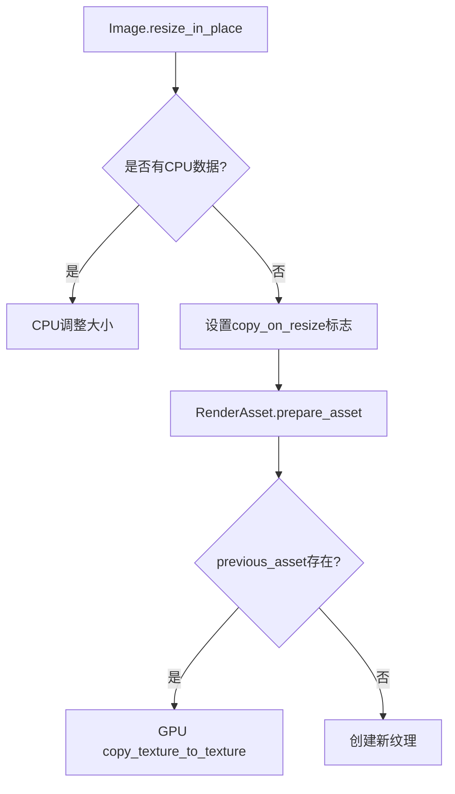

+++
title = "#19462 Allow images to be resized on the GPU without losing data"
date = "2025-06-24T00:00:00"
draft = false
template = "pull_request_page.html"
in_search_index = false

[extra]
current_language = "zh-cn"
available_languages = {"en" = { name = "English", url = "/pull_request/bevy/2025-06/pr-19462-en-20250624" }, "zh-cn" = { name = "中文", url = "/pull_request/bevy/2025-06/pr-19462-zh-cn-20250624" }}
+++

# PR 分析报告：允许在 GPU 上调整图像大小而不丢失数据

## 基本信息
- **标题**: Allow images to be resized on the GPU without losing data
- **PR 链接**: https://github.com/bevyengine/bevy/pull/19462
- **作者**: tychedelia
- **状态**: 已合并 (MERGED)
- **标签**: C-Bug, C-Feature, A-Rendering, S-Ready-For-Final-Review, M-Needs-Migration-Guide
- **创建时间**: 2025-06-02T04:07:59Z
- **合并时间**: 2025-06-24T06:40:45Z
- **合并者**: mockersf

## 描述翻译
### 目标
#19410 添加了对"原地"调整图像大小的支持，这意味着它们的数据会在 CPU 上被复制到新的纹理分配中。然而，在某些情况下，图像可能完全在 GPU 上创建和填充。使用这种方法会导致数据消失，因为它不会被复制到新纹理中。

### 解决方案
当图像被原地调整大小时，如果其资产中没有数据，我们将选择一个新的标志位 `copy_on_resize`，该标志会在旧分配上触发 `copy_texture_to_texture` 命令。

为了支持这一点，我们需要将旧资产传递给所有 `RenderAsset` 实现。这在未来对于减少缓冲区重新分配等操作将非常有用。

### 测试
使用 issue 中的示例进行了测试。

---

## 技术分析

### 问题背景
在 #19410 引入的图像原地调整大小功能中，图像数据在 CPU 上进行复制。然而，对于完全在 GPU 上创建和填充的图像（没有 CPU 端数据），这种方法会导致数据丢失。因为当图像没有 CPU 数据时，调整大小操作无法执行必要的数据复制，导致调整后图像内容丢失。

### 解决方案设计
核心思路是：
1. 为没有 CPU 数据的图像添加 GPU 端复制机制
2. 在图像调整大小时设置标志位，指示需要 GPU 复制
3. 在准备渲染资产时执行实际的 GPU 复制操作

关键决策点：
- 引入 `copy_on_resize` 布尔标志，避免增加不必要的运行时开销
- 修改 `RenderAsset::prepare_asset` 签名以接收旧资产引用，为 GPU 复制提供必要上下文
- 使用 `copy_texture_to_texture` 进行高效 GPU 端数据复制

### 实现细节
#### 1. 图像结构调整
在 `Image` 结构中新增 `copy_on_resize` 标志，用于标记需要 GPU 复制的情况：

```rust
// File: crates/bevy_image/src/image.rs
pub struct Image {
    // ...现有字段...
    pub asset_usage: RenderAssetUsages,
    /// Whether this image should be copied on the GPU when resized.
    pub copy_on_resize: bool,
}
```

#### 2. 调整大小行为变更
重构 `resize_in_place` 方法，移除错误返回，改为设置标志位：

```rust
// File: crates/bevy_image/src/image.rs
// 修改前:
pub fn resize_in_place(&mut self, new_size: Extent3d) -> Result<(), ResizeError> {
    // ...错误处理逻辑...
}

// 修改后:
pub fn resize_in_place(&mut self, new_size: Extent3d) {
    // ...
    let Some(ref mut data) = self.data else {
        self.copy_on_resize = true;
        return;
    };
    // ...正常调整大小逻辑...
}
```

#### 3. 渲染资产准备
扩展 `RenderAsset` trait 接口，添加旧资产参数：

```rust
// File: crates/bevy_render/src/render_asset.rs
pub trait RenderAsset {
    fn prepare_asset(
        // ...
        previous_asset: Option<&Self>,
    ) -> Result<Self, PrepareAssetError<Self::SourceAsset>>;
}
```

#### 4. GPU 复制实现
在 `GpuImage` 的 prepare 方法中实现 GPU 端复制：

```rust
// File: crates/bevy_render/src/texture/gpu_image.rs
impl RenderAsset for GpuImage {
    fn prepare_asset(
        // ...
        previous_asset: Option<&Self>,
    ) -> Result<Self, PrepareAssetError<Self::SourceAsset>> {
        // ...
        if image.copy_on_resize {
            if let Some(previous) = previous_asset {
                let mut command_encoder = /* 创建命令编码器 */;
                let copy_size = /* 计算安全复制区域 */;
                command_encoder.copy_texture_to_texture(
                    previous.texture.as_image_copy(),
                    new_texture.as_image_copy(),
                    copy_size,
                );
                render_queue.submit([command_encoder.finish()]);
            }
        }
        // ...
    }
}
```

### 技术要点
1. **安全复制区域计算**：
   复制操作使用新旧纹理的最小尺寸，避免越界访问：
   ```rust
   let copy_size = Extent3d {
       width: new_width.min(old_width),
       height: new_height.min(old_height),
       depth_or_array_layers: new_depth.min(old_depth),
   };
   ```

2. **资源使用优化**：
   新纹理创建时添加 `COPY_SRC` 使用标志：
   ```rust
   usage: TextureUsages::TEXTURE_BINDING
       | TextureUsages::COPY_DST
       | TextureUsages::COPY_SRC,
   ```

3. **向后兼容处理**：
   所有 `RenderAsset` 实现都添加了 `previous_asset` 参数，即使未使用也需保留参数位置

### 影响分析
1. **问题修复**：
   - 解决 GPU 创建图像调整大小后数据丢失问题
   - 保留现有 CPU 数据调整大小的行为不变

2. **性能优化**：
   - GPU 端复制避免 CPU-GPU 数据传输
   - 为未来资产重用优化奠定基础

3. **API 变更**：
   - `RenderAsset::prepare_asset` 签名变更（需要更新所有实现）
   - 移除 `ResizeError` 类型，简化错误处理

## 组件关系图



## 关键文件变更

### 1. `crates/bevy_image/src/image.rs` (+35/-50)
**变更原因**：
- 实现 `copy_on_resize` 机制
- 重构调整大小逻辑

**关键代码**：
```rust
// 新增字段
pub struct Image {
    // ...
    pub copy_on_resize: bool,
}

// 调整大小逻辑变更
pub fn resize_in_place(&mut self, new_size: Extent3d) {
    let old_size = self.texture_descriptor.size;
    // ...
    let Some(ref mut data) = self.data else {
        self.copy_on_resize = true;
        return;
    };
    // ...调整大小实现...
}
```

### 2. `crates/bevy_render/src/texture/gpu_image.rs` (+34/-1)
**变更原因**：
- 实现 GPU 端复制逻辑

**关键代码**：
```rust
impl RenderAsset for GpuImage {
    fn prepare_asset(/* ... */, previous_asset: Option<&Self>) -> Result<Self, PrepareAssetError> {
        // ...
        if image.copy_on_resize {
            if let Some(previous) = previous_asset {
                // 创建命令编码器
                // 计算复制区域
                command_encoder.copy_texture_to_texture(/* ... */);
                render_queue.submit(/* ... */);
            }
        }
        // ...
    }
}
```

### 3. `crates/bevy_render/src/render_asset.rs` (+5/-3)
**变更原因**：
- 修改 `RenderAsset` trait 接口

**关键代码**：
```rust
pub fn prepare_assets<A: RenderAsset>(/* ... */) {
    // ...
    let previous_asset = render_assets.get(id);
    match A::prepare_asset(extracted_asset, id, &mut param, previous_asset) {
        // ...
    }
    // ...
}
```

### 4. `crates/bevy_core_pipeline/src/auto_exposure/compensation_curve.rs` (+1/-0)
**变更原因**：
- 适配 `RenderAsset` 接口变更

**关键代码**：
```rust
impl RenderAsset for GpuAutoExposureCompensationCurve {
    fn prepare_asset(/* ... */, _: Option<&Self>) { /* ... */ }
}
```

### 5. `crates/bevy_core_pipeline/src/tonemapping/mod.rs` (+1/-0)
**变更原因**：
- 初始化新字段

**关键代码**：
```rust
pub fn lut_placeholder() -> Image {
    Image {
        // ...
        copy_on_resize: false,
    }
}
```

## 延伸阅读
1. [WebGPU copy_texture_to_texture 规范](https://gpuweb.github.io/gpuweb/#dom-gpucommandencoder-copytexturetotexture)
2. [Bevy 渲染资产系统文档](https://bevyengine.org/learn/book/features/rendering/assets)
3. [WGSL 纹理操作指南](https://sotrh.github.io/learn-wgpu/beginner/tutorial5-textures/#loading-textures)