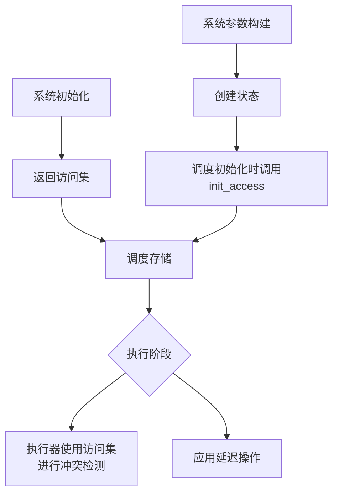

+++
title = "#19477 Stop storing access for all systems"
date = "2025-06-13T00:00:00"
draft = false
template = "pull_request_page.html"
in_search_index = false

[extra]
current_language = "zh-cn"
available_languages = {"en" = { name = "English", url = "/pull_request/bevy/2025-06/pr-19477-en-20250613" }, "zh-cn" = { name = "中文", url = "/pull_request/bevy/2025-06/pr-19477-zh-cn-20250613" }}
labels = ["A-ECS", "C-Performance", "C-Code-Quality"]
+++

# 停止为所有系统存储访问集：PR #19477分析

## Basic Information
- **Title**: Stop storing access for all systems
- **PR Link**: https://github.com/bevyengine/bevy/pull/19477
- **Author**: chescock
- **Status**: MERGED
- **Labels**: A-ECS, C-Performance, C-Code-Quality, S-Ready-For-Final-Review
- **Created**: 2025-06-03T17:21:53Z
- **Merged**: 2025-06-13T18:17:23Z
- **Merged By**: alice-i-cecile

## Description Translation
### 目标
减少内存使用，通过存储更少的`FilteredAccessSet<ComponentId>`副本。

目前，`System` trait暴露了系统的`component_access_set`，供多线程执行器用于确定哪些系统可以并发运行。但由于它是在trait上可用的，因此需要为*每个*系统存储，即使不由执行器运行的系统（如观察者，或`PipeSystem`、`CombinatorSystem`中的内部系统）也不例外！

### 解决方案
不再通过`System`上的方法暴露访问集，而是从`System::initialize`返回。由于在调度期间仍然需要它，因此将访问集与计划中的boxed system一起存储。

但这对于使用`SystemParamBuilder`构建的系统还不够。这些系统在`SystemParamBuilder::build`中计算访问集，这比`System::initialize`更早发生。为了处理这些情况，我们将`SystemParam::init_state`拆分为`init_state`（创建状态值）和`init_access`（计算访问集）。这使得`System::initialize`可以在构建器提供的状态上调用`init_access`。

这种分离的另一个好处是，它消除了在`SystemParamBuilder::build`和`SystemParam::init_state`之间重复访问检查的需要。

## The Story of This Pull Request

### 问题与背景
在Bevy ECS中，每个系统都需要一个组件访问集（component access set）来确定系统之间的并行执行能力。在PR之前，这个访问集作为`System` trait的一部分存储在*每个*系统实例中。这导致了一些问题：

1. **不必要的内存开销**：即使是不需要访问集的系统（如观察者系统和组合器系统内部的系统）也存储了访问集
2. **重复计算**：系统参数构建器（`SystemParamBuilder`）和系统初始化都计算访问集，导致重复工作
3. **架构耦合**：访问集管理分散在多个地方，增加了维护复杂度

技术约束包括：
- 执行器在调度时仍需访问访问集进行冲突检测
- 系统参数需要初始化其状态和访问集
- 需要保持向后兼容性

### 解决方案方法
核心思路是将访问集存储从系统实例移动到调度（schedule）中，只在需要的地方存储。具体方法：

1. **重构`System` trait**：
   - 移除`component_access_set()`方法
   - 修改`initialize()`返回`FilteredAccessSet<ComponentId>`
   - 调度负责存储返回的访问集

2. **拆分系统参数初始化**：
   - 将`SystemParam::init_state`拆分为：
     - `init_state()`：仅创建参数状态
     - `init_access()`：计算并注册访问集
   - 解决构建器和初始化之间的时序问题

3. **重构调度存储**：
   - 引入`SystemWithAccess`包装器，存储系统和其访问集
   - 类似地引入`ConditionWithAccess`用于条件系统

### 实现细节
#### 系统初始化流程重构
```rust
// 修改前
fn initialize(&mut self, world: &mut World) {
    // 初始化逻辑
    // 访问集存储在系统内部
}

// 修改后
fn initialize(&mut self, world: &mut World) -> FilteredAccessSet<ComponentId> {
    // 初始化逻辑
    // 返回计算出的访问集
}
```

#### 系统参数初始化拆分
```rust
// 修改前
fn init_state(world: &mut World, system_meta: &mut SystemMeta) -> Self::State {
    // 同时创建状态和注册访问集
}

// 修改后
fn init_state(world: &mut World) -> Self::State {
    // 仅创建状态
}

fn init_access(
    state: &Self::State,
    system_meta: &mut SystemMeta,
    component_access_set: &mut FilteredAccessSet<ComponentId>,
    world: &mut World
) {
    // 计算并注册访问集
}
```

#### 调度存储优化
```rust
// 新结构体，组合系统和其访问集
pub struct SystemWithAccess {
    pub system: ScheduleSystem,
    pub access: FilteredAccessSet<ComponentId>,
}

// 在调度初始化时
let mut access = system.system.initialize(world);
self.systems[index] = SystemWithAccess { system, access };
```

#### 执行器冲突检测
执行器现在使用存储在调度中的访问集：
```rust
// 修改前
if !system2.component_access_set().is_compatible(system1.component_access_set())

// 修改后
if !system2.access.is_compatible(&system1.access)
```

### 技术洞察
1. **访问集生命周期**：访问集只在调度构建和执行期间需要，不需要永久存储在系统中
2. **初始化时序**：通过分离状态创建和访问集计算，解决了构建器和初始化之间的时序冲突
3. **内存布局优化**：`SystemWithAccess`结构优化了内存访问模式
4. **条件系统处理**：条件系统同样受益于访问集的外部存储

### 影响
1. **内存减少**：避免了为不需要访问集的系统（观察者、组合器内部系统）存储访问集
2. **性能提升**：消除了重复的访问集计算和存储
3. **代码简化**：
   - 移除`SystemMeta`中的`component_access_set`字段
   - 简化系统参数构建器逻辑
4. **迁移需求**：
   - 自定义系统需要更新`initialize()`签名
   - 系统参数需要实现新的`init_access()`方法

## Visual Representation


## Key Files Changed

1. **`crates/bevy_ecs/src/system/system_param.rs` (+412/-139)**
   - 拆分所有系统参数的初始化逻辑
   - 实现新的`init_access()`方法
   - 示例（Query参数）：
     ```rust
     // Before:
     fn init_state(world: &mut World, system_meta: &mut SystemMeta) -> Self::State {
         let state = QueryState::new(world);
         init_query_param(world, system_meta, &state);
         state
     }
     
     // After:
     fn init_state(world: &mut World) -> Self::State {
         QueryState::new(world)
     }
     
     fn init_access(state: &Self::State, system_meta: &mut SystemMeta, 
                   component_access_set: &mut FilteredAccessSet<ComponentId>, world: &mut World) {
         // 注册访问集
     }
     ```

2. **`crates/bevy_ecs/src/system/builder.rs` (+48/-163)**
   - 简化系统参数构建器接口
   - 移除访问集注册逻辑
   - 关键变更：
     ```rust
     // Before:
     fn build(self, world: &mut World, meta: &mut SystemMeta) -> Self::State
     
     // After:
     fn build(self, world: &mut World) -> Self::State
     ```

3. **`crates/bevy_ecs/src/schedule/schedule.rs` (+103/-43)**
   - 引入`SystemWithAccess`存储结构
   - 修改调度初始化逻辑
   - 关键代码：
     ```rust
     pub struct SystemWithAccess {
         pub system: ScheduleSystem,
         pub access: FilteredAccessSet<ComponentId>,
     }
     
     // 初始化系统时：
     let access = system.initialize(world);
     self.systems.push(SystemWithAccess { system, access });
     ```

4. **`crates/bevy_ecs/src/system/function_system.rs` (+24/-38)**
   - 实现函数系统的`initialize()`新签名
   - 移除`SystemMeta`中的访问集字段
   - 关键变更：
     ```rust
     // Before:
     fn initialize(&mut self, world: &mut World) {
         // 访问集存储在SystemMeta中
     }
     
     // After:
     fn initialize(&mut self, world: &mut World) -> FilteredAccessSet<ComponentId> {
         // 返回访问集
     }
     ```

5. **`crates/bevy_ecs/src/system/system_name.rs` (+31/-26)**
   - 适配`SystemName`系统参数
   - 实现新的初始化方法：
     ```rust
     fn init_access(
         _state: &Self::State,
         _system_meta: &mut SystemMeta,
         _component_access_set: &mut FilteredAccessSet<ComponentId>,
         _world: &mut World,
     ) {
         // 无需特殊访问
     }
     ```

## Further Reading
1. [Bevy ECS系统文档](https://bevyengine.org/learn/book/ecs/systems/)
2. [系统调度与并行执行原理](https://bevyengine.org/learn/book/ecs/scheduling/)
3. [组件访问冲突检测机制](https://bevyengine.org/learn/book/ecs/component-access/)
4. [迁移指南：停止存储系统访问集](https://github.com/bevyengine/bevy/blob/main/release-content/migration-guides/stop_storing_system_access.md)