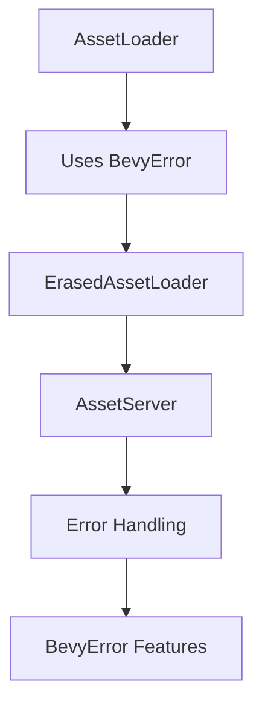

+++
title = "#19478 Use BevyError for AssetLoader::Error"
date = "2025-06-04T00:00:00"
draft = false
template = "pull_request_page.html"
in_search_index = true

[taxonomies]
list_display = ["show"]

[extra]
current_language = "en"
available_languages = {"en" = { name = "English", url = "/pull_request/bevy/2025-06/pr-19478-en-20250604" }, "zh-cn" = { name = "中文", url = "/pull_request/bevy/2025-06/pr-19478-zh-cn-20250604" }}
labels = ["A-Assets", "C-Usability", "D-Straightforward"]
+++

## Use BevyError for AssetLoader::Error

### Basic Information
- **Title**: Use BevyError for AssetLoader::Error
- **PR Link**: https://github.com/bevyengine/bevy/pull/19478
- **Author**: SpecificProtagonist
- **Status**: MERGED
- **Labels**: A-Assets, C-Usability, S-Ready-For-Final-Review, X-Uncontroversial, D-Straightforward
- **Created**: 2025-06-03T17:47:59Z
- **Merged**: 2025-06-04T00:19:21Z
- **Merged By**: alice-i-cecile

### Description Translation
#### Objective
Allow using `BevyResult` in `AssetLoader`s for consistency. Currently, it converts errors into `Box<dyn core::error::Error + Send + Sync + 'static>`, which is essentially a `BevyError` without the optional backtrace functionality.

#### Solution
I don't think needs a migration guide as any type that satisfies `Into<Box<dyn core::error::Error + Send + Sync + 'static>>` also satisfies `Into<BevyError>`.

### The Story of This Pull Request

The asset loading system in Bevy required error handling improvements. Previously, `AssetLoader` implementations used a generic boxed error type (`Box<dyn core::error::Error + Send + Sync + 'static>`) for their `Error` associated type. While functional, this approach didn't integrate cleanly with Bevy's existing error handling patterns, particularly the `BevyError` type from `bevy_ecs`. 

The core issue was that `BevyResult` (a `Result` alias using `BevyError`) couldn't be used directly in asset loaders. Developers had to convert their errors to the boxed type, which meant losing `BevyError` features like optional backtrace support. This created an inconsistency where asset-related errors behaved differently from other Bevy errors.

The solution modifies the `AssetLoader` trait to use `BevyError` directly:
```rust
// Before
type Error: Into<Box<dyn core::error::Error + Send + Sync + 'static>>;

// After
type Error: Into<BevyError>;
```
This change leverages Rust's trait system - any type that previously satisfied `Into<Box<dyn Error...>>` automatically satisfies `Into<BevyError>` due to existing `From` implementations. The implementation is backward-compatible and requires no migration for existing asset loaders.

The changes propagate through two key areas:
1. The `ErasedAssetLoader` trait's `load` method now returns `BevyError` instead of the boxed error
2. The `AssetLoaderError` struct now stores `Arc<BevyError>` instead of a generic error trait object

These modifications create consistency across Bevy's error handling. Asset loaders can now return `BevyResult` directly, and errors propagate through the system with preserved context. The changes are non-breaking and maintain all existing functionality while enabling better error integration.

### Visual Representation



### Key Files Changed

#### crates/bevy_asset/src/loader.rs
**Purpose**: Core asset loader trait modifications  
**Changes**:
```rust
// Import added
use bevy_ecs::{error::BevyError, world::World};

// Trait definition modified
pub trait AssetLoader: Send + Sync + 'static {
    type Error: Into<BevyError>;  // Changed error type
}

// Implementation updated
impl<T: AssetLoader> ErasedAssetLoader for T {
    fn load<'a>(
        &'a self,
        reader: &'a mut dyn Reader,
        meta: &'a dyn AssetMetaDyn,
        mut load_context: LoadContext<'a>,
    ) -> BoxedFuture<'a, Result<ErasedLoadedAsset, BevyError>> {  // Error type changed
        Box::pin(async move {
            // ...
            let asset = self.load(reader, &settings, &mut load_context).await?;
            // ...
        })
    }
}
```

#### crates/bevy_asset/src/server/mod.rs
**Purpose**: Error type propagation  
**Changes**:
```rust
// Struct field updated
pub struct AssetLoaderError {
    path: AssetPath<'static>,
    loader_name: &'static str,
    error: Arc<BevyError>,  // Type changed from generic error
}
```

### Further Reading
1. [Bevy Error Handling RFC](https://github.com/bevyengine/rfcs/pull/23)
2. [Rust Error Handling Book Chapter](https://doc.rust-lang.org/book/ch09-00-error-handling.html)
3. [Bevy Asset System Documentation](https://docs.rs/bevy_asset/latest/bevy_asset/)