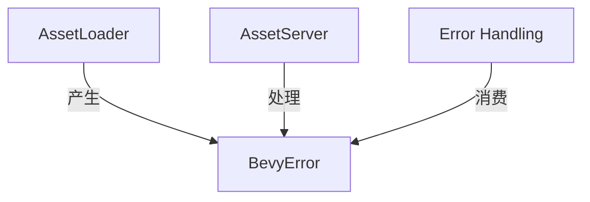

+++
title = "#19478 Use BevyError for AssetLoader::Error"
date = "2025-06-04T00:00:00"
draft = false
template = "pull_request_page.html"
in_search_index = false

[extra]
current_language = "zh-cn"
available_languages = {"en" = { name = "English", url = "/pull_request/bevy/2025-06/pr-19478-en-20250604" }, "zh-cn" = { name = "中文", url = "/pull_request/bevy/2025-06/pr-19478-zh-cn-20250604" }}
+++

# 技术报告：PR #19478 - Use BevyError for AssetLoader::Error

## 基本信息
- **标题**: Use BevyError for AssetLoader::Error
- **PR链接**: https://github.com/bevyengine/bevy/pull/19478
- **作者**: SpecificProtagonist
- **状态**: 已合并
- **标签**: A-Assets, C-Usability, S-Ready-For-Final-Review, X-Uncontroversial, D-Straightforward
- **创建时间**: 2025-06-03T17:47:59Z
- **合并时间**: 2025-06-04T00:19:21Z
- **合并人**: alice-i-cecile

## 描述翻译
### 目标
允许在`AssetLoader`中使用`BevyResult`以保持一致性。当前实现将错误转换为`Box<dyn core::error::Error + Send + Sync + 'static>`，这本质上是一个不具备可选回溯(backtrace)功能的`BevyError`。

### 解决方案
我认为不需要迁移指南，因为任何满足`Into<Box<dyn core::error::Error + Send + Sync + 'static>>`的类型也满足`Into<BevyError>`。

## PR分析报告

### 问题背景
在Bevy的资产系统中，`AssetLoader` trait定义了一个关联错误类型`Error`，要求实现`Into<Box<dyn core::error::Error + Send + Sync + 'static>>`。这种设计存在两个问题：
1. 与Bevy核心的`BevyError`类型不一致，后者是Bevy生态系统中的标准错误类型
2. 丢失了`BevyError`提供的可选回溯功能，降低了错误诊断能力

这种不一致导致开发者处理资产加载错误时需要额外的类型转换，增加了代码复杂度。

### 解决方案设计
解决方案的核心是将`AssetLoader`的错误类型统一为`BevyError`：
1. 修改`AssetLoader::Error`的trait bound为`Into<BevyError>`
2. 更新相关实现使用`BevyError`代替boxed error
3. 调整`AssetLoaderError`结构体使用`Arc<BevyError>`

该设计保持向后兼容性，因为任何满足原trait bound的类型自动满足新bound（通过`BevyError`的`From`实现）。

### 实现细节
**关键修改1：AssetLoader trait定义**
```rust
// 修改前
type Error: Into<Box<dyn core::error::Error + Send + Sync + 'static>>;

// 修改后
type Error: Into<BevyError>;
```
此修改将关联错误类型从boxed error改为`BevyError`，统一了错误处理接口。

**关键修改2：ErasedAssetLoader返回类型**
```rust
// 修改前
BoxedFuture<
    'a,
    Result<ErasedLoadedAsset, Box<dyn core::error::Error + Send + Sync + 'static>>,
>;

// 修改后
BoxedFuture<'a, Result<ErasedLoadedAsset, BevyError>>;
```
抹除类型后的asset loader现在直接返回`BevyError`，简化了错误处理路径。

**关键修改3：AssetLoaderError结构体**
```rust
// 修改前
error: Arc<dyn core::error::Error + Send + Sync + 'static>,

// 修改后
error: Arc<BevyError>,
```
资产加载错误现在直接存储为`BevyError`的原子引用计数指针，与核心错误类型保持一致。

### 技术考量
1. **兼容性保证**：由于`BevyError`实现了`From<Box<dyn Error>>`，所有现有实现自动满足新约束：
   ```rust
   impl From<Box<dyn core::error::Error + Send + Sync + 'static>> for BevyError
   ```
2. **零成本抽象**：错误转换发生在编译时，无运行时开销
3. **诊断增强**：启用`backtrace`特性后可自动捕获错误回溯
4. **简化错误处理**：消费者现在可以直接匹配`BevyError`变体，无需处理boxed trait object

### 影响评估
1. **一致性提升**：资产系统与核心错误处理机制统一
2. **可维护性改进**：减少错误类型转换的样板代码
3. **诊断能力增强**：潜在支持错误回溯捕获
4. **无破坏性变更**：现有实现无需修改即可继续工作

## 组件关系图


## 关键文件变更

### crates/bevy_asset/src/loader.rs
**修改说明**：重构AssetLoader trait使用BevyError作为错误类型  
**代码变更**：
```diff
@@ -12,7 +12,7 @@ use alloc::{
     vec::Vec,
 };
 use atomicow::CowArc;
-use bevy_ecs::world::World;
+use bevy_ecs::{error::BevyError, world::World};
 use bevy_platform::collections::{HashMap, HashSet};
 use bevy_tasks::{BoxedFuture, ConditionalSendFuture};
 use core::any::{Any, TypeId};
@@ -34,7 +34,7 @@ pub trait AssetLoader: Send + Sync + 'static {
     /// The settings type used by this [`AssetLoader`].
     type Settings: Settings + Default + Serialize + for<'a> Deserialize<'a>;
     /// The type of [error](`std::error::Error`) which could be encountered by this loader.
-    type Error: Into<Box<dyn core::error::Error + Send + Sync + 'static>>;
+    type Error: Into<BevyError>;
     /// Asynchronously loads [`AssetLoader::Asset`] (and any other labeled assets) from the bytes provided by [`Reader`].
     fn load(
         &self,
@@ -58,10 +58,7 @@ pub trait ErasedAssetLoader: Send + Sync + 'static {
         reader: &'a mut dyn Reader,
         meta: &'a dyn AssetMetaDyn,
         load_context: LoadContext<'a>,
-    ) -> BoxedFuture<
-        'a,
-        Result<ErasedLoadedAsset, Box<dyn core::error::Error + Send + Sync + 'static>>,
-    >;
+    ) -> BoxedFuture<'a, Result<ErasedLoadedAsset, BevyError>>;
 
     /// Returns a list of extensions supported by this asset loader, without the preceding dot.
     fn extensions(&self) -> &[&str];
@@ -89,10 +86,7 @@ where
         reader: &'a mut dyn Reader,
         meta: &'a dyn AssetMetaDyn,
         mut load_context: LoadContext<'a>,
-    ) -> BoxedFuture<
-        'a,
-        Result<ErasedLoadedAsset, Box<dyn core::error::Error + Send + Sync + 'static>>,
-    > {
+    ) -> BoxedFuture<'a, Result<ErasedLoadedAsset, BevyError>> {
         Box::pin(async move {
             let settings = meta
                 .loader_settings()
```

### crates/bevy_asset/src/server/mod.rs
**修改说明**：更新AssetLoaderError使用BevyError  
**代码变更**：
```diff
@@ -1945,7 +1945,7 @@ pub enum AssetLoadError {
 pub struct AssetLoaderError {
     path: AssetPath<'static>,
     loader_name: &'static str,
-    error: Arc<dyn core::error::Error + Send + Sync + 'static>,
+    error: Arc<BevyError>,
 }
 
 impl AssetLoaderError {
```

## 延伸阅读
1. [Rust错误处理指南](https://doc.rust-lang.org/book/ch09-00-error-handling.html)
2. [Bevy错误模块源码](https://github.com/bevyengine/bevy/blob/main/crates/bevy_ecs/src/error.rs)
3. [Rust的Error trait文档](https://doc.rust-lang.org/std/error/trait.Error.html)
4. [零成本抽象原理](https://blog.rust-lang.org/2015/05/11/traits.html)