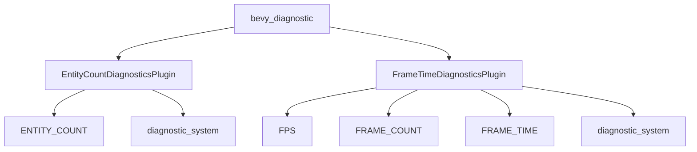

+++
title = "#19482 deny(missing_docs) for bevy_diagnostic"
date = "2025-06-04T00:00:00"
draft = false
template = "pull_request_page.html"
in_search_index = true

[taxonomies]
list_display = ["show"]

[extra]
current_language = "en"
available_languages = {"en" = { name = "English", url = "/pull_request/bevy/2025-06/pr-19482-en-20250604" }, "zh-cn" = { name = "中文", url = "/pull_request/bevy/2025-06/pr-19482-zh-cn-20250604" }}
labels = ["C-Docs", "D-Trivial"]
+++

# deny(missing_docs) for bevy_diagnostic

## Basic Information
- **Title**: deny(missing_docs) for bevy_diagnostic
- **PR Link**: https://github.com/bevyengine/bevy/pull/19482
- **Author**: theotherphil
- **Status**: MERGED
- **Labels**: C-Docs, D-Trivial, S-Ready-For-Final-Review
- **Created**: 2025-06-03T20:33:08Z
- **Merged**: 2025-06-04T01:50:10Z
- **Merged By**: alice-i-cecile

## Description Translation
# Objective

Deny missing docs in bevy_diagnostic, towards https://github.com/bevyengine/bevy/issues/3492.

## The Story of This Pull Request

This PR addresses a specific documentation gap in Bevy's diagnostic module. The core problem was that `bevy_diagnostic` contained public API items without documentation, which violates Rust's best practices and makes the API harder to understand for users. The project already had an open issue (#3492) tracking overall documentation improvements, and this PR contributes to that effort.

The solution approach was straightforward: first add missing documentation to all public items in the module, then enforce documentation requirements by enabling the `deny(missing_docs)` lint. This lint configuration ensures that future additions to the module must include documentation, preventing regression.

Implementation details focused on two key areas. For the `EntityCountDiagnosticsPlugin`, doc comments were added to both the `ENTITY_COUNT` constant and the `diagnostic_system` function. Similarly, for `FrameTimeDiagnosticsPlugin`, documentation was added to the `FPS`, `FRAME_COUNT`, and `FRAME_TIME` constants, plus the `diagnostic_system` function. The comments describe what each item represents and its purpose in the diagnostics system.

The key technical insight here is that while `#![expect(missing_docs)]` suppresses lint warnings, `#![deny(missing_docs)]` actively prevents compilation if documentation is missing. This creates a stronger enforcement mechanism for maintaining documentation quality.

The impact of these changes is immediate and practical. Developers using these diagnostics now have clear documentation directly in the code, making the API more discoverable and self-explanatory. More importantly, the enabled lint ensures this documentation quality will be maintained as the module evolves. This change also moves the project closer to resolving the overarching documentation issue (#3492) by completing the documentation requirements for this specific module.

## Visual Representation



## Key Files Changed

### crates/bevy_diagnostic/src/entity_count_diagnostics_plugin.rs
Added documentation to public API items to satisfy missing_docs requirement.

```rust
// Before:
impl EntityCountDiagnosticsPlugin {
    pub const ENTITY_COUNT: DiagnosticPath = DiagnosticPath::const_new("entity_count");

    pub fn diagnostic_system(mut diagnostics: Diagnostics, entities: &Entities) {
        diagnostics.add_measurement(&Self::ENTITY_COUNT, || entities.len() as f64);
    }
}

// After:
impl EntityCountDiagnosticsPlugin {
    /// Number of currently allocated entities.
    pub const ENTITY_COUNT: DiagnosticPath = DiagnosticPath::const_new("entity_count");

    /// Updates entity count measurement.
    pub fn diagnostic_system(mut diagnostics: Diagnostics, entities: &Entities) {
        diagnostics.add_measurement(&Self::ENTITY_COUNT, || entities.len() as f64);
    }
}
```

### crates/bevy_diagnostic/src/frame_time_diagnostics_plugin.rs
Added documentation to constants and system function.

```rust
// Before:
impl FrameTimeDiagnosticsPlugin {
    pub const FPS: DiagnosticPath = DiagnosticPath::const_new("fps");
    pub const FRAME_COUNT: DiagnosticPath = DiagnosticPath::const_new("frame_count");
    pub const FRAME_TIME: DiagnosticPath = DiagnosticPath::const_new("frame_time");

    pub fn diagnostic_system(
        mut diagnostics: Diagnostics,
        time: Res<Time<Real>>,
    ) {
        // ... existing implementation ...
    }
}

// After:
impl FrameTimeDiagnosticsPlugin {
    /// Frames per second.
    pub const FPS: DiagnosticPath = DiagnosticPath::const_new("fps");
    
    /// Total frames since application start.
    pub const FRAME_COUNT: DiagnosticPath = DiagnosticPath::const_new("frame_count");
    
    /// Frame time in ms.
    pub const FRAME_TIME: DiagnosticPath = DiagnosticPath::const_new("frame_time");

    /// Updates frame count, frame time and fps measurements.
    pub fn diagnostic_system(
        mut diagnostics: Diagnostics,
        time: Res<Time<Real>>,
    ) {
        // ... existing implementation ...
    }
}
```

### crates/bevy_diagnostic/src/lib.rs
Removed lint exception to enforce documentation requirements.

```rust
// Before:
#![expect(missing_docs, reason = "Not all docs are written yet, see #3492.")]
#![cfg_attr(docsrs, feature(doc_auto_cfg))]
#![forbid(unsafe_code)]

// After:
#![cfg_attr(docsrs, feature(doc_auto_cfg))]
#![forbid(unsafe_code)]
```

## Further Reading
1. [Rust Documentation Guidelines](https://rust-lang.github.io/api-guidelines/documentation.html)
2. [Rust lint levels (allow/warn/deny/forbid)](https://doc.rust-lang.org/rustc/lints/levels.html)
3. [Bevy's Documentation Issue #3492](https://github.com/bevyengine/bevy/issues/3492)
4. [DiagnosticPath API Reference](https://docs.rs/bevy_diagnostic/latest/bevy_diagnostic/struct.DiagnosticPath.html)

## Full Code Diff
```diff
diff --git a/crates/bevy_diagnostic/src/entity_count_diagnostics_plugin.rs b/crates/bevy_diagnostic/src/entity_count_diagnostics_plugin.rs
index 91874a390c0f6..b20a82bf6cc5d 100644
--- a/crates/bevy_diagnostic/src/entity_count_diagnostics_plugin.rs
+++ b/crates/bevy_diagnostic/src/entity_count_diagnostics_plugin.rs
@@ -19,8 +19,10 @@ impl Plugin for EntityCountDiagnosticsPlugin {
 }
 
 impl EntityCountDiagnosticsPlugin {
+    /// Number of currently allocated entities.
     pub const ENTITY_COUNT: DiagnosticPath = DiagnosticPath::const_new("entity_count");
 
+    /// Updates entity count measurement.
     pub fn diagnostic_system(mut diagnostics: Diagnostics, entities: &Entities) {
         diagnostics.add_measurement(&Self::ENTITY_COUNT, || entities.len() as f64);
     }
diff --git a/crates/bevy_diagnostic/src/frame_time_diagnostics_plugin.rs b/crates/bevy_diagnostic/src/frame_time_diagnostics_plugin.rs
index 22b6176fa2856..a632c1b49abc4 100644
--- a/crates/bevy_diagnostic/src/frame_time_diagnostics_plugin.rs
+++ b/crates/bevy_diagnostic/src/frame_time_diagnostics_plugin.rs
@@ -58,10 +58,16 @@ impl Plugin for FrameTimeDiagnosticsPlugin {
 }
 
 impl FrameTimeDiagnosticsPlugin {
+    /// Frames per second.
     pub const FPS: DiagnosticPath = DiagnosticPath::const_new("fps");
+
+    /// Total frames since application start.
     pub const FRAME_COUNT: DiagnosticPath = DiagnosticPath::const_new("frame_count");
+
+    /// Frame time in ms.
     pub const FRAME_TIME: DiagnosticPath = DiagnosticPath::const_new("frame_time");
 
+    /// Updates frame count, frame time and fps measurements.
     pub fn diagnostic_system(
         mut diagnostics: Diagnostics,
         time: Res<Time<Real>>,
diff --git a/crates/bevy_diagnostic/src/lib.rs b/crates/bevy_diagnostic/src/lib.rs
index 588b3276f6a79..1b1beb9c36a9d 100644
--- a/crates/bevy_diagnostic/src/lib.rs
+++ b/crates/bevy_diagnostic/src/lib.rs
@@ -1,4 +1,3 @@
-#![expect(missing_docs, reason = "Not all docs are written yet, see #3492.")]
 #![cfg_attr(docsrs, feature(doc_auto_cfg))]
 #![forbid(unsafe_code)]
 #![doc(
```