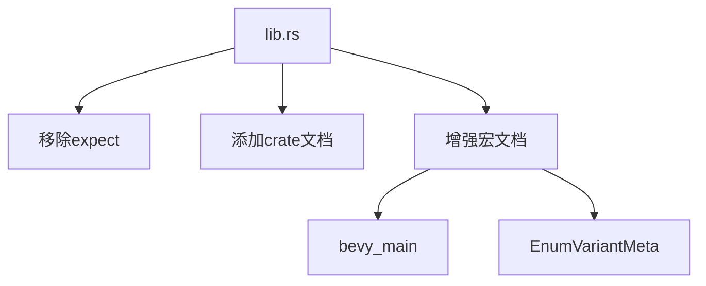

+++
title = "#19483 deny(missing_docs) for bevy_derive"
date = "2025-06-04T00:00:00"
draft = false
template = "pull_request_page.html"
in_search_index = false

[extra]
current_language = "zh-cn"
available_languages = {"en" = { name = "English", url = "/pull_request/bevy/2025-06/pr-19483-en-20250604" }, "zh-cn" = { name = "中文", url = "/pull_request/bevy/2025-06/pr-19483-zh-cn-20250604" }}
labels = ["C-Docs", "D-Trivial"]
+++

# PR分析：bevy_derive中的文档完整性要求

## Basic Information
- **Title**: deny(missing_docs) for bevy_derive
- **PR Link**: https://github.com/bevyengine/bevy/pull/19483
- **Author**: theotherphil
- **Status**: MERGED
- **Labels**: C-Docs, D-Trivial, S-Ready-For-Final-Review
- **Created**: 2025-06-03T21:07:56Z
- **Merged**: 2025-06-04T01:28:43Z
- **Merged By**: alice-i-cecile

## Description Translation
### 目标
在bevy_derive中启用deny(missing_docs)，向https://github.com/bevyengine/bevy/issues/3492的目标迈进。

## The Story of This Pull Request

### 问题背景
Bevy引擎长期存在文档覆盖率问题(#3492)。虽然大多数crate已启用`#![deny(missing_docs)]`，但`bevy_derive`作为关键派生宏工具集仍存在例外。此前该crate使用`#![expect(missing_docs)]`暂时抑制警告，这意味着开发人员可以忽略文档缺失问题，导致重要API缺乏文档说明。

### 解决方案
PR通过三个步骤解决文档缺失问题：
1. 移除`expect(missing_docs)`抑制
2. 添加顶级crate文档
3. 为关键派生宏添加详细文档注释

这种改动强制要求所有公共API必须有文档，否则编译失败。选择此方案是因为：
- 符合Bevy的文档策略
- 通过编译器强制执行标准
- 避免引入新依赖或复杂工具链

### 具体实现
实现集中在`lib.rs`文件，主要变化包括：
1. 将`#![expect(missing_docs)]`替换为主动文档声明
2. 为`bevy_main`属性宏添加功能说明
3. 为`EnumVariantMeta`派生宏添加完整用法示例

这些改动确保所有公共API都有明确文档，同时保持代码结构不变。文档示例特别重要，因为派生宏的使用模式通常需要明确示范。

### 技术影响
主要技术影响包括：
1. 消除技术债务：移除临时抑制标记
2. 提升开发者体验：新文档明确说明宏行为
3. 强制执行标准：新贡献者必须为API添加文档

```rust
// 变更前：临时抑制文档警告
#![expect(missing_docs, reason = "Not all docs are written yet, see #3492.")]

// 变更后：主动声明模块文档
//! Assorted proc macro derive functions.
```

### 潜在改进
虽然PR已解决基本问题，但未来可考虑：
- 为其他派生宏添加类似文档
- 统一文档示例格式
- 扩展文档测试覆盖率

## Visual Representation



## Key Files Changed

### `crates/bevy_derive/src/lib.rs`
**变更说明**：实现文档完整性要求，移除临时抑制标记，添加缺失文档

**关键变更**:
```rust
// 文件顶部变更
// 变更前:
#![expect(missing_docs, reason = "Not all docs are written yet, see #3492.")]

// 变更后:
//! Assorted proc macro derive functions.
```

```rust
// bevy_main宏文档增强
// 变更前:
#[proc_macro_attribute]
pub fn bevy_main(attr: TokenStream, item: TokenStream) -> TokenStream {

// 变更后:
/// Generates the required main function boilerplate for Android.
#[proc_macro_attribute]
pub fn bevy_main(attr: TokenStream, item: TokenStream) -> TokenStream {
```

```rust
// EnumVariantMeta宏文档增强
// 变更前:
#[proc_macro_derive(EnumVariantMeta)]
pub fn derive_enum_variant_meta(input: TokenStream) -> TokenStream {

// 变更后:
/// Adds `enum_variant_index` and `enum_variant_name` functions to enums.
///
/// # Example
///
/// ```
/// use bevy_derive::{EnumVariantMeta};
///
/// #[derive(EnumVariantMeta)]
/// enum MyEnum {
///     A,
///     B,
/// }
///
/// let a = MyEnum::A;
/// let b = MyEnum::B;
///
/// assert_eq!(0, a.enum_variant_index());
/// assert_eq!("A", a.enum_variant_name());
///
/// assert_eq!(1, b.enum_variant_index());
/// assert_eq!("B", b.enum_variant_name());
/// ```
#[proc_macro_derive(EnumVariantMeta)]
pub fn derive_enum_variant_meta(input: TokenStream) -> TokenStream {
```

## Further Reading
1. [Bevy文档计划#3492](https://github.com/bevyengine/bevy/issues/3492) - 整体文档改进计划
2. [Rust文档规范](https://rust-lang.github.io/api-guidelines/documentation.html) - API文档最佳实践
3. [proc_macro文档](https://doc.rust-lang.org/reference/procedural-macros.html) - Rust过程宏技术细节

# Full Code Diff
```diff
diff --git a/crates/bevy_derive/src/lib.rs b/crates/bevy_derive/src/lib.rs
index e446d0f50dd50..c2ce08cbae27d 100644
--- a/crates/bevy_derive/src/lib.rs
+++ b/crates/bevy_derive/src/lib.rs
@@ -1,4 +1,5 @@
-#![expect(missing_docs, reason = "Not all docs are written yet, see #3492.")]
+//! Assorted proc macro derive functions.
+
 #![forbid(unsafe_code)]
 #![cfg_attr(docsrs, feature(doc_auto_cfg))]
 #![doc(
@@ -188,11 +189,34 @@ pub fn derive_deref_mut(input: TokenStream) -> TokenStream {
     derefs::derive_deref_mut(input)
 }
 
+/// Generates the required main function boilerplate for Android.
 #[proc_macro_attribute]
 pub fn bevy_main(attr: TokenStream, item: TokenStream) -> TokenStream {
     bevy_main::bevy_main(attr, item)
 }
 
+/// Adds `enum_variant_index` and `enum_variant_name` functions to enums.
+///
+/// # Example
+///
+/// ```
+/// use bevy_derive::{EnumVariantMeta};
+///
+/// #[derive(EnumVariantMeta)]
+/// enum MyEnum {
+///     A,
+///     B,
+/// }
+///
+/// let a = MyEnum::A;
+/// let b = MyEnum::B;
+///
+/// assert_eq!(0, a.enum_variant_index());
+/// assert_eq!("A", a.enum_variant_name());
+///
+/// assert_eq!(1, b.enum_variant_index());
+/// assert_eq!("B", b.enum_variant_name());
+/// ```
 #[proc_macro_derive(EnumVariantMeta)]
 pub fn derive_enum_variant_meta(input: TokenStream) -> TokenStream {
     enum_variant_meta::derive_enum_variant_meta(input)
```