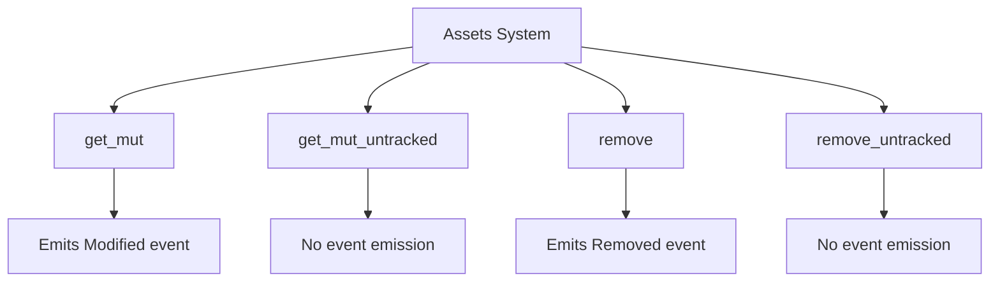

+++
title = "#19487"
date = "2025-06-04T00:00:00"
draft = false
template = "pull_request_page.html"
in_search_index = true

[taxonomies]
list_display = ["show"]

[extra]
current_language = "en"
available_languages = {"en" = { name = "English", url = "/pull_request/bevy/2025-06/pr-19487-en-20250604" }, "zh-cn" = { name = "中文", url = "/pull_request/bevy/2025-06/pr-19487-zh-cn-20250604" }}
+++

## Narrative Analysis: Adding get_mut_untracked to Bevy's Asset System

### The Problem and Context
In Bevy's asset system, modifying assets through `Assets::get_mut` automatically generated `AssetEvent::Modified` events. While this event tracking is useful for most scenarios, it became problematic for certain internal operations where event emission caused unnecessary overhead or recursive event handling. Specifically, issue #13104 highlighted cases where asset modification events triggered during asset loading or internal bookkeeping created event loops and redundant processing. The system needed a way to mutate assets without triggering modification events for these special cases.

### The Solution Approach
The solution maintains consistency with Bevy's existing pattern for untracked operations by introducing `get_mut_untracked` - a direct counterpart to the existing `remove_untracked` method. This approach:
1. Mirrors the established pattern of providing untracked variants for asset operations
2. Requires minimal changes to the existing codebase
3. Maintains clear parity between method behaviors through documentation
4. Preserves the existing event emission behavior for normal usage while providing an escape hatch for special cases

The implementation deliberately avoids modifying existing methods to prevent breaking changes and maintains the same performance characteristics as `get_mut`.

### The Implementation
The new method directly accesses asset storage without triggering events, mirroring the internal implementation of `get_mut` but skipping event emission:

```rust
/// Retrieves a mutable reference to the [`Asset`] with the given `id`, if it exists.
///
/// This is the same as [`Assets::get_mut`] except it doesn't emit [`AssetEvent::Modified`].
#[inline]
pub fn get_mut_untracked(&mut self, id: impl Into<AssetId<A>>) -> Option<&mut A> {
    let id: AssetId<A> = id.into();
    match id {
        AssetId::Index { index, .. } => self.dense_storage.get_mut(index),
        AssetId::Uuid { uuid } => self.hash_map.get_mut(&uuid),
    }
}
```

The documentation for `remove_untracked` was also updated to maintain consistency:

```rust
/// Removes (and returns) the [`Asset`] with the given `id`, if it exists. This skips emitting [`AssetEvent::Removed`].
/// Note that this supports anything that implements `Into<AssetId<A>>`, which includes [`Handle`] and [`AssetId`].
///
/// This is the same as [`Assets::remove`] except it doesn't emit [`AssetEvent::Removed`].
pub fn remove_untracked(&mut self, id: impl Into<AssetId<A>>) -> Option<A> {
```

### Technical Insights
1. **Asset Identification**: Both methods use Bevy's `AssetId` system which supports both index-based and UUID-based identification
2. **Storage Access**: The implementation efficiently handles both storage types:
   - `dense_storage` for index-based assets
   - `hash_map` for UUID-based assets
3. **Inline Optimization**: The `#[inline]` attribute suggests this is intended as a lightweight accessor
4. **Consistency Principle**: The solution follows Bevy's established convention where:
   - Normal methods emit events
   - `_untracked` variants skip event emission
5. **Safety**: The method provides safe mutable access without bypassing Rust's borrowing rules

### The Impact
This change provides important flexibility for:
1. Asset loading systems that modify assets during initialization
2. Internal systems that need to update assets without triggering recursive events
3. Performance-sensitive operations where event emission would cause unnecessary overhead
4. Special cases where event handling would create circular dependencies

The change maintains backward compatibility while solving a specific pain point in the asset system, demonstrating how targeted API additions can solve edge cases without disrupting existing workflows.

## Visual Representation



## Key Files Changed

### `crates/bevy_asset/src/assets.rs`
**Purpose**: Added new method for mutating assets without event emission and improved documentation consistency.

**Changes**:
```rust
// New method implementation
pub fn get_mut_untracked(&mut self, id: impl Into<AssetId<A>>) -> Option<&mut A> {
    let id: AssetId<A> = id.into();
    match id {
        AssetId::Index { index, .. } => self.dense_storage.get_mut(index),
        AssetId::Uuid { uuid } => self.hash_map.get_mut(&uuid),
    }
}

// Updated documentation for existing method
/// Removes (and returns) the [`Asset`] with the given `id`, if it exists. This skips emitting [`AssetEvent::Removed`].
/// Note that this supports anything that implements `Into<AssetId<A>>`, which includes [`Handle`] and [`AssetId`].
///
/// This is the same as [`Assets::remove`] except it doesn't emit [`AssetEvent::Removed`].
pub fn remove_untracked(&mut self, id: impl Into<AssetId<A>>) -> Option<A> {
```

## Further Reading
1. [Bevy Assets Documentation](https://docs.rs/bevy_asset/latest/bevy_asset/)
2. [Asset Events System](https://github.com/bevyengine/bevy/blob/main/crates/bevy_asset/src/asset_server.rs)
3. [ECS Pattern in Bevy](https://bevy-cheatbook.github.io/programming/ecs-intro.html)
4. [Rust Borrowing Rules](https://doc.rust-lang.org/book/ch04-02-references-and-borrowing.html)