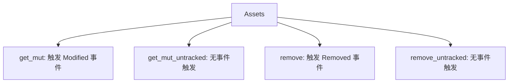

+++
title = "#19487 Add get_mut_untracked to Assets"
date = "2025-06-04T00:00:00"
draft = false
template = "pull_request_page.html"
in_search_index = false

[extra]
current_language = "zh-cn"
available_languages = {"en" = { name = "English", url = "/pull_request/bevy/2025-06/pr-19487-en-20250604" }, "zh-cn" = { name = "中文", url = "/pull_request/bevy/2025-06/pr-19487-zh-cn-20250604" }}
labels = ["D-Trivial", "A-Assets", "C-Usability"]
+++

# Add get_mut_untracked to Assets

## Basic Information
- **Title**: Add get_mut_untracked to Assets
- **PR Link**: https://github.com/bevyengine/bevy/pull/19487
- **Author**: kristoff3r
- **Status**: MERGED
- **Labels**: D-Trivial, A-Assets, C-Usability, S-Ready-For-Final-Review
- **Created**: 2025-06-04T13:16:29Z
- **Merged**: 2025-06-04T16:56:06Z
- **Merged By**: alice-i-cecile

## Description Translation
# Objective

Fixes #13104

## Solution

Add a `get_mut_untracked` method to `Assets`

## The Story of This Pull Request

### 问题背景和需求
在 Bevy 的 Assets 系统中，当开发者需要修改一个资源时，通常会使用 `get_mut` 方法。这个方法在返回资源的可变引用时，会自动触发 `AssetEvent::Modified` 事件通知系统资源已被修改。然而在某些特定场景下，这种自动事件通知反而会造成问题——特别是当开发者执行内部维护操作或临时修改，不希望触发外部系统响应时。Issue #13104 明确指出需要一种不触发事件通知的资源修改方式。

### 解决方案设计
考虑到 Assets 系统中已存在类似模式（`remove_untracked` 方法），最直接的解决方案是添加一个与 `get_mut` 功能相同但跳过事件通知的新方法。这种方法保持 API 一致性：
1. 命名沿用 `_untracked` 后缀表示不触发事件
2. 参数和返回值与 `get_mut` 完全一致
3. 实现复用现有资源查找逻辑

### 具体实现分析
新方法 `get_mut_untracked` 的实现直接复用 `get_mut` 的资源查找逻辑，但移除了事件通知机制。关键点在于：
- 方法签名与 `get_mut` 保持一致，接受 `AssetId` 或能转换为 `AssetId` 的类型
- 内部使用相同的存储查找逻辑：通过索引查找 dense storage 或通过 UUID 查找 hash map
- 明确文档说明该方法不会触发 `AssetEvent::Modified`

```rust
#[inline]
pub fn get_mut_untracked(&mut self, id: impl Into<AssetId<A>>) -> Option<&mut A> {
    let id: AssetId<A> = id.into();
    match id {
        AssetId::Index { index, .. } => self.dense_storage.get_mut(index),
        AssetId::Uuid { uuid } => self.hash_map.get_mut(&uuid),
    }
}
```

### 工程决策考量
实现时考虑了以下因素：
1. **性能优化**：使用 `#[inline]` 属性提示编译器进行内联优化，避免函数调用开销
2. **API 一致性**：参数处理和资源查找路径与 `get_mut` 完全相同，降低认知负担
3. **文档明确性**：通过文档注释清晰说明与 `get_mut` 的行为差异
4. **错误预防**：复用经过验证的资源查找逻辑，避免引入新错误

### 影响和实际价值
此变更解决了特定场景下的开发痛点：
- 资源初始化：可在资源加载后执行初始化操作而不触发修改事件
- 内部状态更新：适用于不影响游戏逻辑的元数据更新
- 性能敏感操作：避免不必要的事件处理开销

同时保持原有工作流不变——需要事件通知的场景仍使用 `get_mut` 方法。这种显式的行为选择使开发者能更精确地控制资源修改的副作用。

## Visual Representation



## Key Files Changed

### `crates/bevy_asset/src/assets.rs` (+14/-0)
添加新方法 `get_mut_untracked` 并完善文档说明，与现有的 `remove_untracked` 形成完整的事件控制 API。

```rust
// 新增方法实现
pub fn get_mut_untracked(&mut self, id: impl Into<AssetId<A>>) -> Option<&mut A> {
    let id: AssetId<A> = id.into();
    match id {
        AssetId::Index { index, .. } => self.dense_storage.get_mut(index),
        AssetId::Uuid { uuid } => self.hash_map.get_mut(&uuid),
    }
}

// 更新 remove_untracked 文档说明
pub fn remove_untracked(&mut self, id: impl Into<AssetId<A>>) -> Option<A> {
    // ...原有实现...
    /// This is the same as [`Assets::remove`] except it doesn't emit [`AssetEvent::Removed`].
}
```

## Further Reading
1. [Bevy Assets 系统文档](https://docs.rs/bevy_asset/latest/bevy_asset/)
2. [原始 Issue #13104：需要无事件触发的资源访问方法](https://github.com/bevyengine/bevy/issues/13104)
3. [Rust 内联优化指南](https://nnethercote.github.io/perf-book/inlining.html)