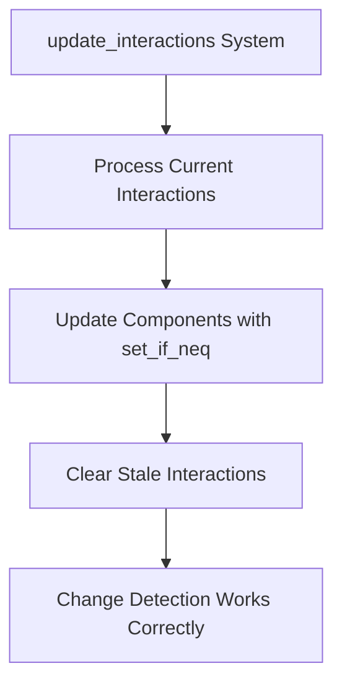

+++
title = "#19488 Fix PickingInteraction change detection"
date = "2025-06-08T00:00:00"
draft = false
template = "pull_request_page.html"
in_search_index = true

[taxonomies]
list_display = ["show"]

[extra]
current_language = "en"
available_languages = {"en" = { name = "English", url = "/pull_request/bevy/2025-06/pr-19488-en-20250608" }, "zh-cn" = { name = "中文", url = "/pull_request/bevy/2025-06/pr-19488-zh-cn-20250608" }}
labels = ["C-Bug", "D-Straightforward", "A-Picking"]
+++

### Fixing PickingInteraction Change Detection in Bevy

## Basic Information  
- **Title**: Fix PickingInteraction change detection  
- **PR Link**: https://github.com/bevyengine/bevy/pull/19488  
- **Author**: kristoff3r  
- **Status**: MERGED  
- **Labels**: C-Bug, S-Ready-For-Final-Review, D-Straightforward, A-Picking  
- **Created**: 2025-06-04T14:16:59Z  
- **Merged**: 2025-06-08T16:46:53Z  
- **Merged By**: alice-i-cecile  

## Description Translation  
# Objective  

Fixes #19464  

## Solution  

Instead of clearing previous `PickingInteractions` before updating, we clear them last for those components that weren't updated, and use `set_if_neq` when writing.  

## Testing  

I tried the sprite_picking example and it still works.  

You can add the following system to picking examples to check that change detection works as intended:  

```rust  
fn print_picking(query: Query<(Entity, &PickingInteraction), Changed<PickingInteraction>>) {  
    for (entity, interaction) in &query {  
        println!("{entity} {interaction:?}");  
    }  
}  
```

## The Story of This Pull Request  

### The Problem and Context  
The issue (#19464) centered around incorrect change detection behavior in Bevy's picking system. When entities stopped being hovered, their `PickingInteraction` components were cleared to `None`, but subsequent change detection queries didn't register this state change correctly. The root cause was the order of operations in the hover system:  

1. All previously hovered entities were unconditionally reset to `PickingInteraction::None` at the start of each frame  
2. Current hover states were applied later in the same frame  

This approach caused two issues:  
- For still-hovered entities: The initial reset followed by re-application triggered two change events per frame  
- For no-longer-hovered entities: Change detection failed after the first frame since subsequent `None` assignments appeared identical  

### The Solution Approach  
The fix required:  
1. Preserving change detection integrity by eliminating unnecessary state resets  
2. Only modifying components when actual state changes occurred  
3. Handling state cleanup after current interactions are processed  

The key insight was to delay clearing operations until after processing current interactions, and only reset components that weren't updated. Using `set_if_neq` ensured components were only modified when values actually changed.  

### The Implementation  
The solution restructured the `update_interactions` system:  

1. **Removed premature clearing**: The initial loop that reset all previous hover states was eliminated  
2. **State-aware updates**: Used `set_if_neq` when applying new interaction states to avoid unnecessary writes  
3. **Targeted cleanup**: Added a final clearing pass that only resets entities not present in the current frame's hover state  

```rust
// Before: Premature clearing at start
for (pointer, _, mut pointer_interaction) in &mut pointers {
    pointer_interaction.sorted_entities.clear();
    if let Some(previously_hovered_entities) = previous_hover_map.get(pointer) {
        for entity in previously_hovered_entities.keys() {
            if let Ok(mut interaction) = interact.get_mut(*entity) {
                *interaction = PickingInteraction::None; // Always reset
            }
        }
    }
}

// After: Targeted clearing at end with change detection
for (pointer, _, _) in &mut pointers {
    let Some(previously_hovered_entities) = previous_hover_map.get(pointer) else {
        continue;
    };

    for entity in previously_hovered_entities.keys() {
        if !new_interaction_state.contains_key(entity) {
            if let Ok(mut interaction) = interact.get_mut(*entity) {
                // Only set if not already None
                interaction.set_if_neq(PickingInteraction::None);
            }
        }
    }
}
```

### Technical Insights  
Critical aspects of the solution:  

1. **Change Detection Preservation**:  
   - `set_if_neq` prevents spurious change events by comparing values before assignment  
   - Delayed clearing ensures final state is set in a single operation  

2. **Efficiency Gains**:  
   - Avoids O(n) clearing of all previously hovered entities each frame  
   - Reduces component writes by only modifying stale interactions  

3. **System Ordering Sensitivity**:  
   The solution depends on processing current interactions before cleaning stale ones - a dependency that must be maintained in system schedules  

### The Impact  
This fix:  
- Corrects change detection for picking interactions  
- Reduces unnecessary component writes  
- Maintains backward compatibility with existing examples  
- Introduces more efficient state management patterns  

The changes are contained to the picking system and don't affect other engine subsystems. The solution demonstrates proper handling of state transitions in ECS systems where change detection is critical.

## Visual Representation  



## Key Files Changed  

### crates/bevy_picking/src/hover.rs  
**Purpose**: Fixes change detection in picking interaction system  

**Key Changes**:  
1. Removed premature clearing of hover states  
2. Added targeted clearing after processing current state  
3. Implemented `set_if_neq` for state updates  

**Code Comparison**:  
```rust
// Before: Early reset of all previous states
for (pointer, _, mut pointer_interaction) in &mut pointers {
    pointer_interaction.sorted_entities.clear();
    if let Some(previously_hovered_entities) = previous_hover_map.get(pointer) {
        for entity in previously_hovered_entities.keys() {
            if let Ok(mut interaction) = interact.get_mut(*entity) {
                *interaction = PickingInteraction::None;
            }
        }
    }
}

// After: State-preserving update and delayed cleanup
for (&hovered_entity, &new_interaction) in new_interaction_state.iter() {
    if let Ok(mut interaction) = interact.get_mut(hovered_entity) {
        interaction.set_if_neq(new_interaction); // Change-aware update
    }
    // ... (insert logic unchanged)
}

// New: Targeted clearing only for stale interactions
for (pointer, _, _) in &mut pointers {
    // ...
    for entity in previously_hovered_entities.keys() {
        if !new_interaction_state.contains_key(entity) {
            if let Ok(mut interaction) = interact.get_mut(*entity) {
                interaction.set_if_neq(PickingInteraction::None);
            }
        }
    }
}
```

## Further Reading  
1. [Bevy Change Detection Documentation](https://bevyengine.org/learn/book/next/programming/change-detection/)  
2. [ECS Best Practices: State Transitions](https://github.com/bevyengine/bevy/discussions/19464)  
3. [`set_if_neq` API Reference](https://docs.rs/bevy-ecs/latest/bevy_ecs/component/struct.ComponentMut.html#method.set_if_neq)