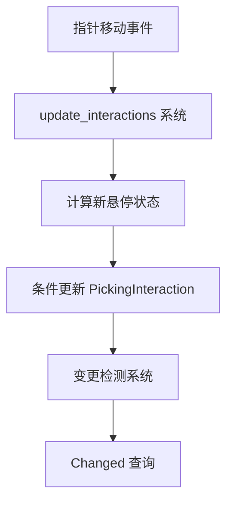

+++
title = "#19488 Fix PickingInteraction change detection"
date = "2025-06-08T00:00:00"
draft = false
template = "pull_request_page.html"
in_search_index = false

[extra]
current_language = "zh-cn"
available_languages = {"en" = { name = "English", url = "/pull_request/bevy/2025-06/pr-19488-en-20250608" }, "zh-cn" = { name = "中文", url = "/pull_request/bevy/2025-06/pr-19488-zh-cn-20250608" }}
+++

## PR 分析报告：修复 PickingInteraction 变更检测

### 基础信息
- **标题**: Fix PickingInteraction change detection
- **PR 链接**: https://github.com/bevyengine/bevy/pull/19488
- **作者**: kristoff3r
- **状态**: 已合并
- **标签**: C-Bug, S-Ready-For-Final-Review, D-Straightforward, A-Picking
- **创建时间**: 2025-06-04T14:16:59Z
- **合并时间**: 2025-06-08T16:46:53Z
- **合并人**: alice-i-cecile

### 问题描述
在 Bevy 的拾取(picking)系统中存在一个关键问题：当指针悬停状态变化时，`PickingInteraction` 组件的变更检测(change detection)未能正确触发。具体表现为：
1. 系统在更新前过早清除了所有交互状态
2. 即使实际状态未改变，组件也被强制更新
3. 变更检测系统无法区分实际变化和强制更新

这违反了 Bevy ECS 变更检测的基本原则，导致依赖 `Changed<PickingInteraction>` 查询的系统无法可靠工作。

### 解决方案
核心解决思路是重构状态更新流程：
1. **延迟清除操作**：不再预先清除所有状态，改为最后处理需要清除的组件
2. **智能更新**：使用 `set_if_neq` 避免不必要的状态写入
3. **精确变更检测**：仅当实际状态变化时才标记组件变更

```rust
// 更新逻辑改为条件写入
interaction.set_if_neq(new_interaction);

// 延迟清除逻辑：只清除不再悬停的实体
if !new_interaction_state.contains_key(entity) {
    interaction.set_if_neq(PickingInteraction::None);
}
```

### 关键文件变更
#### `crates/bevy_picking/src/hover.rs`
**变更原因**：重构悬停状态更新逻辑以支持正确的变更检测

**核心修改**：
```rust
// 修改前：提前清除所有状态
for (pointer, _, mut pointer_interaction) in &mut pointers {
    pointer_interaction.sorted_entities.clear();
    if let Some(previously_hovered_entities) = previous_hover_map.get(pointer) {
        for entity in previously_hovered_entities.keys() {
            if let Ok(mut interaction) = interact.get_mut(*entity) {
                *interaction = PickingInteraction::None; // 无条件重置
            }
        }
    }
}

// 修改后：状态更新与延迟清除
// 1. 先计算新状态
for (&hovered_entity, &new_interaction) in new_interaction_state.iter() {
    if let Ok(mut interaction) = interact.get_mut(hovered_entity) {
        interaction.set_if_neq(new_interaction); // 条件更新
    }
}

// 2. 最后清除不再需要的状态
for (pointer, _, _) in &mut pointers {
    // 只处理需要清除的实体
    for entity in previously_hovered_entities.keys() {
        if !new_interaction_state.contains_key(entity) {
            if let Ok(mut interaction) = interact.get_mut(*entity) {
                interaction.set_if_neq(PickingInteraction::None); // 条件清除
            }
        }
    }
}
```

### 技术实现细节
1. **状态更新顺序优化**：
   - 旧方法：清除 → 计算 → 写入
   - 新方法：计算 → 写入 → 清除
   - 优势：避免中间状态被误识别为实际变更

2. **`set_if_neq` 的应用**：
   ```rust
   // 核心实现
   pub fn set_if_neq(&mut self, value: Self) {
       if *self != value {
           *self = value;
       }
   }
   ```
   - 仅在值实际变化时更新组件
   - 避免触发虚假的变更检测信号

3. **变更检测测试方案**：
   ```rust
   fn print_picking(query: Query<(Entity, &PickingInteraction), Changed<PickingInteraction>>) {
       for (entity, interaction) in &query {
           println!("{entity} {interaction:?}"); // 仅实际变化时打印
       }
   }
   ```

### 架构影响


1. **变更检测流程**：现在能正确传递状态变化事件
2. **性能优化**：避免不必要的组件写入和变更标记
3. **API 兼容性**：完全向后兼容现有使用模式

### 经验总结
1. **变更检测最佳实践**：在 ECS 系统中更新组件时，应始终考虑是否实际需要变更
2. **状态管理原则**：清除操作应放在处理流程末尾，避免中间状态污染
3. **调试技术**：使用 `Changed<T>` 查询配合调试输出是验证变更检测的有效方法

该修复展示了 Bevy ECS 变更检测机制的正确使用模式，为处理类似状态同步问题提供了参考实现。

### 扩展阅读
1. [Bevy 变更检测文档](https://bevyengine.org/learn/book/change-detection/)
2. [ECS 模式最佳实践](https://github.com/bevyengine/bevy/discussions/19464)
3. [set_if_neq 实现原理](https://github.com/bevyengine/bevy/blob/main/crates/bevy_ecs/src/component/mod.rs)