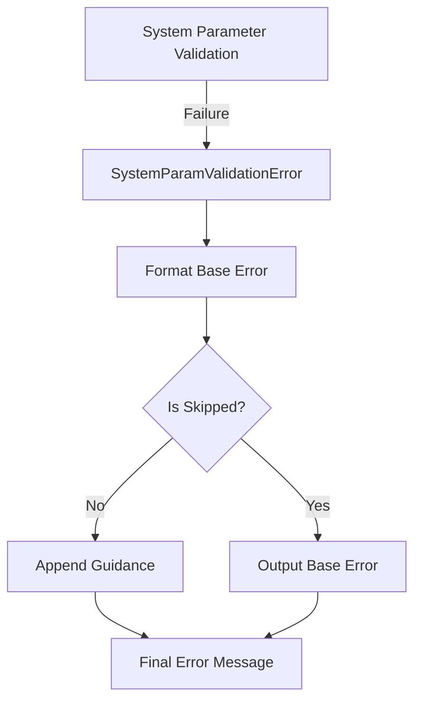

+++
title = "#19490 Improving Error Messaging for Failing System Parameters in Bevy ECS"
date = "2025-06-04T00:00:00"
draft = false
template = "pull_request_page.html"
in_search_index = true

[taxonomies]
list_display = ["show"]

[extra]
current_language = "en"
available_languages = {"en" = { name = "English", url = "/pull_request/bevy/2025-06/pr-19490-en-20250604" }, "zh-cn" = { name = "中文", url = "/pull_request/bevy/2025-06/pr-19490-zh-cn-20250604" }}
labels = ["D-Trivial", "A-ECS", "C-Usability"]
+++

## Title: Improving Error Messaging for Failing System Parameters in Bevy ECS

## Basic Information
- **Title**: Mention `Option` and `When` in the error message for a failing system parameter
- **PR Link**: https://github.com/bevyengine/bevy/pull/19490
- **Author**: chescock
- **Status**: MERGED
- **Labels**: D-Trivial, A-ECS, C-Usability, S-Ready-For-Final-Review, X-Uncontroversial
- **Created**: 2025-06-04T16:20:51Z
- **Merged**: 2025-06-04T17:01:55Z
- **Merged By**: alice-i-cecile

## Description Translation
# Objective

Help users discover how to use `Option<T>` and `When<T>` to handle failing parameters.

## Solution

Have the error message for a failed parameter mention that `Option<T>` and `When<T>` can be used to handle the failure.  

## Showcase

```
Encountered an error in system `system_name`: Parameter `Res<ResourceType>` failed validation: Resource does not exist
If this is an expected state, wrap the parameter in `Option<T>` and handle `None` when it happens, or wrap the parameter in `When<T>` to skip the system when it happens.
```

## The Story of This Pull Request

### The Problem and Context
In Bevy's ECS system, when a system parameter fails validation (like missing a required resource), the error message only stated what went wrong without guiding users toward solutions. This created friction because newer users might not know Bevy provides built-in mechanisms (`Option<T>` and `When<T>`) to gracefully handle these cases. Without this guidance, users might either:
1. Assume the error indicates a critical problem requiring immediate fixing
2. Spend unnecessary time searching documentation for handling optional parameters

The core issue was a usability gap in error messaging - the system knew why validation failed but didn't suggest standard remediation patterns.

### The Solution Approach
The solution focused on enhancing the error message to include actionable guidance. The approach:
1. Appends a note to existing validation error messages
2. Specifically mentions `Option<T>` for handling missing values at runtime
3. Mentions `When<T>` for conditionally skipping systems
4. Maintains existing error formatting while adding the new guidance

No alternatives were considered since this was a straightforward messaging improvement that didn't affect system behavior. The implementation deliberately avoided:
- Changing error types or structures
- Introducing new dependencies
- Modifying validation logic itself

### The Implementation
The core change occurred in `SystemParamValidationError`'s `Display` implementation. Previously, it only formatted the error reason. The modification appends the guidance text conditionally:

```rust
// Before:
impl Display for SystemParamValidationError {
    fn fmt(&self, fmt: &mut fmt::Formatter) -> fmt::Result {
        write!(
            fmt,
            "Parameter `{}` failed validation: {}",
            ShortName(&self.param),
            self.message
        )
    }
}

// After:
impl Display for SystemParamValidationError {
    fn fmt(&self, fmt: &mut fmt::Formatter) -> fmt::Result {
        write!(
            fmt,
            "Parameter `{}` failed validation: {}",
            ShortName(&self.param),
            self.message
        )?;
        if !self.skipped {
            write!(fmt, "\nIf this is an expected state, wrap the parameter in `Option<T>` and handle `None` when it happens, or wrap the parameter in `When<T>` to skip the system when it happens.")?;
        }
        Ok(())
    }
}
```

The conditional check `if !self.skipped` prevents showing the note when the error is already from an optional wrapper, avoiding redundant suggestions. Three test files were updated to match the new message format.

### Technical Insights
Key technical points:
1. **Error Composition**: The solution leverages Rust's `Display` trait for clean message composition
2. **Conditional Messaging**: The `skipped` flag prevents suggesting solutions when they're already applied
3. **Backward Compatibility**: Existing error handling flows remain unchanged
4. **Minimal Footprint**: Changes are localized to the error formatting logic

The `When<T>` wrapper is particularly valuable as it enables systems to skip execution when parameters are missing, while `Option<T>` allows handling the missing case explicitly.

### The Impact
This change directly improves developer experience by:
1. Reducing debugging time for expected missing resources
2. Educating users about built-in error handling patterns
3. Maintaining all existing error information while adding guidance
4. Requiring zero changes to existing system logic

The solution is low-risk since it only affects error messages and doesn't alter system execution logic. Tests were updated to validate the new message format, ensuring the guidance appears correctly.

## Visual Representation



## Key Files Changed

1. **crates/bevy_ecs/src/system/system_param.rs**
   - Modified error message formatting to include guidance
   - Added conditional suggestion for `Option`/`When`

```rust
// Before:
impl Display for SystemParamValidationError {
    fn fmt(&self, fmt: &mut fmt::Formatter) -> fmt::Result {
        write!(
            fmt,
            "Parameter `{}` failed validation: {}",
            ShortName(&self.param),
            self.message
        )
    }
}

// After:
impl Display for SystemParamValidationError {
    fn fmt(&self, fmt: &mut fmt::Formatter) -> fmt::Result {
        write!(
            fmt,
            "Parameter `{}` failed validation: {}",
            ShortName(&self.param),
            self.message
        )?;
        if !self.skipped {
            write!(fmt, "\nIf this is an expected state, wrap the parameter in `Option<T>` and handle `None` when it happens, or wrap the parameter in `When<T>` to skip the system when it happens.")?;
        }
        Ok(())
    }
}
```

2. **crates/bevy_ecs/src/system/system.rs**
   - Updated test to expect new message format

```rust
// Before:
let expected = "System ... Parameter `Res<T>` failed validation: Resource does not exist";

// After:
let expected = "System ... Parameter `Res<T>` failed validation: Resource does not exist\nIf this is an expected state, wrap...";
```

3. **crates/bevy_ecs/src/system/system_registry.rs**
   - Updated test to expect new message format

```rust
// Before:
let expected = format!("System {id:?} ... Resource does not exist");

// After:
let expected = format!("System {id:?} ... Resource does not exist\nIf this is an expected state, wrap...");
```

## Further Reading
1. [Bevy System Parameters Documentation](https://docs.rs/bevy_ecs/latest/bevy_ecs/system/trait.SystemParam.html)
2. [`Option<T>` in Rust Standard Library](https://doc.rust-lang.org/std/option/enum.Option.html)
3. [Conditional System Execution in Bevy](https://bevy-cheatbook.github.io/programming/conditions.html)