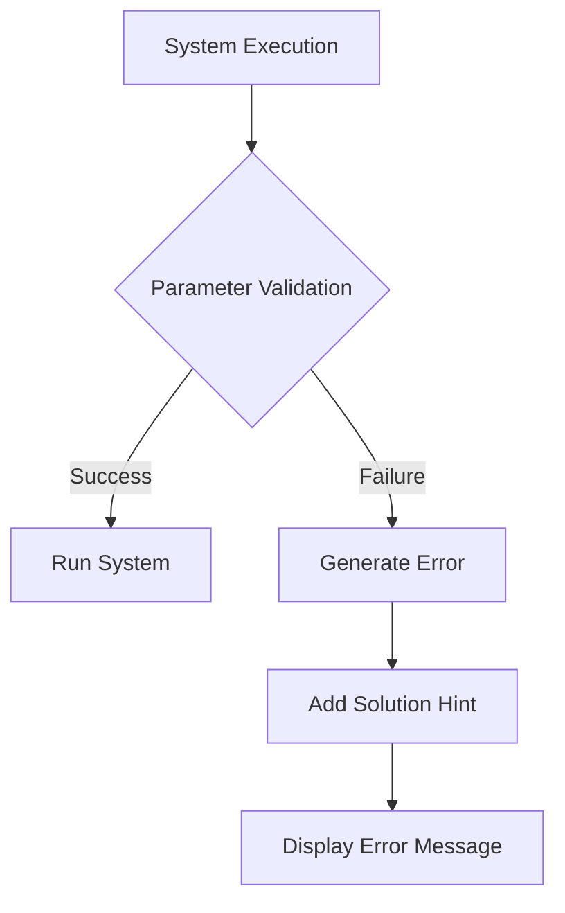

+++
title = "#19490 Mention `Option` and `When` in the error message for a failing system parameter"
date = "2025-06-04T00:00:00"
draft = false
template = "pull_request_page.html"
in_search_index = false

[extra]
current_language = "zh-cn"
available_languages = {"en" = { name = "English", url = "/pull_request/bevy/2025-06/pr-19490-en-20250604" }, "zh-cn" = { name = "中文", url = "/pull_request/bevy/2025-06/pr-19490-zh-cn-20250604" }}
labels = ["D-Trivial", "A-ECS", "C-Usability"]
+++

# PR 分析报告: Mention `Option` and `When` in the error message for a failing system parameter

## Basic Information
- **Title**: Mention `Option` and `When` in the error message for a failing system parameter
- **PR Link**: https://github.com/bevyengine/bevy/pull/19490
- **Author**: chescock
- **Status**: MERGED
- **Labels**: D-Trivial, A-ECS, C-Usability, S-Ready-For-Final-Review, X-Uncontroversial
- **Created**: 2025-06-04T16:20:51Z
- **Merged**: 2025-06-04T17:01:55Z
- **Merged By**: alice-i-cecile

## Description Translation
### 目标
帮助用户发现如何使用 `Option<T>` 和 `When<T>` 来处理失败的系统参数。

### 解决方案
在参数验证失败的报错信息中加入提示，说明可以使用 `Option<T>` 和 `When<T>` 来处理这种失败情况。

### 效果展示
```
Encountered an error in system `system_name`: Parameter `Res<ResourceType>` failed validation: Resource does not exist
If this is an expected state, wrap the parameter in `Option<T>` and handle `None` when it happens, or wrap the parameter in `When<T>` to skip the system when it happens.
```

## The Story of This Pull Request

### 问题背景
在 Bevy 的 ECS 系统中，当系统参数验证失败时（例如尝试访问不存在的资源），会抛出错误信息。原始的错误信息只说明了失败原因（如 "Resource does not exist"），但没有提供解决方案指引。这导致开发者，特别是新手，可能不知道 Bevy 提供了 `Option<T>` 和 `When<T>` 机制来优雅处理这类情况：

- `Option<T>`：允许参数返回 `None`，系统可安全处理缺失状态
- `When<T>`：当条件不满足时直接跳过系统执行

### 解决方案
该 PR 采取最小化修改方案：在参数验证错误的显示逻辑中追加帮助信息。具体在 `SystemParamValidationError` 的 `Display` 实现中加入条件判断：
- 当错误未被跳过时 (`!self.skipped`)
- 追加指导性文本，说明如何使用 `Option<T>` 和 `When<T>`

### 实现细节
核心修改在 `system_param.rs` 的 `Display for SystemParamValidationError` 实现中。原始实现只输出基本错误信息：

```rust
// 原始实现
write!(
    fmt,
    "Parameter `{}::{}` failed validation: {}",
    ShortName(&self.param),
    self.field,
    self.message
)
```

修改后增加了帮助文本：
```rust
// 修改后实现
write!(
    fmt,
    "Parameter `{}::{}` failed validation: {}",
    ShortName(&self.param),
    self.field,
    self.message
)?;  // 注意 ? 操作符处理可能的错误

// 新增帮助信息
if !self.skipped {
    write!(fmt, "\nIf this is an expected state...")?;
}
```

### 技术考量
1. **条件输出**：通过 `!self.skipped` 判断确保只在需要时显示提示
2. **错误链处理**：使用 `?` 操作符正确传播格式化错误
3. **最小影响**：保持原始错误结构不变，仅追加文本
4. **测试同步**：更新了相关测试用例以匹配新的错误信息格式

### 实际影响
当开发者遇到如下常见错误时：
```
Parameter `Res<TextureAtlas>` failed validation: Resource does not exist
```

现在会看到追加的解决方案提示：
```
If this is an expected state, wrap the parameter in `Option<T>`...
```

这能显著降低调试时间，并教育用户正确使用 Bevy 的错误处理机制。

## Visual Representation


## Key Files Changed

### 1. crates/bevy_ecs/src/system/system_param.rs (+6/-2)
**修改原因**：核心变更点，在参数验证错误信息中追加解决方案提示。

**关键变更**：
```rust
// Before:
impl Display for SystemParamValidationError {
    fn fmt(&self, fmt: &mut Formatter<'_>) -> fmt::Result {
        write!(
            fmt,
            "Parameter `{}::{}` failed validation: {}",
            ShortName(&self.param),
            self.field,
            self.message
        )
    }
}

// After:
impl Display for SystemParamValidationError {
    fn fmt(&self, fmt: &mut Formatter<'_>) -> fmt::Result {
        write!(
            fmt,
            "Parameter `{}::{}` failed validation: {}",
            ShortName(&self.param),
            self.field,
            self.message
        )?;
        if !self.skipped {
            write!(fmt, "\nIf this is an expected state, wrap the parameter in `Option<T>` and handle `None` when it happens, or wrap the parameter in `When<T>` to skip the system when it happens.")?;
        }
        Ok(())
    }
}
```

### 2. crates/bevy_ecs/src/system/system.rs (+1/-1)
**修改原因**：更新测试用例以匹配新的错误信息格式。

**关键变更**：
```rust
// Before:
let expected = "System ... validation: Resource does not exist";

// After:
let expected = "System ... validation: Resource does not exist\nIf this is...";
```

### 3. crates/bevy_ecs/src/system/system_registry.rs (+1/-1)
**修改原因**：同步更新另一个测试用例的错误信息验证。

**关键变更**：
```rust
// Before:
let expected = format!("System ... Resource does not exist");

// After:
let expected = format!("System ... Resource does not exist\nIf this is...");
```

## Further Reading
1. Bevy 系统参数文档:  
   https://bevyengine.org/learn/book/getting-started/ecs/#system-parameters
2. `Option<T>` 官方文档:  
   https://doc.rust-lang.org/std/option/enum.Option.html
3. 条件系统执行机制:  
   https://bevy-cheatbook.github.io/programming/conditions.html