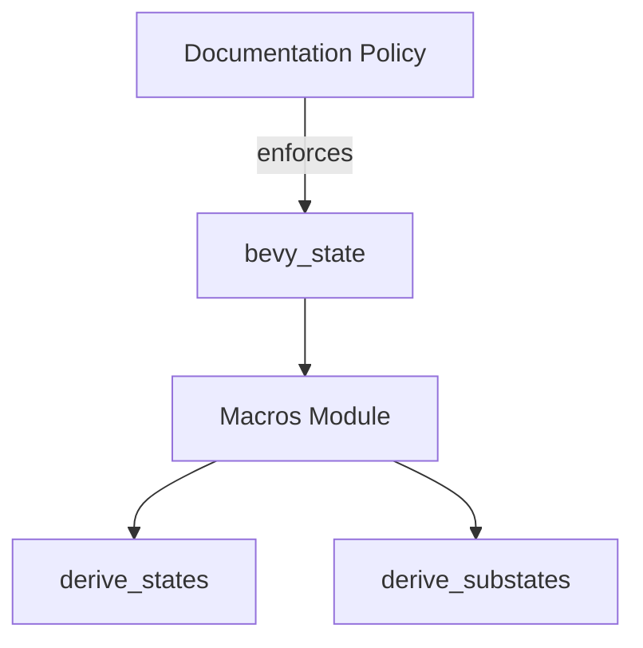

+++
title = "#19492 deny(missing_docs) for bevy_state"
date = "2025-06-04T00:00:00"
draft = false
template = "pull_request_page.html"
in_search_index = false

[extra]
current_language = "zh-cn"
available_languages = {"en" = { name = "English", url = "/pull_request/bevy/2025-06/pr-19492-en-20250604" }, "zh-cn" = { name = "中文", url = "/pull_request/bevy/2025-06/pr-19492-zh-cn-20250604" }}
labels = ["C-Docs", "D-Trivial"]
+++

# deny(missing_docs) for bevy_state

## Basic Information
- **Title**: deny(missing_docs) for bevy_state
- **PR Link**: https://github.com/bevyengine/bevy/pull/19492
- **Author**: theotherphil
- **Status**: MERGED
- **Labels**: C-Docs, D-Trivial, S-Ready-For-Final-Review
- **Created**: 2025-06-04T20:24:06Z
- **Merged**: 2025-06-04T21:04:52Z
- **Merged By**: alice-i-cecile

## Description Translation
# 目标

对 bevy_state 启用 deny(missing_docs)，推进 https://github.com/bevyengine/bevy/issues/3492 的进展。

## The Story of This Pull Request

### 问题背景
在 Bevy 引擎的持续改进过程中，项目维护者通过 issue #3492 计划为所有公共 API 添加文档。作为这项工作的一部分，`bevy_state` crate 之前使用了 `#![expect(missing_docs)]` 属性来临时抑制缺少文档的警告。这种临时措施允许开发在不完全满足文档要求的情况下继续推进，但随着项目成熟，需要逐步移除这些例外。

### 解决方案
本 PR 采取了直接的方法来解决 `bevy_state` 中的文档缺失问题：
1. 移除了允许缺失文档的临时例外属性
2. 为 crate 添加了基本的模块级文档
3. 为两个关键的过程宏添加了文档注释

这种方法完全符合 issue #3492 的要求，不需要复杂的架构变更，因为核心功能保持不变，只是补充了缺失的文档元数据。

### 实现细节
修改主要集中在 `bevy_state` 的宏模块中。首先移除了 `#![expect(missing_docs)]` 属性，该属性原本用于临时抑制文档缺失警告。接着添加了模块级文档，明确说明这个模块包含 `States` 和 `SubStates` trait 的派生宏：

```rust
//! Macros for deriving `States` and `SubStates` traits.
```

然后为两个过程宏添加了文档注释。`derive_states` 宏现在包含指向 trait 文档的指引：

```rust
/// Implements the `States` trait for a type - see the trait
/// docs for an example usage.
```

同样地，`derive_substates` 宏也添加了类似的文档：

```rust
/// Implements the `SubStates` trait for a type - see the trait
/// docs for an example usage.
```

这些文档注释遵循了 Rust 的最佳实践，提供了清晰的指引而不重复 trait 本身的文档内容。通过指向 trait 文档中的示例，保持了文档的 DRY（Don't Repeat Yourself）原则。

### 技术考量
1. **Lint 级别变更**：将 `expect(missing_docs)` 改为隐式的 `deny(missing_docs)` 意味着该 crate 现在会严格执行文档要求
2. **文档质量**：添加的文档简洁但足够，提供了必要的上下文和使用指引
3. **渐进式改进**：这种小规模改动符合 Bevy 逐步改进文档的策略

### 影响与收益
1. **代码质量提升**：现在 `bevy_state` 的公共 API 都有基本文档
2. **开发者体验**：新贡献者更容易理解这些宏的用途
3. **维护性**：为未来文档改进奠定了基础
4. **项目一致性**：推进了 Bevy 整体文档覆盖的目标

## Visual Representation



## Key Files Changed

### crates/bevy_state/macros/src/lib.rs
该文件是本次 PR 的唯一修改点，主要变更包括：
1. 移除临时文档例外
2. 添加模块文档
3. 为两个过程宏添加文档注释

```rust
// Before:
#![expect(missing_docs, reason = "Not all docs are written yet, see #3492.")]
#![cfg_attr(docsrs, feature(doc_auto_cfg))]

extern crate proc_macro;

mod states;

use bevy_macro_utils::BevyManifest;
use proc_macro::TokenStream;

#[proc_macro_derive(States, attributes(states))]
pub fn derive_states(input: TokenStream) -> TokenStream {
    states::derive_states(input)
}

#[proc_macro_derive(SubStates, attributes(states, source))]
pub fn derive_substates(input: TokenStream) -> TokenStream {
    states::derive_substates(input)
}

// After:
#![cfg_attr(docsrs, feature(doc_auto_cfg))]

//! Macros for deriving `States` and `SubStates` traits.

extern crate proc_macro;

mod states;

use bevy_macro_utils::BevyManifest;
use proc_macro::TokenStream;

/// Implements the `States` trait for a type - see the trait
/// docs for an example usage.
#[proc_macro_derive(States, attributes(states))]
pub fn derive_states(input: TokenStream) -> TokenStream {
    states::derive_states(input)
}

/// Implements the `SubStates` trait for a type - see the trait
/// docs for an example usage.
#[proc_macro_derive(SubStates, attributes(states, source))]
pub fn derive_substates(input: TokenStream) -> TokenStream {
    states::derive_substates(input)
}
```

## Further Reading
1. [Bevy's Documentation Initiative (Issue #3492)](https://github.com/bevyengine/bevy/issues/3492)
2. [Rust API Guidelines on Documentation](https://rust-lang.github.io/api-guidelines/documentation.html)
3. [The Rustdoc Book - Documentation Comments](https://doc.rust-lang.org/rustdoc/how-to-write-documentation.html)
4. [Rust Lint Levels Explained](https://doc.rust-lang.org/rustc/lints/levels.html)