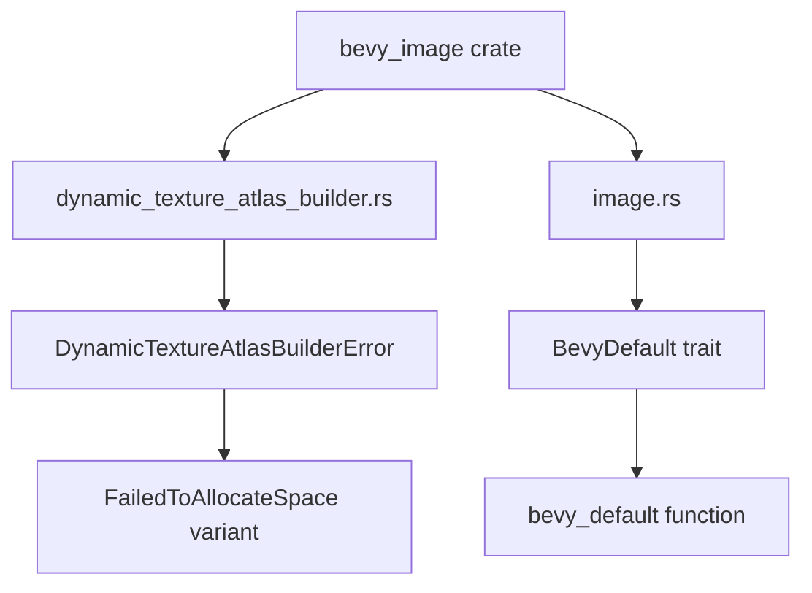

+++
title = "#19493 Add a few missing doc comments in bevy_image"
date = "2025-06-04T00:00:00"
draft = false
template = "pull_request_page.html"
in_search_index = true

[taxonomies]
list_display = ["show"]

[extra]
current_language = "en"
available_languages = {"en" = { name = "English", url = "/pull_request/bevy/2025-06/pr-19493-en-20250604" }, "zh-cn" = { name = "中文", url = "/pull_request/bevy/2025-06/pr-19493-zh-cn-20250604" }}
labels = ["C-Docs", "D-Trivial", "A-Rendering"]
+++

# PR Analysis: Add a few missing doc comments in bevy_image

## Basic Information
- **Title**: Add a few missing doc comments in bevy_image
- **PR Link**: https://github.com/bevyengine/bevy/pull/19493
- **Author**: theotherphil
- **Status**: MERGED
- **Labels**: C-Docs, D-Trivial, A-Rendering, S-Ready-For-Final-Review
- **Created**: 2025-06-04T20:46:33Z
- **Merged**: 2025-06-04T21:33:37Z
- **Merged By**: alice-i-cecile

## Description Translation
# Objective

Another tiny step towards https://github.com/bevyengine/bevy/issues/3492.

## The Story of This Pull Request

This PR addresses a documentation gap in Bevy's image processing components. The author noticed that two public API elements in the `bevy_image` crate lacked proper documentation: the `DynamicTextureAtlasBuilderError` enum and the `BevyDefault` trait. Both are important parts of Bevy's texture handling system but were missing doc comments that explain their purpose and usage.

The core issue was that without these doc comments, developers working with texture atlases or custom default implementations would need to inspect the source code to understand these components. This violates Rust's best practices for documenting public APIs and makes the codebase less accessible to new contributors.

The solution was straightforward: add concise but informative doc comments to these elements. For `DynamicTextureAtlasBuilderError`, the author added documentation explaining it's produced when adding new textures to a texture atlas layout, with specific comments for its error variants. For `BevyDefault`, they documented its purpose of providing defaults for external types that don't implement Rust's standard `Default` trait.

These changes are non-functional and purely additive. They follow Rust's documentation conventions by using triple-slash comments that will appear in generated documentation. The implementation required careful attention to:
1. Precise wording that clearly explains each component's purpose
2. Proper linking between related components using Rustdoc syntax
3. Maintaining existing error messages and trait definitions

The impact is improved code clarity and better developer experience. These doc comments will appear in IDE tooltips and generated documentation, helping developers understand these components without reading their implementations. This aligns with Bevy's ongoing documentation improvement effort tracked in issue #3492.

## Visual Representation



## Key Files Changed

### File: crates/bevy_image/src/dynamic_texture_atlas_builder.rs

Added documentation for the error enum and its main variant.

**Before:**
```rust
#[derive(Debug, Error)]
pub enum DynamicTextureAtlasBuilderError {
    #[error("Couldn't allocate space to add the image requested")]
    FailedToAllocateSpace,
    /// Attempted to add a texture to an uninitialized atlas
    #[error("The texture atlas has not been initialized yet")]
    Uninitialized,
}
```

**After:**
```rust
/// An error produced by [`DynamicTextureAtlasBuilder`] when trying to add a new
/// texture to a [`TextureAtlasLayout`].
#[derive(Debug, Error)]
pub enum DynamicTextureAtlasBuilderError {
    /// Unable to allocate space within the atlas for the new texture
    #[error("Couldn't allocate space to add the image requested")]
    FailedToAllocateSpace,
    /// Attempted to add a texture to an uninitialized atlas
    #[error("The texture atlas has not been initialized yet")]
    Uninitialized,
}
```

### File: crates/bevy_image/src/image.rs

Added documentation for the trait and its method.

**Before:**
```rust
pub trait BevyDefault {
    fn bevy_default() -> Self;
}
```

**After:**
```rust
/// Trait used to provide default values for Bevy-external types that
/// do not implement [`Default`].
pub trait BevyDefault {
    /// Returns the default value for a type.
    fn bevy_default() -> Self;
}
```

## Further Reading
1. [Rust Documentation Guidelines](https://rust-lang.github.io/api-guidelines/documentation.html)
2. [Bevy's Contribution Documentation](https://github.com/bevyengine/bevy/blob/main/CONTRIBUTING.md#documenting-code)
3. [Issue #3492: Document All Public Items](https://github.com/bevyengine/bevy/issues/3492)