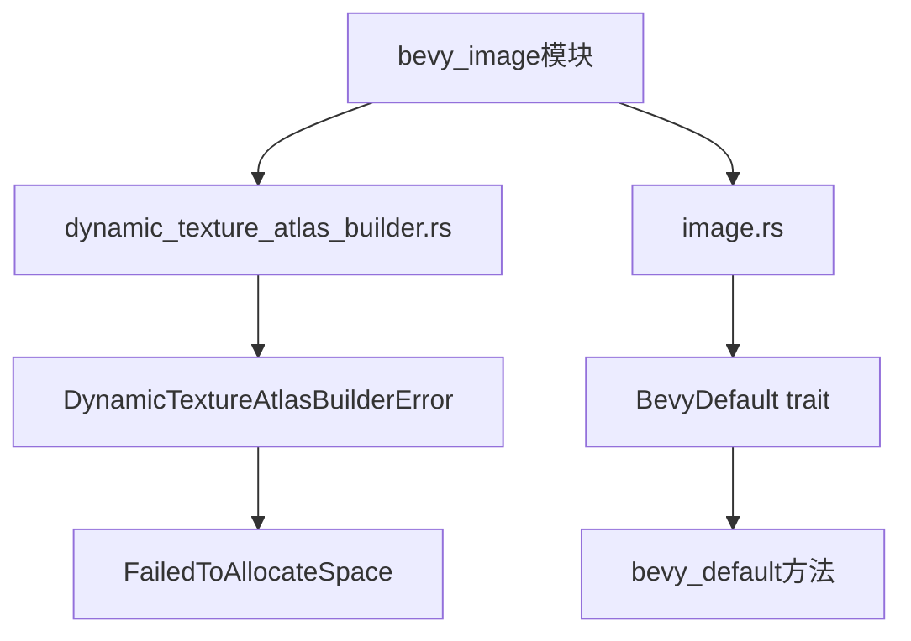

+++
title = "#19493 Add a few missing doc comments in bevy_image"
date = "2025-06-04T00:00:00"
draft = false
template = "pull_request_page.html"
in_search_index = false

[extra]
current_language = "zh-cn"
available_languages = {"en" = { name = "English", url = "/pull_request/bevy/2025-06/pr-19493-en-20250604" }, "zh-cn" = { name = "中文", url = "/pull_request/bevy/2025-06/pr-19493-zh-cn-20250604" }}
labels = ["C-Docs", "D-Trivial", "A-Rendering"]
+++

# Add a few missing doc comments in bevy_image

## Basic Information
- **Title**: Add a few missing doc comments in bevy_image
- **PR Link**: https://github.com/bevyengine/bevy/pull/19493
- **Author**: theotherphil
- **Status**: MERGED
- **Labels**: C-Docs, D-Trivial, A-Rendering, S-Ready-For-Final-Review
- **Created**: 2025-06-04T20:46:33Z
- **Merged**: 2025-06-04T21:33:37Z
- **Merged By**: alice-i-cecile

## Description Translation
该PR是向bevy_image模块中添加几个缺失的文档注释(doc comments)，这是朝着解决issue #3492（提高文档覆盖率）迈出的又一小步。

## The Story of This Pull Request

在维护大型代码库时，文档注释对于保持代码可维护性和可理解性至关重要。Bevy引擎的issue #3492专门跟踪文档覆盖率的改进工作。该PR作者在审查bevy_image模块时，识别出两个关键位置需要补充文档：一个错误枚举(enum)及其变体(variant)，以及一个自定义trait及其方法。

在dynamic_texture_atlas_builder.rs文件中，DynamicTextureAtlasBuilderError枚举缺少解释其用途的文档。该错误类型在尝试向纹理图集(texture atlas)添加新纹理时可能产生，但开发者无法从代码中直接了解其具体使用场景。类似地，该枚举的FailedToAllocateSpace变体也没有说明其代表的错误条件。

在image.rs文件中，BevyDefault trait及其bevy_default方法完全缺失文档。这个trait为外部类型提供默认值实现，但没有说明其设计目的或预期用法，使得其他开发者难以理解何时以及如何使用它。

作者采用直接解决方案：为每个缺失文档的公共接口添加精确的rustdoc注释。这些注释简明扼要地解释：
1. 类型/方法的目的
2. 使用场景
3. 错误条件的具体含义

这种修改不需要重构任何功能代码，纯粹是文档补充。由于修改范围小且独立，作者将其作为独立PR提交，遵循Bevy的"小步快跑"贡献原则。维护者快速审查并合并了这些改动，因为：
1. 文档改进是明确需求
2. 修改符合Rust文档标准
3. 不影响任何现有功能

这些文档注释现在为开发者提供了必要的上下文，帮助他们正确使用纹理图集功能和自定义默认值trait，减少了潜在的错误使用或混淆。

## Visual Representation



## Key Files Changed

### 1. `crates/bevy_image/src/dynamic_texture_atlas_builder.rs`
**修改原因**：为错误枚举及其变体添加文档说明  
**代码变更**：
```rust
// 修改前：
#[derive(Debug, Error)]
pub enum DynamicTextureAtlasBuilderError {
    #[error("Couldn't allocate space to add the image requested")]
    FailedToAllocateSpace,
    // ...
}

// 修改后：
/// An error produced by [`DynamicTextureAtlasBuilder`] when trying to add a new
/// texture to a [`TextureAtlasLayout`].
#[derive(Debug, Error)]
pub enum DynamicTextureAtlasBuilderError {
    /// Unable to allocate space within the atlas for the new texture
    #[error("Couldn't allocate space to add the image requested")]
    FailedToAllocateSpace,
    // ...
}
```

### 2. `crates/bevy_image/src/image.rs`
**修改原因**：为自定义trait及其方法添加文档说明  
**代码变更**：
```rust
// 修改前：
pub trait BevyDefault {
    fn bevy_default() -> Self;
}

// 修改后：
/// Trait used to provide default values for Bevy-external types that
/// do not implement [`Default`].
pub trait BevyDefault {
    /// Returns the default value for a type.
    fn bevy_default() -> Self;
}
```

## Further Reading
1. [Rust Documentation Guidelines](https://rust-lang.github.io/api-guidelines/documentation.html)
2. [Bevy Issue #3492 - Improve documentation coverage](https://github.com/bevyengine/bevy/issues/3492)
3. [Rustdoc Book](https://doc.rust-lang.org/rustdoc/index.html)