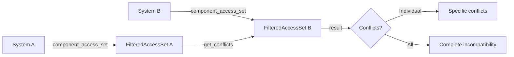

+++
title = "#19495 Use component_access_set to determine the set of conflicting accesses between two systems."
date = "2025-06-09T00:00:00"
draft = false
template = "pull_request_page.html"
in_search_index = true

[taxonomies]
list_display = ["show"]

[extra]
current_language = "en"
available_languages = {"en" = { name = "English", url = "/pull_request/bevy/2025-06/pr-19495-en-20250609" }, "zh-cn" = { name = "中文", url = "/pull_request/bevy/2025-06/pr-19495-zh-cn-20250609" }}
labels = ["C-Bug", "A-ECS", "D-Straightforward"]
+++

# PR Analysis: Use component_access_set to determine the set of conflicting accesses between two systems

## Basic Information
- **Title**: Use component_access_set to determine the set of conflicting accesses between two systems.
- **PR Link**: https://github.com/bevyengine/bevy/pull/19495
- **Author**: andriyDev
- **Status**: MERGED
- **Labels**: C-Bug, A-ECS, S-Ready-For-Final-Review, D-Straightforward
- **Created**: 2025-06-05T00:22:37Z
- **Merged**: 2025-06-09T20:01:22Z
- **Merged By**: alice-i-cecile

## Description Translation
# Objective

- Fixes #4381

## Solution

- Replace `component_access` with `component_access_set` when determining conflicting systems during schedule building.
- All `component_access()` impls just forward to `&component_access_set().combined_access`, so we are essentially trading `Access::is_compatible` for `FilteredAccessSet::is_compatible`.
- `FilteredAccessSet::get_conflicts` internally calls `combined_access.is_compatible` as the first step, so we can remove that redundant check.

## Testing

- Un-ignored a previously failing test now that it passes!
- Ran the `build_schedule` benchmark and got basically no change in the results. Perhaps are benchmarks are just not targetted towards this situation.
```
$ critcmp main fix-ambiguity -f 'build_schedule'
group                                          fix-ambiguity                          main
-----                                          -------------                          ----
build_schedule/1000_schedule                   1.00       2.9±0.02s        ? ?/sec    1.01       2.9±0.05s        ? ?/sec
build_schedule/1000_schedule_no_constraints    1.02     48.3±1.48ms        ? ?/sec    1.00     47.4±1.78ms        ? ?/sec
build_schedule/100_schedule                    1.00      9.9±0.17ms        ? ?/sec    1.06     10.5±0.32ms        ? ?/sec
build_schedule/100_schedule_no_constraints     1.00   804.7±21.85µs        ? ?/sec    1.03   828.7±19.36µs        ? ?/sec
build_schedule/500_schedule                    1.00    451.7±7.25ms        ? ?/sec    1.04   468.9±11.70ms        ? ?/sec
build_schedule/500_schedule_no_constraints     1.02     12.7±0.46ms        ? ?/sec    1.00     12.5±0.44ms        ? ?/sec
```

## The Story of This Pull Request

### The Problem and Context
This PR addresses a long-standing issue (#4381) in Bevy's ECS scheduler where the system conflict detection wasn't properly handling filtered component accesses. The core problem was that when determining if two systems conflicted, the scheduler was only considering the combined component access patterns without accounting for the full filtered access sets. This could lead to missed conflicts when systems used component filters (like `With<T>` or `Without<T>`), potentially causing data races during parallel execution.

The issue manifested in a specific test case (`filtered_components`) that had been marked as ignored due to its failure. This test was designed to verify correct conflict detection between systems with filtered component accesses, but the existing implementation couldn't properly handle these cases.

### The Solution Approach
The solution centers on switching from using `component_access()` to `component_access_set()` when checking for system conflicts. The key insight was that:
1. All `component_access()` implementations simply forward to `&component_access_set().combined_access`
2. Using the full filtered access set provides more accurate conflict detection
3. The existing `get_conflicts` method already contained a redundant compatibility check that could be eliminated

By making this change, we effectively replace the less accurate `Access::is_compatible` check with the more comprehensive `FilteredAccessSet::is_compatible` logic. This ensures that all aspects of component access patterns, including filters, are considered during conflict detection.

### The Implementation
The core changes occur in the schedule graph construction logic. Previously, the implementation would:
1. Retrieve each system's component access
2. Check if they were incompatible
3. If incompatible, retrieve the specific conflicts

The updated implementation:
1. Retrieves each system's full component access set
2. Directly checks for conflicts using `get_conflicts`
3. Processes the results without the redundant compatibility check

Here's the key change in the conflict detection logic:

```rust
// Before:
let access_a = system_a.component_access();
let access_b = system_b.component_access();
if !access_a.is_compatible(access_b) {
    match access_a.get_conflicts(access_b) {
        // ... conflict handling ...
    }
}

// After:
let access_a = system_a.component_access_set();
let access_b = system_b.component_access_set();
match access_a.get_conflicts(access_b) {
    // ... conflict handling ...
}
```

This change eliminates the redundant `is_compatible` check since `get_conflicts` already performs this check internally. The result is cleaner code that properly accounts for filtered accesses.

### Technical Insights
The key improvement comes from using `FilteredAccessSet` instead of the simplified `Access` structure. A `FilteredAccessSet` contains the complete access pattern information including:
- Read/write access types
- Component filters (`With`, `Without`, etc.)
- Combined access patterns

This provides a more accurate representation of a system's actual access requirements compared to the combined access alone. The `get_conflicts` method properly considers all these factors when determining conflicts between systems.

### The Impact
The most immediate impact is fixing the known issue with filtered component conflicts. The previously failing `filtered_components` test now passes and has been un-ignored. This improves the scheduler's correctness when dealing with complex system access patterns involving filters.

Performance benchmarks showed no significant regression, indicating the change doesn't add computational overhead despite providing more accurate conflict detection. The solution maintains Bevy's strict safety guarantees around parallel system execution while fixing a subtle edge case.

## Visual Representation



## Key Files Changed

### `crates/bevy_ecs/src/schedule/schedule.rs`
**Changes**: 
- Replaced `component_access()` with `component_access_set()` for conflict detection
- Removed redundant compatibility check before calling `get_conflicts`
- Simplified control flow by directly matching on `get_conflicts` result

**Code Snippet**:
```rust
// Before:
let access_a = system_a.component_access();
let access_b = system_b.component_access();
if !access_a.is_compatible(access_b) {
    match access_a.get_conflicts(access_b) {
        AccessConflicts::Individual(conflicts) => {
            // ... conflict processing ...
        }
        AccessConflicts::All => {
            // ... complete incompatibility ...
        }
    }
}

// After:
let access_a = system_a.component_access_set();
let access_b = system_b.component_access_set();
match access_a.get_conflicts(access_b) {
    AccessConflicts::Individual(conflicts) => {
        // ... conflict processing ...
    }
    AccessConflicts::All => {
        // ... complete incompatibility ...
    }
}
```

### `crates/bevy_ecs/src/schedule/mod.rs`
**Changes**: 
- Un-ignored the `filtered_components` test that previously failed due to the conflict detection issue

**Code Snippet**:
```rust
// Before:
#[test]
#[ignore = "Known failing but fix is non-trivial: https://github.com/bevyengine/bevy/issues/4381"]
fn filtered_components() {
    // ... test body ...
}

// After:
#[test]
fn filtered_components() {
    // ... test body ...
}
```

## Further Reading
1. [Original Issue #4381](https://github.com/bevyengine/bevy/issues/4381) - Details the original problem with filtered component conflicts
2. [Bevy ECS System Params Documentation](https://docs.rs/bevy_ecs/latest/bevy_ecs/system/trait.SystemParam.html) - Explains system parameter access patterns
3. [Bevy Schedule Execution Model](https://bevyengine.org/learn/book/getting-started/ecs/#systems) - Overview of Bevy's system scheduling approach
4. [FilteredAccessSet Implementation](https://github.com/bevyengine/bevy/blob/main/crates/bevy_ecs/src/query/filtered_access.rs) - Source code for the filtered access data structure