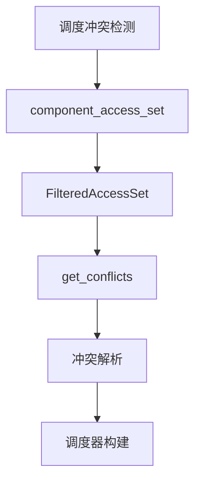

+++
title = "#19495 Use component_access_set to determine the set of conflicting accesses between two systems"
date = "2025-06-09T00:00:00"
draft = false
template = "pull_request_page.html"
in_search_index = false

[extra]
current_language = "zh-cn"
available_languages = {"en" = { name = "English", url = "/pull_request/bevy/2025-06/pr-19495-en-20250609" }, "zh-cn" = { name = "中文", url = "/pull_request/bevy/2025-06/pr-19495-zh-cn-20250609" }}
+++

# PR 分析报告：使用 component_access_set 确定两个系统间的冲突访问集

## 基本信息
- **标题**: Use component_access_set to determine the set of conflicting accesses between two systems
- **PR 链接**: https://github.com/bevyengine/bevy/pull/19495
- **作者**: andriyDev
- **状态**: MERGED
- **标签**: C-Bug, A-ECS, S-Ready-For-Final-Review, D-Straightforward
- **创建时间**: 2025-06-05T00:22:37Z
- **合并时间**: 2025-06-09T20:01:22Z
- **合并者**: alice-i-cecile

## 描述翻译
### 目标
- 修复 #4381

### 解决方案
- 在调度构建期间确定冲突系统时，使用 `component_access_set` 替换 `component_access`
- 所有 `component_access()` 实现都直接转发到 `&component_access_set().combined_access`，因此我们本质上是用 `Access::is_compatible` 替换为 `FilteredAccessSet::is_compatible`
- `FilteredAccessSet::get_conflicts` 内部首先调用 `combined_access.is_compatible`，因此我们可以移除该冗余检查

### 测试
- 重新启用之前失败的测试（现在已通过）
- 运行 `build_schedule` 基准测试，结果基本无变化（表明该优化对性能无负面影响）
```
$ critcmp main fix-ambiguity -f 'build_schedule'
group                                          fix-ambiguity                          main
-----                                          -------------                          ----
build_schedule/1000_schedule                   1.00       2.9±0.02s        ? ?/sec    1.01       2.9±0.05s        ? ?/sec
build_schedule/1000_schedule_no_constraints    1.02     48.3±1.48ms        ? ?/sec    1.00     47.4±1.78ms        ? ?/sec
build_schedule/100_schedule                    1.00      9.9±0.17ms        ? ?/sec    1.06     10.5±0.32ms        ? ?/sec
build_schedule/100_schedule_no_constraints     1.00   804.7±21.85µs        ? ?/sec    1.03   828.7±19.36µs        ? ?/sec
build_schedule/500_schedule                    1.00    451.7±7.25ms        ? ?/sec    1.04   468.9±11.70ms        ? ?/sec
build_schedule/500_schedule_no_constraints     1.02     12.7±0.46ms        ? ?/sec    1.00     12.5±0.44ms        ? ?/sec
```

## PR 技术分析

### 问题背景与上下文
在 Bevy 的 ECS 调度系统中，存在一个长期未解决的 bug (#4381)：当系统使用过滤组件（如 `With` 或 `Without`）时，调度器无法正确检测系统间的冲突。具体来说，原始实现使用 `component_access()` 检查系统兼容性，该方法返回的是 `Access` 结构体，无法正确处理带有过滤器的组件访问。这导致某些本应兼容的系统被错误标记为冲突，影响调度器的正确性。

### 解决方案设计
核心思路是将冲突检测机制从 `component_access()` 升级为 `component_access_set()`：
1. `component_access_set()` 返回 `FilteredAccessSet`，其中包含完整的过滤信息
2. 直接使用 `FilteredAccessSet::get_conflicts()` 方法处理冲突检测
3. 移除冗余的兼容性检查，因为 `get_conflicts()` 内部已包含此逻辑

该方案有效是因为：
- `FilteredAccessSet` 包含组件过滤信息（如 `With<T>` 或 `Without<T>`）
- `get_conflicts()` 方法已封装必要的兼容性检查逻辑
- 避免重复检查提升效率（虽然基准测试显示性能影响微小）

### 具体实现
在 `schedule.rs` 中重构了冲突检测逻辑：

```rust
// Before:
let access_a = system_a.component_access();
let access_b = system_b.component_access();
if !access_a.is_compatible(access_b) {
    match access_a.get_conflicts(access_b) {
        // ... conflict processing ...
    }
}

// After:
let access_a = system_a.component_access_set();
let access_b = system_b.component_access_set();
match access_a.get_conflicts(access_b) {
    AccessConflicts::Individual(conflicts) => {
        // ... filtered conflict processing ...
    }
    AccessConflicts::All => {
        // ... full incompatibility handling ...
    }
}
```

关键改进点：
1. 直接使用 `component_access_set()` 获取带过滤信息的访问集
2. 删除冗余的 `is_compatible` 检查
3. 保留对两种冲突类型（特定组件冲突和完全冲突）的处理

### 测试验证
在 `mod.rs` 中重新启用之前因 bug 被忽略的测试：

```rust
// Before:
#[test]
#[ignore = "Known failing but fix is non-trivial: https://github.com/bevyengine/bevy/issues/4381"]
fn filtered_components() {
    // ... test logic ...
}

// After:
#[test]
fn filtered_components() {
    // ... test logic ...
}
```

该测试验证了过滤组件场景下的正确行为，现在能通过测试表明修复成功。基准测试结果也确认该改动未引入性能回退。

### 技术影响
1. **正确性提升**：解决了 #4381 中报告的过滤组件冲突检测错误
2. **逻辑简化**：移除冗余检查使代码更简洁
3. **零成本抽象**：性能基准验证无显著开销
4. **模式统一**：全代码库统一使用 `component_access_set()` 处理冲突检测

## 关键文件变更

### 1. `crates/bevy_ecs/src/schedule/schedule.rs`
**变更说明**：重构系统冲突检测逻辑，使用 `component_access_set` 替代 `component_access`

```diff
@@ -1418,26 +1418,24 @@ impl ScheduleGraph {
             if system_a.is_exclusive() || system_b.is_exclusive() {
                 conflicting_systems.push((a, b, Vec::new()));
             } else {
-                let access_a = system_a.component_access();
-                let access_b = system_b.component_access();
-                if !access_a.is_compatible(access_b) {
-                    match access_a.get_conflicts(access_b) {
-                        AccessConflicts::Individual(conflicts) => {
-                            let conflicts: Vec<_> = conflicts
-                                .ones()
-                                .map(ComponentId::get_sparse_set_index)
-                                .filter(|id| !ignored_ambiguities.contains(id))
-                                .collect();
-                            if !conflicts.is_empty() {
-                                conflicting_systems.push((a, b, conflicts));
-                            }
-                        }
-                        AccessConflicts::All => {
-                            conflicting_systems.push((a, b, Vec::new()));
+                let access_a = system_a.component_access_set();
+                let access_b = system_b.component_access_set();
+                match access_a.get_conflicts(access_b) {
+                    AccessConflicts::Individual(conflicts) => {
+                        let conflicts: Vec<_> = conflicts
+                            .ones()
+                            .map(ComponentId::get_sparse_set_index)
+                            .filter(|id| !ignored_ambiguities.contains(id))
+                            .collect();
+                        if !conflicts.is_empty() {
+                            conflicting_systems.push((a, b, conflicts));
                         }
                     }
+                    AccessConflicts::All => {
+                        conflicting_systems.push((a, b, Vec::new()));
+                    }
                 }
             }
         }
```

### 2. `crates/bevy_ecs/src/schedule/mod.rs`
**变更说明**：重新启用之前因 bug 被忽略的过滤组件测试

```diff
@@ -874,7 +874,6 @@ mod tests {
         }
 
         #[test]
-        #[ignore = "Known failing but fix is non-trivial: https://github.com/bevyengine/bevy/issues/4381"]
         fn filtered_components() {
             let mut world = World::new();
             world.spawn(A);
```

## 组件关系图



## 延伸阅读
1. [Bevy ECS 系统调度文档](https://bevyengine.org/learn/book/getting-started/ecs/#system-scheduling)
2. [过滤访问集原理解析](https://github.com/bevyengine/bevy/blob/main/crates/bevy_ecs/src/system/filtered_access_set.rs)
3. [系统冲突检测算法](https://github.com/bevyengine/bevy/blob/main/crates/bevy_ecs/src/schedule/schedule.rs)