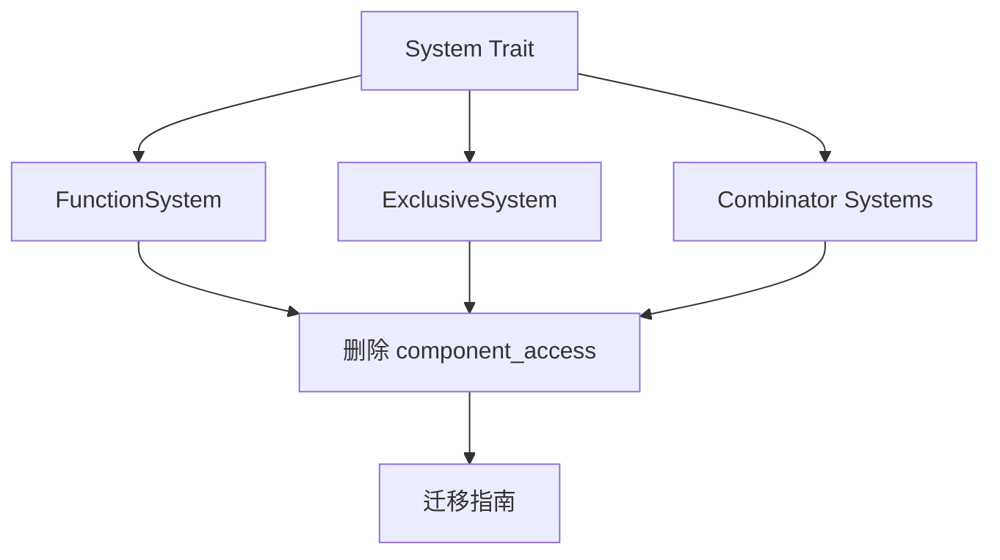

+++
title = "#19496 Delete `System::component_access()`."
date = "2025-06-09T00:00:00"
draft = false
template = "pull_request_page.html"
in_search_index = false

[extra]
current_language = "zh-cn"
available_languages = {"en" = { name = "English", url = "/pull_request/bevy/2025-06/pr-19496-en-20250609" }, "zh-cn" = { name = "中文", url = "/pull_request/bevy/2025-06/pr-19496-zh-cn-20250609" }}
+++

## 标题：删除冗余 API `System::component_access()` 的技术分析

### 基本信息
- **标题**: Delete `System::component_access()`.
- **PR 链接**: https://github.com/bevyengine/bevy/pull/19496
- **作者**: andriyDev
- **状态**: MERGED
- **标签**: A-ECS, C-Code-Quality, S-Ready-For-Final-Review, M-Needs-Migration-Guide, D-Straightforward
- **创建时间**: 2025-06-05T00:36:00Z
- **合并时间**: 2025-06-09T23:13:26Z
- **合并人**: alice-i-cecile

### 描述翻译
#### 目标
- 清理 #19495 相关代码

#### 解决方案
- 删除 `System::component_access()`。该函数与 `System::component_access_set().combined_access()` 功能冗余

#### 测试
- 无。此函数无任何调用方

### PR 技术分析

#### 问题背景
在 Bevy 的 ECS 架构中，系统(System)需要声明其组件访问权限以实现安全并发。原设计包含两个相关 API：
1. `component_access()` - 返回 `Access<ComponentId>`
2. `component_access_set()` - 返回 `FilteredAccessSet<ComponentId>`

随着架构演进，`component_access()` 的实现变为直接调用 `component_access_set().combined_access()`，形成冗余：
```rust
// 冗余实现示例
fn component_access(&self) -> &Access<ComponentId> {
    self.component_access_set.combined_access()
}
```
这种冗余导致：
- 维护成本增加（需在 10+ 系统类型中重复实现）
- API 表面复杂度提升
- 文档负担加重

#### 解决方案
直接删除 `component_access()` 方法及其所有实现，原因：
1. 功能完全可由 `component_access_set().combined_access()` 替代
2. 内部代码审计确认无调用方（零使用风险）
3. 简化 `System` trait 接口

#### 实现细节
修改分为三类：

**1. 从 System trait 移除声明**
文件：`crates/bevy_ecs/src/system/system.rs`
```diff
 pub trait System: Send + Sync + 'static {
-    fn component_access(&self) -> &Access<ComponentId>;
     fn component_access_set(&self) -> &FilteredAccessSet<ComponentId>;
 }
```

**2. 删除具体系统实现**
典型修改如普通函数系统：
文件：`crates/bevy_ecs/src/system/function_system.rs`
```diff
 impl<In, Out, Param, Marker, F> System for FunctionSystem<In, Out, Param, Marker, F> {
-    fn component_access(&self) -> &Access<ComponentId> {
-        self.system_meta.component_access_set.combined_access()
-    }
     
     fn component_access_set(&self) -> &FilteredAccessSet<ComponentId> {
         &self.system_meta.component_access_set
     }
 }
```

**3. 更新文档说明**
文件：`crates/bevy_ecs/src/world/unsafe_world_cell.rs`
```diff
-// APIs like [`System::component_access`]
+// APIs like [`System::component_access_set`]
```

#### 迁移处理
新增迁移指南文件：
文件：`release-content/migration-guides/delete_component_access.md`
```markdown
`System::component_access` has been deleted. If you were calling this method, you can simply use
`my_system.component_access_set().combined_access()` to get the same result.
```

#### 技术影响
1. **API 简化**：`System` trait 方法减少 1 个（从 11→10）
2. **代码量减少**：净删除 24 行代码
3. **维护性提升**：消除冗余实现
4. **后向兼容**：通过迁移指南平滑过渡

### 关键文件变更

#### 1. 系统 trait 定义
**文件**: `crates/bevy_ecs/src/system/system.rs`  
**变更**: +1/-14  
```diff
 pub trait System: Send + Sync + 'static {
     fn name(&self) -> Cow<'static, str>;
     fn type_id(&self) -> TypeId {
         TypeId::of::<Self>()
     }
-
-    fn component_access(&self) -> &Access<ComponentId>;
     
     fn component_access_set(&self) -> &FilteredAccessSet<ComponentId>;
```

#### 2. 组合器系统
**文件**: `crates/bevy_ecs/src/system/combinator.rs`  
**变更**: +1/-9  
```diff
 impl<S: System> System for IntoSystemSet<S> {
-    fn component_access(&self) -> &Access<ComponentId> {
-        self.component_access_set.combined_access()
-    }
-
     fn component_access_set(&self) -> &FilteredAccessSet<ComponentId> {
         &self.component_access_set
     }
```

#### 3. 迁移指南
**文件**: `release-content/migration-guides/delete_component_access.md`  
**变更**: +10/-0  
```markdown
---
title: `System::component_access` has been deleted.
pull_requests: [19496]
---

`System::component_access` has been deleted. If you were calling this method...
```

#### 4. 执行器系统
**文件**: `crates/bevy_ecs/src/schedule/executor/mod.rs`  
**变更**: +2/-6  
```diff
 impl System for ApplyDeferred {
-    fn component_access(&self) -> &Access<ComponentId> {
-        const { &Access::new() }
-    }
-
     fn component_access_set(&self) -> &FilteredAccessSet<ComponentId> {
+        // This system accesses no components.
         const { &FilteredAccessSet::new() }
     }
```

#### 5. 独占系统
**文件**: `crates/bevy_ecs/src/system/exclusive_function_system.rs`  
**变更**: +1/-6  
```diff
 impl<Param, F> System for ExclusiveFunctionSystem<Param, F> {
-    fn component_access(&self) -> &Access<ComponentId> {
-        self.system_meta.component_access_set.combined_access()
-    }
-
     fn component_access_set(&self) -> &FilteredAccessSet<ComponentId> {
         &self.system_meta.component_access_set
     }
```

### 组件关系图


### 延伸阅读
1. [Bevy ECS 系统设计原理](https://bevyengine.org/learn/book/ecs/system/)
2. [组件访问控制机制](https://github.com/bevyengine/bevy/blob/main/crates/bevy_ecs/src/query/access.rs)
3. [安全并发架构设计](https://github.com/bevyengine/bevy/blob/main/crates/bevy_ecs/src/world/unsafe_world_cell.rs)

### 完整代码变更
```diff
diff --git a/crates/bevy_ecs/src/schedule/executor/mod.rs b/crates/bevy_ecs/src/schedule/executor/mod.rs
index b73ffdfd33928..38b85c1ca5ad7 100644
--- a/crates/bevy_ecs/src/schedule/executor/mod.rs
+++ b/crates/bevy_ecs/src/schedule/executor/mod.rs
@@ -18,7 +18,7 @@ use crate::{
     component::{ComponentId, Tick},
     error::{BevyError, ErrorContext, Result},
     prelude::{IntoSystemSet, SystemSet},
-    query::{Access, FilteredAccessSet},
+    query::FilteredAccessSet,
     schedule::{BoxedCondition, InternedSystemSet, NodeId, SystemTypeSet},
     system::{ScheduleSystem, System, SystemIn, SystemParamValidationError, SystemStateFlags},
     world::{unsafe_world_cell::UnsafeWorldCell, DeferredWorld, World},
@@ -162,12 +162,8 @@ impl System for ApplyDeferred {
         Cow::Borrowed("bevy_ecs::apply_deferred")
     }
 
-    fn component_access(&self) -> &Access<ComponentId> {
-        // This system accesses no components.
-        const { &Access::new() }
-    }
-
     fn component_access_set(&self) -> &FilteredAccessSet<ComponentId> {
+        // This system accesses no components.
         const { &FilteredAccessSet::new() }
     }
 
diff --git a/crates/bevy_ecs/src/system/adapter_system.rs b/crates/bevy_ecs/src/system/adapter_system.rs
index 062fbb3d5b2cb..6caa002deb167 100644
--- a/crates/bevy_ecs/src/system/adapter_system.rs
+++ b/crates/bevy_ecs/src/system/adapter_system.rs
@@ -127,10 +127,6 @@ where
         self.name.clone()
     }
 
-    fn component_access(&self) -> &crate::query::Access<crate::component::ComponentId> {
-        self.system.component_access()
-    }
-
     fn component_access_set(
         &self,
     ) -> &crate::query::FilteredAccessSet<crate::component::ComponentId> {
diff --git a/crates/bevy_ecs/src/system/combinator.rs b/crates/bevy_ecs/src/system/combinator.rs
index 18de14126338f..95fea44985817 100644
--- a/crates/bevy_ecs/src/system/combinator.rs
+++ b/crates/bevy_ecs/src/system/combinator.rs
@@ -4,7 +4,7 @@ use core::marker::PhantomData;
 use crate::{
     component::{ComponentId, Tick},
     prelude::World,
-    query::{Access, FilteredAccessSet},
+    query::FilteredAccessSet,
     schedule::InternedSystemSet,
     system::{input::SystemInput, SystemIn, SystemParamValidationError},
     world::unsafe_world_cell::UnsafeWorldCell,
@@ -144,10 +144,6 @@ where
         self.name.clone()
     }
 
-    fn component_access(&self) -> &Access<ComponentId> {
-        self.component_access_set.combined_access()
-    }
-
     fn component_access_set(&self) -> &FilteredAccessSet<ComponentId> {
         &self.component_access_set
     }
@@ -363,10 +359,6 @@ where
         self.name.clone()
     }
 
-    fn component_access(&self) -> &Access<ComponentId> {
-        self.component_access_set.combined_access()
-    }
-
     fn component_access_set(&self) -> &FilteredAccessSet<ComponentId> {
         &self.component_access_set
     }
diff --git a/crates/bevy_ecs/src/system/exclusive_function_system.rs b/crates/bevy_ecs/src/system/exclusive_function_system.rs
index f7e362a6709b9..1cbdb5b07d31b 100644
--- a/crates/bevy_ecs/src/system/exclusive_function_system.rs
+++ b/crates/bevy_ecs/src/system/exclusive_function_system.rs
@@ -1,6 +1,6 @@
 use crate::{
     component::{ComponentId, Tick},
-    query::{Access, FilteredAccessSet},
+    query::FilteredAccessSet,
     schedule::{InternedSystemSet, SystemSet},
     system::{
         check_system_change_tick, ExclusiveSystemParam, ExclusiveSystemParamItem, IntoSystem,
@@ -87,11 +87,6 @@ where
         self.system_meta.name.clone()
     }
 
-    #[inline]
-    fn component_access(&self) -> &Access<ComponentId> {
-        self.system_meta.component_access_set.combined_access()
-    }
-
     #[inline]
     fn component_access_set(&self) -> &FilteredAccessSet<ComponentId> {
         &self.system_meta.component_access_set
diff --git a/crates/bevy_ecs/src/system/function_system.rs b/crates/bevy_ecs/src/system/function_system.rs
index d257a9f0799fe..7ad7f27e2bb89 100644
--- a/crates/bevy_ecs/src/system/function_system.rs
+++ b/crates/bevy_ecs/src/system/function_system.rs
@@ -1,7 +1,7 @@
 use crate::{
     component::{ComponentId, Tick},
     prelude::FromWorld,
-    query::{Access, FilteredAccessSet},
+    query::FilteredAccessSet,
     schedule::{InternedSystemSet, SystemSet},
     system::{
         check_system_change_tick, ReadOnlySystemParam, System, SystemIn, SystemInput, SystemParam,
@@ -620,11 +620,6 @@ where
         self.system_meta.name.clone()
     }
 
-    #[inline]
-    fn component_access(&self) -> &Access<ComponentId> {
-        self.system_meta.component_access_set.combined_access()
-    }
-
     #[inline]
     fn component_access_set(&self) -> &FilteredAccessSet<ComponentId> {
         &self.system_meta.component_access_set
diff --git a/crates/bevy_ecs/src/system/mod.rs b/crates/bevy_ecs/src/system/mod.rs
index 54e5a781ab3eb..91ba8660d4cbd 100644
--- a/crates/bevy_ecs/src/system/mod.rs
+++ b/crates/bevy_ecs/src/system/mod.rs
@@ -1166,7 +1166,9 @@ mod tests {
         x.initialize(&mut world);
         y.initialize(&mut world);
 
-        let conflicts = x.component_access().get_conflicts(y.component_access());
+        let conflicts = x
+            .component_access_set()
+            .get_conflicts(y.component_access_set());
         let b_id = world
             .components()
             .get_resource_id(TypeId::of::<B>())
diff --git a/crates/bevy_ecs/src/system/observer_system.rs b/crates/bevy_ecs/src/system/observer_system.rs
index b123301a08401..4891a39d4581c 100644
--- a/crates/bevy_ecs/src/system/observer_system.rs
+++ b/crates/bevy_ecs/src/system/observer_system.rs
@@ -6,7 +6,7 @@ use crate::{
     error::Result,
     never::Never,
     prelude::{Bundle, Trigger},
-    query::{Access, FilteredAccessSet},
+    query::FilteredAccessSet,
     schedule::{Fallible, Infallible},
     system::{input::SystemIn, System},
     world::{unsafe_world_cell::UnsafeWorldCell, DeferredWorld, World},
@@ -116,11 +116,6 @@ where
         self.observer.name()
     }
 
-    #[inline]
-    fn component_access(&self) -> &Access<ComponentId> {
-        self.observer.component_access()
-    }
-
     #[inline]
     fn component_access_set(&self) -> &FilteredAccessSet<ComponentId> {
         self.observer.component_access_set()
diff --git a/crates/bevy_ecs/src/system/schedule_system.rs b/crates/bevy_ecs/src/system/schedule_system.rs
index 17bd3f46de8a7..5e05a5ada9c9f 100644
--- a/crates/bevy_ecs/src/system/schedule_system.rs
+++ b/crates/bevy_ecs/src/system/schedule_system.rs
@@ -3,7 +3,7 @@ use alloc::{borrow::Cow, vec::Vec};
 use crate::{
     component::{ComponentId, Tick},
     error::Result,
-    query::{Access, FilteredAccessSet},
+    query::FilteredAccessSet,
     system::{input::SystemIn, BoxedSystem, System, SystemInput},
     world::{unsafe_world_cell::UnsafeWorldCell, DeferredWorld, FromWorld, World},
 };
@@ -33,11 +33,6 @@ impl<S: System<In = ()>> System for InfallibleSystemWrapper<S> {
         self.0.type_id()
     }
 
-    #[inline]
-    fn component_access(&self) -> &Access<ComponentId> {
-        self.0.component_access()
-    }
-
     #[inline]
     fn component_access_set(&self) -> &FilteredAccessSet<ComponentId> {
         self.0.component_access_set()
@@ -154,10 +149,6 @@ where
         self.system.name()
     }
 
-    fn component_access(&self) -> &Access<ComponentId> {
-        self.system.component_access()
-    }
-
     fn component_access_set(&self) -> &FilteredAccessSet<ComponentId> {
         self.system.component_access_set()
     }
@@ -256,10 +247,6 @@ where
         self.system.name()
     }
 
-    fn component_access(&self) -> &Access<ComponentId> {
-        self.system.component_access()
-    }
-
     fn component_access_set(&self) -> &FilteredAccessSet<ComponentId> {
         self.system.component_access_set()
     }
diff --git a/crates/bevy_ecs/src/system/system.rs b/crates/bevy_ecs/src/system/system.rs
index 211152f3d877c..fc96e8a843ace 100644
--- a/crates/bevy_ecs/src/system/system.rs
+++ b/crates/bevy_ecs/src/system/system.rs
@@ -9,7 +9,7 @@ use thiserror::Error;
 
 use crate::{
     component::{ComponentId, Tick},
-    query::{Access, FilteredAccessSet},
+    query::FilteredAccessSet,
     schedule::InternedSystemSet,
     system::{input::SystemInput, SystemIn},
     world::{unsafe_world_cell::UnsafeWorldCell, DeferredWorld, World},
@@ -57,9 +57,6 @@ pub trait System: Send + Sync + 'static {
         TypeId::of::<Self>()
     }
 
-    /// Returns the system's component [`Access`].
-    fn component_access(&self) -> &Access<ComponentId>;
-
     /// Returns the system's component [`FilteredAccessSet`].
     fn component_access_set(&self) -> &FilteredAccessSet<ComponentId>;
 
diff --git a/crates/bevy_ecs/src/world/unsafe_world_cell.rs b/crates/bevy_ecs/src/world/unsafe_world_cell.rs
index 1959f3e5f3623..8fb084d444352 100644
--- a/crates/bevy_ecs/src/world/unsafe_world_cell.rs
+++ b/crates/bevy_ecs/src/world/unsafe_world_cell.rs
@@ -36,7 +36,7 @@ use thiserror::Error;
 ///
 /// This alone is not enough to implement bevy systems where multiple systems can access *disjoint* parts of the world concurrently. For this, bevy stores all values of
 /// resources and components (and [`ComponentTicks`]) in [`UnsafeCell`]s, and carefully validates disjoint access patterns using
-/// APIs like [`System::component_access`](crate::system::System::component_access).
+/// APIs like [`System::component_access_set`](crate::system::System::component_access_set).
 ///
 /// A system then can be executed using [`System::run_unsafe`](crate::system::System::run_unsafe) with a `&World` and use methods with interior mutability to access resource values.
 ///
diff --git a/release-content/migration-guides/delete_component_access.md b/release-content/migration-guides/delete_component_access.md
new file mode 100644
index 0000000000000..5369c506c5844
--- /dev/null
+++ b/release-content/migration-guides/delete_component_access.md
@@ -0,0 +1,10 @@
+---
+title: `System::component_access` has been deleted.
+pull_requests: [19496]
+---
+
+`System::component_access` has been deleted. If you were calling this method, you can simply use
+`my_system.component_access_set().combined_access()` to get the same result.
+
+If you were manually implementing this, it should be equivalent to `System::component_access_set`
+anyway.
```