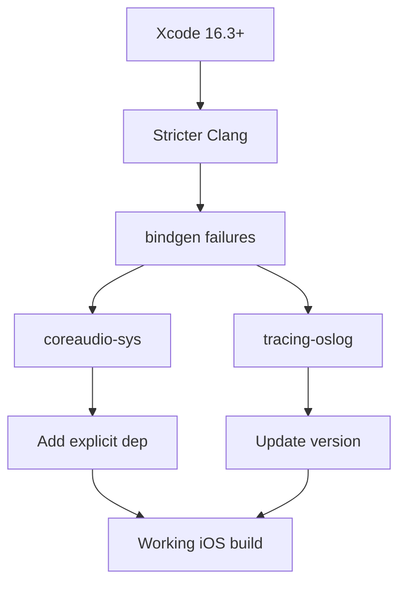

+++
title = "#19498 Fix iOS simulator build"
date = "2025-06-10T00:00:00"
draft = false
template = "pull_request_page.html"
in_search_index = true

[taxonomies]
list_display = ["show"]

[extra]
current_language = "en"
available_languages = {"en" = { name = "English", url = "/pull_request/bevy/2025-06/pr-19498-en-20250610" }, "zh-cn" = { name = "中文", url = "/pull_request/bevy/2025-06/pr-19498-zh-cn-20250610" }}
labels = ["C-Bug", "A-Build-System", "O-iOS"]
+++

# Fix iOS simulator build

## Basic Information
- **Title**: Fix iOS simulator build
- **PR Link**: https://github.com/bevyengine/bevy/pull/19498
- **Author**: madsmtm
- **Status**: MERGED
- **Labels**: C-Bug, A-Build-System, O-iOS, P-Compile-Failure, S-Needs-Review
- **Created**: 2025-06-05T17:38:52Z
- **Merged**: 2025-06-10T17:24:05Z
- **Merged By**: mockersf

## Description Translation
# Objective

Fixes https://github.com/bevyengine/bevy/issues/18893.

## Solution

`bindgen` currently has issues with building Xcode 16.3 and above, due to Clang being more strict about target triples. It was fixed in https://github.com/rust-lang/rust-bindgen/pull/3182, but as a breaking release, so affected dependencies have to be updated to either not depend on `bindgen`, or depend on a fixed version of it:
- `tracing-oslog`: https://github.com/Absolucy/tracing-oslog/pull/12
- `coreaudio-sys`: https://github.com/RustAudio/coreaudio-sys/pull/114

## Testing

```sh
cargo build --target aarch64-apple-ios-sim
```

With Xcode 16.3 or 16.4.

## The Story of This Pull Request

### The Problem and Context
The iOS simulator build was failing when using Xcode 16.3 or newer due to increased strictness in Clang regarding target triples. This manifested as compilation failures when targeting `aarch64-apple-ios-sim`. The root cause was outdated dependencies in Bevy's audio and logging subsystems that relied on `bindgen`, which hadn't been updated to handle Clang's stricter requirements. Specifically:

1. `coreaudio-sys` (used by Bevy's audio system) contained bindings that broke under new Clang versions
2. `tracing-oslog` (used for iOS logging) had similar compatibility issues

These failures blocked iOS development with newer Xcode versions, making it impossible to build Bevy projects for iOS simulators.

### The Solution Approach
The solution required updating specific dependencies to versions containing the Clang compatibility fixes. For `coreaudio-sys`, we needed version 0.2.17 which includes the necessary bindgen updates. For `tracing-oslog`, version 0.3 contains the required fixes. Since `coreaudio-sys` is an indirect dependency via `rodio` and `cpal`, we explicitly added it to ensure the correct version is used. The approach was:

1. Pin `coreaudio-sys` to the fixed version for Apple targets
2. Update `tracing-oslog` to the compatible version for iOS
3. Add clear comments about the temporary nature of the workaround

### The Implementation
The changes were implemented through targeted modifications to dependency declarations in Cargo.toml files. For Bevy Audio, we added an explicit dependency on the fixed `coreaudio-sys` version specifically for Apple targets. This ensures other platforms aren't affected:

```toml
[target.'cfg(target_vendor = "apple")'.dependencies]
# NOTE: Explicitly depend on this patch version to fix:
# https://github.com/bevyengine/bevy/issues/18893
coreaudio-sys = { version = "0.2.17", default-features = false }
```

The `target_vendor = "apple"` configuration ensures this only applies to macOS and iOS targets. A TODO comment was added to remove this explicit dependency once `cpal` updates its `coreaudio-sys` version.

For Bevy Log, we updated the iOS-specific dependency:

```toml
[target.'cfg(target_os = "ios")'.dependencies]
tracing-oslog = "0.3"
```

This simple version bump brings in the compatible bindings without affecting other platforms.

### Technical Insights
- **Dependency Pinning**: Explicitly specifying `coreaudio-sys` overrides the transitive dependency from `cpal`, demonstrating how to work around outdated indirect dependencies
- **Target-Specific Dependencies**: Using `cfg` directives ensures changes only affect relevant platforms
- **Temporary Workarounds**: The TODO comment acknowledges this as a temporary solution until upstream dependencies update
- **Minimal Surface Area**: Only two files modified with minimal changes reduces regression risk

### The Impact
These changes restore iOS simulator build capability for developers using Xcode 16.3+. The solution:
1. Fixes immediate build failures
2. Maintains compatibility with older Xcode versions
3. Adds clear documentation for future maintenance
4. Requires no code changes beyond dependency management

The explicit dependency on `coreaudio-sys` can be safely removed once `cpal` updates its dependency, as noted in the TODO.

## Visual Representation



## Key Files Changed

### 1. `crates/bevy_audio/Cargo.toml`
Added explicit dependency on fixed `coreaudio-sys` version for Apple targets.

```diff
# Before:
[target.'cfg(target_os = "android")'.dependencies]
cpal = { version = "0.15", optional = true }

# After:
[target.'cfg(target_os = "android")'.dependencies]
cpal = { version = "0.15", optional = true }

+[target.'cfg(target_vendor = "apple")'.dependencies]
+# NOTE: Explicitly depend on this patch version to fix:
+# https://github.com/bevyengine/bevy/issues/18893
+coreaudio-sys = { version = "0.2.17", default-features = false }
```

### 2. `crates/bevy_log/Cargo.toml`
Updated iOS logging dependency to fixed version.

```diff
# Before:
[target.'cfg(target_os = "ios")'.dependencies]
-tracing-oslog = "0.2"

# After:
[target.'cfg(target_os = "ios")'.dependencies]
+tracing-oslog = "0.3"
```

## Further Reading
1. [bindgen fix PR](https://github.com/rust-lang/rust-bindgen/pull/3182) - Root cause solution
2. [coreaudio-sys fix](https://github.com/RustAudio/coreaudio-sys/pull/114) - Dependency update
3. [tracing-oslog fix](https://github.com/Absolucy/tracing-oslog/pull/12) - Dependency update
4. [Rust target-specific dependencies](https://doc.rust-lang.org/cargo/reference/specifying-dependencies.html#platform-specific-dependencies) - Official documentation