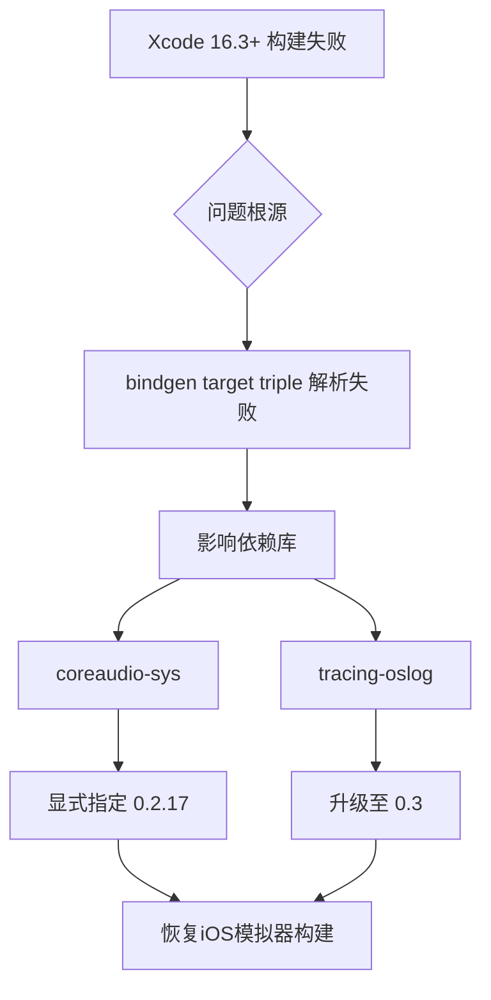

+++
title = "#19498 Fix iOS simulator build"
date = "2025-06-10T00:00:00"
draft = false
template = "pull_request_page.html"
in_search_index = false

[extra]
current_language = "zh-cn"
available_languages = {"en" = { name = "English", url = "/pull_request/bevy/2025-06/pr-19498-en-20250610" }, "zh-cn" = { name = "中文", url = "/pull_request/bevy/2025-06/pr-19498-zh-cn-20250610" }}
labels = ["C-Bug", "A-Build-System", "O-iOS"]
+++

# PR #19498 分析报告：修复 iOS 模拟器构建问题

## Basic Information
- **Title**: Fix iOS simulator build
- **PR Link**: https://github.com/bevyengine/bevy/pull/19498
- **Author**: madsmtm
- **Status**: MERGED
- **Labels**: C-Bug, A-Build-System, O-iOS, P-Compile-Failure, S-Needs-Review
- **Created**: 2025-06-05T17:38:52Z
- **Merged**: 2025-06-10T17:24:05Z
- **Merged By**: mockersf

## Description Translation
### Objective
修复 https://github.com/bevyengine/bevy/issues/18893。

### Solution
`bindgen` 目前在构建 Xcode 16.3 及以上版本时存在问题，原因是 Clang 对 target triples 的要求更加严格。该问题已在 https://github.com/rust-lang/rust-bindgen/pull/3182 中修复，但这是一个破坏性更新（breaking release），因此受影响的依赖项必须更新，要么不再依赖 `bindgen`，要么依赖其修复后的版本：
- `tracing-oslog`: https://github.com/Absolucy/tracing-oslog/pull/12
- `coreaudio-sys`: https://github.com/RustAudio/coreaudio-sys/pull/114

### Testing
```sh
cargo build --target aarch64-apple-ios-sim
```

使用 Xcode 16.3 或 16.4 进行测试。

## The Story of This Pull Request

### 问题背景
当开发者尝试在 Xcode 16.3 或更新版本上构建 iOS 模拟器目标（`aarch64-apple-ios-sim`）时，Bevy 工程会出现编译失败。根本原因是 Clang 在较新版本中加强了对 target triple 格式的校验规则，而 `bindgen` 工具链未能及时适应这一变化。这导致两个关键依赖库出现问题：
1. `coreaudio-sys`（音频子系统依赖）
2. `tracing-oslog`（iOS 日志记录依赖）

这些库使用的旧版 `bindgen` 无法正确处理新的 target triple 格式，引发编译错误。由于 iOS 是 Bevy 支持的重要平台，此问题直接影响开发者在 Apple 生态中的工作流。

### 解决方案选择
经分析，`bindgen` 已在 [#3182](https://github.com/rust-lang/rust-bindgen/pull/3182) 修复此问题，但属于破坏性更新（breaking change）。因此需要：
1. 升级 `tracing-oslog` 到包含修复的 0.3 版本
2. 显式指定 `coreaudio-sys` 的修复版本 (0.2.17)
   
选择直接覆盖依赖版本而非等待上游更新，能最快恢复构建能力。此方案平衡了修复速度与长期维护成本，因为：
- `tracing-oslog` 已发布正式修复版本
- `coreaudio-sys` 修复已合并但尚未更新到 `cpal` 依赖链

### 实现细节
**1. 音频子系统修复 (`bevy_audio/Cargo.toml`)**  
添加 Apple 平台的显式依赖覆盖：
```toml
[target.'cfg(target_vendor = "apple")'.dependencies]
coreaudio-sys = { version = "0.2.17", default-features = false }
```
此配置确保在编译 iOS/macOS 目标时强制使用修复版本，绕过有问题的传递依赖。添加的 `default-features = false` 避免引入不必要功能。

**2. 日志系统升级 (`bevy_log/Cargo.toml`)**  
```toml
[target.'cfg(target_os = "ios")'.dependencies]
tracing-oslog = "0.3"  # 从 0.2 升级
```
直接指定新版本解决 `bindgen` 兼容性问题。条件编译限定仅 iOS 平台生效，避免影响其他系统。

### 技术考量
1. **依赖覆盖机制**：通过显式声明相同依赖项，Cargo 会优先使用当前 crate 指定的版本。这是解决传递依赖问题的标准做法
2. **平台限定作用域**：使用 `target_vendor = "apple"` 和 `target_os = "ios"` 精确控制依赖范围，最小化对其它平台的构建影响
3. **临时措施标记**：在 `coreaudio-sys` 的注释中添加 `TODO`，提示未来应移除该覆盖
4. **构建验证**：通过 `cargo build --target aarch64-apple-ios-sim` 命令直接验证修复效果

### 影响分析
**立即收益**：
- 恢复 Xcode 16.3+ 的 iOS 模拟器构建能力
- 避免开发者需要手动修改依赖的 workaround

**技术债务管理**：
- `coreaudio-sys` 的显式依赖应在 `cpal` 更新后移除（通过 TODO 注释标记）
- 保持依赖版本约束宽松（`version = "0.2.17"`）允许未来补丁版本

**教训总结**：
- 工具链更新可能引发深层依赖问题，需监控关键构建工具（如 `bindgen`）的兼容性
- 精确的依赖版本控制是维护跨平台支持的必要手段
- 条件编译配置能有效隔离平台特定问题

## Visual Representation


## Key Files Changed

### 1. `crates/bevy_audio/Cargo.toml`
**修改原因**：解决 `coreaudio-sys` 的传递依赖问题

```toml
# 修改前：无 Apple 平台特定声明
[target.'cfg(target_os = "android")'.dependencies]
cpal = { version = "0.15", optional = true }

# 修改后：添加 Apple 平台依赖覆盖
[target.'cfg(target_vendor = "apple")'.dependencies]
# NOTE: Explicitly depend on this patch version to fix:
# https://github.com/bevyengine/bevy/issues/18893
coreaudio-sys = { version = "0.2.17", default-features = false }
```

### 2. `crates/bevy_log/Cargo.toml`
**修改原因**：升级 `tracing-oslog` 解决构建错误

```toml
# 修改前
[target.'cfg(target_os = "ios")'.dependencies]
tracing-oslog = "0.2"

# 修改后
[target.'cfg(target_os = "ios")'.dependencies]
tracing-oslog = "0.3"
```

## Further Reading
1. [bindgen 修复 PR](https://github.com/rust-lang/rust-bindgen/pull/3182) - target triple 处理逻辑变更
2. [Cargo 依赖覆盖机制](https://doc.rust-lang.org/cargo/reference/overriding-dependencies.html) - 理解依赖解析优先级
3. [Rust 条件编译](https://doc.rust-lang.org/reference/conditional-compilation.html) - `cfg` 属性的使用规范
4. [语义化版本控制](https://semver.org/) - 解读版本号约束规范