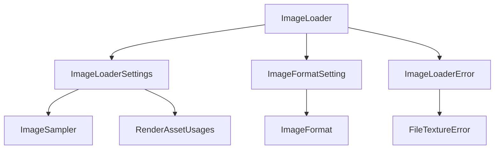

+++
title = "#19499 Add missing docs for ImageLoader"
date = "2025-06-09T00:00:00"
draft = false
template = "pull_request_page.html"
in_search_index = true

[taxonomies]
list_display = ["show"]

[extra]
current_language = "en"
available_languages = {"en" = { name = "English", url = "/pull_request/bevy/2025-06/pr-19499-en-20250609" }, "zh-cn" = { name = "中文", url = "/pull_request/bevy/2025-06/pr-19499-zh-cn-20250609" }}
labels = ["C-Docs", "D-Trivial"]
+++

# Technical Analysis: Add missing docs for ImageLoader

## Basic Information
- **Title**: Add missing docs for ImageLoader
- **PR Link**: https://github.com/bevyengine/bevy/pull/19499
- **Author**: theotherphil
- **Status**: MERGED
- **Labels**: C-Docs, D-Trivial, S-Ready-For-Final-Review
- **Created**: 2025-06-05T19:04:13Z
- **Merged**: 2025-06-09T20:05:18Z
- **Merged By**: alice-i-cecile

## Description Translation
# Objective

Yet another tiny step towards https://github.com/bevyengine/bevy/issues/3492.

## The Story of This Pull Request

### The Problem and Context
Bevy's ongoing documentation effort (issue #3492) identified missing documentation for the `ImageLoader` module. Without proper documentation, developers using Bevy's image loading functionality faced several challenges:

1. Public types like `ImageFormatSetting`, `ImageLoaderSettings`, and `ImageLoaderError` lacked explanations of their purpose and usage
2. Enum variants had no descriptions of their behavior or when to use them
3. Configuration options like `is_srgb` and `asset_usage` had no context about their effects
4. Error messages contained technical jargon without sufficient context

This documentation gap made it harder for developers to correctly configure image loading and troubleshoot issues, particularly for those new to Bevy's asset system.

### The Solution Approach
The solution involved systematically adding documentation comments to all public items in the `image_loader` module. The approach followed these principles:

1. Add concise but complete explanations for each public type and enum variant
2. Clarify configuration options and their practical effects
3. Improve error messages with more actionable information
4. Maintain Bevy's documentation style and conventions
5. Avoid behavioral changes - strictly documentation-only modifications

### The Implementation
The implementation focused on adding doc comments to previously undocumented public items. Key additions include:

For `ImageFormatSetting`:
```rust
/// How to determine an image's format when loading.
#[derive(Serialize, Deserialize, Default, Debug, Clone)]
pub enum ImageFormatSetting {
    /// Determine the image format from its file extension.
    ///
    /// This is the default.
    #[default]
    FromExtension,
    /// Declare the image format explicitly.
    Format(ImageFormat),
    /// Guess the image format by looking for magic bytes at the
    /// beginning of its data.
    Guess,
}
```

For `ImageLoaderSettings`:
```rust
/// Settings for loading an [`Image`] using an [`ImageLoader`].
#[derive(Serialize, Deserialize, Debug, Clone)]
pub struct ImageLoaderSettings {
    /// How to determine the image's format.
    pub format: ImageFormatSetting,
    /// Specifies whether image data is linear
    /// or in sRGB space when this is not determined by
    /// the image format.
    pub is_srgb: bool,
    /// [`ImageSampler`] to use when rendering - this does
    /// not affect the loading of the image data.
    pub sampler: ImageSampler,
    /// Where the asset will be used - see the docs on
    /// [`RenderAssetUsages`] for details.
    pub asset_usage: RenderAssetUsages,
}
```

For error types:
```rust
/// An error when loading an image using [`ImageLoader`].
#[non_exhaustive]
#[derive(Debug, Error)]
pub enum ImageLoaderError {
    /// An error occurred while trying to load the image bytes.
    #[error("Failed to load image bytes: {0}")]
    Io(#[from] std::io::Error),
    /// An error occurred while trying to decode the image bytes.
    #[error("Could not load texture file: {0}")]
    FileTexture(#[from] FileTextureError),
}
```

Additionally, the error message for `FileTextureError` was simplified:
```rust
// Before:
#[error("Error reading image file {path}: {error}, this is an error in `bevy_render`.")]

// After:
#[error("Error reading image file {path}: {error}.")]
```

### Technical Insights
The documentation follows Rust's best practices for public APIs:
- All public items now have doc comments explaining their purpose
- Enum variants have individual documentation
- Configuration fields explain both what they do and what they don't affect
- Error variants clearly separate I/O errors from decoding errors
- Cross-references to related types (`Image`, `ImageLoader`, `RenderAssetUsages`) use Rustdoc link syntax

The error message simplification removes redundant framework-specific information while preserving the essential path and error details developers need for troubleshooting.

### The Impact
These changes provide several concrete benefits:
- Developers can now understand image loading configuration options without reading source code
- Self-documenting code via IDE hover tooltips and generated documentation
- Clearer separation of concerns between loading configuration and runtime behavior
- More actionable error messages during asset loading
- Progress toward Bevy's documentation completeness goals

## Visual Representation



## Key Files Changed

### `crates/bevy_image/src/image_loader.rs` (+21/-2)

This file contains the core implementation of Bevy's image loading functionality. The changes exclusively add documentation to public types and improve an error message.

Key modifications:

1. Added comprehensive documentation for `ImageFormatSetting` and its variants:
```rust
// Before:
#[derive(Serialize, Deserialize, Default, Debug, Clone)]
pub enum ImageFormatSetting {
    #[default]
    FromExtension,
    Format(ImageFormat),
    Guess,
}

// After:
/// How to determine an image's format when loading.
#[derive(Serialize, Deserialize, Default, Debug, Clone)]
pub enum ImageFormatSetting {
    /// Determine the image format from its file extension.
    ///
    /// This is the default.
    #[default]
    FromExtension,
    /// Declare the image format explicitly.
    Format(ImageFormat),
    /// Guess the image format by looking for magic bytes at the
    /// beginning of its data.
    Guess,
}
```

2. Documented `ImageLoaderSettings` struct and its fields:
```rust
// Before:
#[derive(Serialize, Deserialize, Debug, Clone)]
pub struct ImageLoaderSettings {
    pub format: ImageFormatSetting,
    pub is_srgb: bool,
    pub sampler: ImageSampler,
    pub asset_usage: RenderAssetUsages,
}

// After:
/// Settings for loading an [`Image`] using an [`ImageLoader`].
#[derive(Serialize, Deserialize, Debug, Clone)]
pub struct ImageLoaderSettings {
    /// How to determine the image's format.
    pub format: ImageFormatSetting,
    /// Specifies whether image data is linear
    /// or in sRGB space when this is not determined by
    /// the image format.
    pub is_srgb: bool,
    /// [`ImageSampler`] to use when rendering - this does
    /// not affect the loading of the image data.
    pub sampler: ImageSampler,
    /// Where the asset will be used - see the docs on
    /// [`RenderAssetUsages`] for details.
    pub asset_usage: RenderAssetUsages,
}
```

3. Added documentation for `ImageLoaderError` and improved error message:
```rust
// Before:
#[non_exhaustive]
#[derive(Debug, Error)]
pub enum ImageLoaderError {
    #[error("Could load shader: {0}")]
    Io(#[from] std::io::Error),
    #[error("Could not load texture file: {0}")]
    FileTexture(#[from] FileTextureError),
}

// After:
/// An error when loading an image using [`ImageLoader`].
#[non_exhaustive]
#[derive(Debug, Error)]
pub enum ImageLoaderError {
    /// An error occurred while trying to load the image bytes.
    #[error("Failed to load image bytes: {0}")]
    Io(#[from] std::io::Error),
    /// An error occurred while trying to decode the image bytes.
    #[error("Could not load texture file: {0}")]
    FileTexture(#[from] FileTextureError),
}

// Error message improvement:
#[derive(Error, Debug)]
// Before: #[error("Error reading image file {path}: {error}, this is an error in `bevy_render`.")]
// After:
#[error("Error reading image file {path}: {error}.")]
pub struct FileTextureError {
    error: TextureError,
    path: String,
}
```

## Further Reading
1. [Bevy's Documentation Guidelines](https://github.com/bevyengine/bevy/blob/main/docs/plugins_guidelines.md#documentation)
2. [Rust API Documentation Guidelines](https://rust-lang.github.io/api-guidelines/documentation.html)
3. [RFC 1574: More API Documentation Conventions](https://rust-lang.github.io/rfcs/1574-more-api-documentation-conventions.html)
4. [Bevy Asset System Overview](https://bevyengine.org/learn/book/assets/)