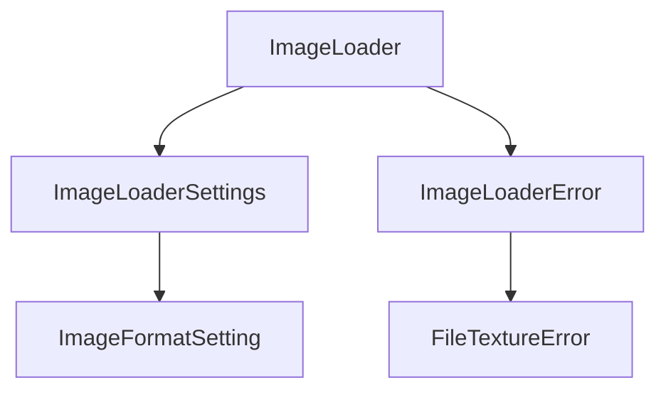

+++
title = "#19499 Add missing docs for ImageLoader"
date = "2025-06-09T00:00:00"
draft = false
template = "pull_request_page.html"
in_search_index = false

[extra]
current_language = "zh-cn"
available_languages = {"en" = { name = "English", url = "/pull_request/bevy/2025-06/pr-19499-en-20250609" }, "zh-cn" = { name = "中文", url = "/pull_request/bevy/2025-06/pr-19499-zh-cn-20250609" }}
+++

## Add missing docs for ImageLoader

### 基本信息
- **标题**: Add missing docs for ImageLoader
- **PR链接**: https://github.com/bevyengine/bevy/pull/19499
- **作者**: theotherphil
- **状态**: 已合并
- **标签**: C-Docs, D-Trivial, S-Ready-For-Final-Review
- **创建时间**: 2025-06-05T19:04:13Z
- **合并时间**: 2025-06-09T20:05:18Z
- **合并人**: alice-i-cecile

### 描述翻译
# Objective

Yet another tiny step towards https://github.com/bevyengine/bevy/issues/3492.

### PR分析报告

这个PR主要解决Bevy引擎中ImageLoader相关类型文档缺失的问题。作为#3492文档改进计划的一部分，作者系统性地为ImageLoader模块中的公共API添加了详细的文档注释。修改集中在`image_loader.rs`文件，没有功能逻辑变更，属于纯文档补充。

问题起源于ImageLoader及其相关类型缺乏足够的文档说明，这会给开发者使用图像加载功能带来困惑。例如：
- `ImageFormatSetting`枚举没有解释各变体的用途
- `ImageLoaderSettings`结构体字段没有说明其作用
- 错误类型缺少上下文解释

解决方案是直接为这些公共类型和字段添加Rustdoc注释。作者为每个需要文档的元素编写了清晰的技术说明：
1. 为`ImageFormatSetting`枚举及其所有变体添加解释性文档
2. 为`ImageLoaderSettings`结构体及其每个字段添加详细说明
3. 为`ImageLoaderError`错误类型及其变体补充错误上下文
4. 优化了`FileTextureError`的错误消息文本

技术实现方面，所有修改都遵循Rust文档标准：
- 使用`///`语法添加文档注释
- 为枚举变体添加`#[doc]`注释说明
- 错误消息文本更简洁明确
- 保持原有代码结构和功能不变

这些文档改进的直接影响包括：
1. 开发者能明确理解`ImageFormatSetting`不同选项的行为差异
2. `ImageLoaderSettings`各字段的用途和默认值变得透明
3. 错误处理时有更明确的错误原因指引
4. 符合Rust API文档规范，支持自动生成文档



### 关键文件变更

**crates/bevy_image/src/image_loader.rs (+21/-2)**

1. **变更说明**：为ImageLoader相关类型添加缺失文档，优化错误消息
2. **代码片段**：
```rust
// 变更前：
#[derive(Serialize, Deserialize, Default, Debug, Clone)]
pub enum ImageFormatSetting {
    #[default]
    FromExtension,
    Format(ImageFormat),
    Guess,
}

// 变更后：
/// How to determine an image's format when loading.
#[derive(Serialize, Deserialize, Default, Debug, Clone)]
pub enum ImageFormatSetting {
    /// Determine the image format from its file extension.
    ///
    /// This is the default.
    #[default]
    FromExtension,
    /// Declare the image format explicitly.
    Format(ImageFormat),
    /// Guess the image format by looking for magic bytes at the
    /// beginning of its data.
    Guess,
}
```

```rust
// 变更前：
#[derive(Serialize, Deserialize, Debug, Clone)]
pub struct ImageLoaderSettings {
    pub format: ImageFormatSetting,
    pub is_srgb: bool,
    pub sampler: ImageSampler,
    pub asset_usage: RenderAssetUsages,
}

// 变更后：
/// Settings for loading an [`Image`] using an [`ImageLoader`].
#[derive(Serialize, Deserialize, Debug, Clone)]
pub struct ImageLoaderSettings {
    /// How to determine the image's format.
    pub format: ImageFormatSetting,
    /// Specifies whether image data is linear
    /// or in sRGB space when this is not determined by
    /// the image format.
    pub is_srgb: bool,
    /// [`ImageSampler`] to use when rendering - this does
    /// not affect the loading of the image data.
    pub sampler: ImageSampler,
    /// Where the asset will be used - see the docs on
    /// [`RenderAssetUsages`] for details.
    pub asset_usage: RenderAssetUsages,
}
```

```rust
// 错误类型文档变更：
#[non_exhaustive]
#[derive(Debug, Error)]
pub enum ImageLoaderError {
    /// An error occurred while trying to load the image bytes.
    #[error("Failed to load image bytes: {0}")]
    Io(#[from] std::io::Error),
    /// An error occurred while trying to decode the image bytes.
    #[error("Could not load texture file: {0}")]
    FileTexture(#[from] FileTextureError),
}

// 错误消息优化：
#[derive(Error, Debug)]
-#[error("Error reading image file {path}: {error}, this is an error in `bevy_render`.")]
+#[error("Error reading image file {path}: {error}.")]
pub struct FileTextureError {
    error: TextureError,
    path: String,
}
```

### 延伸阅读
1. [Rust API文档指南](https://rust-lang.github.io/api-guidelines/documentation.html)
2. [Bevy文档改进计划#3492](https://github.com/bevyengine/bevy/issues/3492)
3. [Rustdoc使用手册](https://doc.rust-lang.org/rustdoc/index.html)