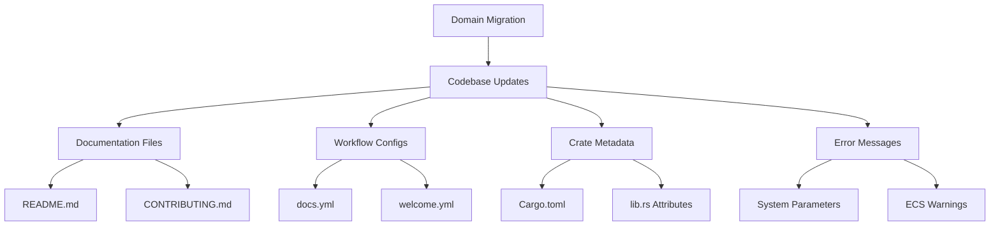

+++
title = "#19503 Domain Migration: Updating References from bevyengine.org to bevy.org"
date = "2025-06-06T00:00:00"
draft = false
template = "pull_request_page.html"
in_search_index = true

[taxonomies]
list_display = ["show"]

[extra]
current_language = "en"
available_languages = {"en" = { name = "English", url = "/pull_request/bevy/2025-06/pr-19503-en-20250606" }, "zh-cn" = { name = "中文", url = "/pull_request/bevy/2025-06/pr-19503-zh-cn-20250606" }}
labels = ["A-Meta"]
+++

# Title: Domain Migration: Updating References from bevyengine.org to bevy.org

## Basic Information
- **Title**: bevyengine.org -> bevy.org
- **PR Link**: https://github.com/bevyengine/bevy/pull/19503
- **Author**: cart
- **Status**: MERGED
- **Labels**: A-Meta
- **Created**: 2025-06-05T22:47:07Z
- **Merged**: 2025-06-05T23:29:59Z
- **Merged By**: cart

## Description Translation
We have acquired [bevy.org](https://bevy.org) and the migration has finished! Meaning we can now update all of the references in this repo.

## The Story of This Pull Request

### Problem and Context
Bevy acquired the shorter `bevy.org` domain to replace `bevyengine.org`. This required updating all existing references to the old domain throughout the codebase. The changes affected documentation links, workflow configurations, metadata, and error message references. Maintaining outdated links would create confusion and broken references for users.

### Solution Approach
The solution involved a systematic search-and-replace operation across the entire repository. The approach included:
1. Identifying all occurrences of `bevyengine.org`
2. Replacing them with `bevy.org`
3. Verifying link validity where applicable
4. Ensuring code comments and metadata remained accurate

No alternatives were considered since this was a straightforward domain migration requiring comprehensive updates.

### Implementation
Changes were made across 97 files, categorized into three main areas:

1. **Documentation files** (README.md, CONTRIBUTING.md):
```diff
# File: README.md
# Before:
[contributing guide](https://bevyengine.org/learn/contribute/introduction)

# After:
[contributing guide](https://bevy.org/learn/contribute/introduction)
```

2. **Workflow configurations** (.github/workflows):
```diff
# File: .github/workflows/docs.yml
# Before:
echo "dev-docs.bevyengine.org" > target/doc/CNAME

# After:
echo "dev-docs.bevy.org" > target/doc/CNAME
```

3. **Crate metadata** (Cargo.toml files and lib.rs doc attributes):
```diff
# File: crates/bevy_app/src/lib.rs
# Before:
html_logo_url = "https://bevyengine.org/assets/icon.png",
html_favicon_url = "https://bevyengine.org/assets/icon.png"

# After:
html_logo_url = "https://bevy.org/assets/icon.png",
html_favicon_url = "https://bevy.org/assets/icon.png"
```

Error message references were also updated to point to the new domain:
```diff
# File: crates/bevy_ecs/src/system/system_param.rs
# Before:
panic!("error[B0002]: ResMut<{}> in system {} conflicts... See: https://bevyengine.org/learn/errors/b0002"

# After:
panic!("error[B0002]: ResMut<{}> in system {} conflicts... See: https://bevy.org/learn/errors/b0002"
```

### Technical Insights
The changes required special attention to:
1. **YAML workflow files**: Required updates to subdomain references
2. **Doc attributes**: Needed updates for proper documentation generation
3. **Error messages**: Maintained correct reference links for developer debugging
4. **Markdown files**: Ensured all learning resources links remained functional

The replacements preserved:
- Existing URL paths (`/learn/`, `/news/`)
- Anchor targets
- Query parameters

### Impact
The changes:
1. Ensure all documentation links point to valid destinations
2. Maintain consistency across the project's branding
3. Prevent confusion from outdated domain references
4. Improve accessibility through shorter, more memorable URLs

## Visual Representation



## Key Files Changed

1. `README.md` (+12/-12)
```diff
# File: README.md
# Before:
[contributing guide](https://bevyengine.org/learn/contribute/introduction)

# After:
[contributing guide](https://bevy.org/learn/contribute/introduction)
```
Updated all documentation links to use the new domain.

2. `crates/bevy_ecs/src/system/system_param.rs` (+7/-7)
```diff
# File: crates/bevy_ecs/src/system/system_param.rs
# Before:
panic!("error[B0002]: ... See: https://bevyengine.org/learn/errors/b0002"

# After:
panic!("error[B0002]: ... See: https://bevy.org/learn/errors/b0002"
```
Updated error message links to reference new domain.

3. `crates/bevy_ecs/src/system/mod.rs` (+4/-4)
```diff
# File: crates/bevy_ecs/src/system/mod.rs
# Before:
expected = "error[B0001]: ... See: https://bevyengine.org/learn/errors/b0001"

# After:
expected = "error[B0001]: ... See: https://bevy.org/learn/errors/b0001"
```
Updated test expectations to match new error URLs.

4. `crates/bevy_dev_tools/src/lib.rs` (+3/-3)
```diff
# File: crates/bevy_dev_tools/src/lib.rs
# Before:
html_logo_url = "https://bevyengine.org/assets/icon.png"

# After:
html_logo_url = "https://bevy.org/assets/icon.png"
```
Updated documentation attributes for correct logo references.

5. `crates/bevy_diagnostic/src/lib.rs` (+3/-3)
```diff
# File: crates/bevy_diagnostic/src/lib.rs
# Before:
//! [Bevy game engine](https://bevyengine.org/)

# After:
//! [Bevy game engine](https://bevy.org/)
```
Updated crate documentation to reference new domain.

## Further Reading
- [Bevy's New Domain](https://bevy.org)
- [Contributing Guide](https://bevy.org/learn/contribute/introduction)
- [Bevy's Error Codes](https://bevy.org/learn/errors)