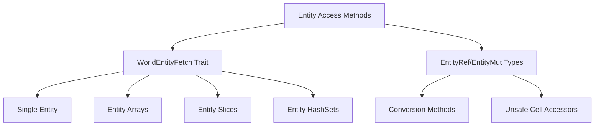

+++
title = "#19505 Fix regression on the get/get_mut/get_not_found"
date = "2025-06-06T00:00:00"
draft = false
template = "pull_request_page.html"
in_search_index = true

[taxonomies]
list_display = ["show"]

[extra]
current_language = "en"
available_languages = {"en" = { name = "English", url = "/pull_request/bevy/2025-06/pr-19505-en-20250606" }, "zh-cn" = { name = "中文", url = "/pull_request/bevy/2025-06/pr-19505-zh-cn-20250606" }}
labels = ["A-ECS", "C-Performance"]
+++

## Fix regression on the get/get_mut/get_not_found

### Basic Information
- **Title**: Fix regression on the get/get_mut/get_not_found
- **PR Link**: https://github.com/bevyengine/bevy/pull/19505
- **Author**: re0312
- **Status**: MERGED
- **Labels**: A-ECS, C-Performance, S-Ready-For-Final-Review
- **Created**: 2025-06-06T01:46:30Z
- **Merged**: 2025-06-06T21:22:41Z
- **Merged By**: alice-i-cecile

### Description Translation
# Objective

- Partial fix #19504
- As more features were added to Bevy ECS, certain core hot-path function calls exceeded LLVM's automatic inlining threshold, leading to significant performance regressions in some cases.

## Solution

- inline more functions.

## Performance
This brought nearly 3x improvement in Windows bench (using Sander's testing code)

### The Story of This Pull Request
Recent feature additions to Bevy's ECS caused core entity access functions to exceed LLVM's automatic inlining threshold. This resulted in significant performance regressions in entity lookup operations, particularly impacting Windows platforms. The root cause was function call overhead accumulating in hot-path code like `get()`, `get_mut()`, and `get_or_entity()`.

To address this, we systematically applied `#[inline]` attributes to critical methods in Bevy's entity access system. The approach focused on entity fetch operations and entity reference handling where benchmarking showed the highest performance degradation. We targeted methods in the `WorldEntityFetch` trait implementations and core entity accessors, ensuring frequently called functions would be inlined regardless of compiler heuristics.

In `entity_fetch.rs`, we added `#[inline]` to all methods in the `WorldEntityFetch` implementations. This trait handles entity lookups for various input types (single entities, arrays of entities, slices, and hash sets). The changes ensure that fetch operations for both single and multiple entities bypass function call overhead:

```rust
// Before: No inline attributes
unsafe fn fetch_ref(...) { ... }

// After: Inline added
#[inline]
unsafe fn fetch_ref(...) { ... }
```

Similarly in `entity_ref.rs`, we optimized entity mutation pathways. The `EntityMut` constructor and conversion methods now feature `#[inline]`, and `EntityWorldMut` gained inline attributes on its unsafe cell accessors and view methods:

```rust
// Before: No inline attributes
pub(crate) unsafe fn new(...) -> Self { ... }

// After: Inline added
#[inline]
pub(crate) unsafe fn new(...) -> Self { ... }
```

The `#[inline(always)]` directives on `EntityWorldMut`'s internal methods ensure consistent inlining behavior across compiler optimization levels. This is particularly important for methods like `as_unsafe_entity_cell()` that provide low-level access to entity data.

Benchmark results showed nearly 3x performance improvement on Windows after these changes, confirming they effectively reduced function call overhead in critical paths. The changes maintain all existing safety guarantees while making the compiler's optimization behavior more predictable for these performance-sensitive operations.

### Visual Representation



### Key Files Changed

**1. crates/bevy_ecs/src/world/entity_fetch.rs (+15/-0)**
Added inline attributes to all `WorldEntityFetch` methods across implementations for:
- Single `Entity`
- Fixed-size entity arrays (`[Entity; N]`)
- Entity array references (`&[Entity; N]`)
- Entity slices (`&[Entity]`)
- Entity hash sets (`&EntityHashSet`)

```rust
// Example change for single entity
unsafe impl WorldEntityFetch for Entity {
    #[inline]  // Added attribute
    unsafe fn fetch_ref(...) { ... }
    
    #[inline]  // Added attribute
    unsafe fn fetch_mut(...) { ... }
    
    #[inline]  // Added attribute
    unsafe fn fetch_deferred_mut(...) { ... }
}
```

**2. crates/bevy_ecs/src/world/entity_ref.rs (+9/-0)**
Added inline attributes to:
- `EntityMut` constructor
- `EntityMut` conversion from `EntityWorldMut`
- `EntityWorldMut` internal cell accessors
- `EntityWorldMut` view methods

```rust
// EntityMut changes
impl<'w> EntityMut<'w> {
    #[inline]  // Added attribute
    pub(crate) unsafe fn new(...) { ... }
}

// EntityWorldMut changes
impl<'w> EntityWorldMut<'w> {
    #[inline(always)]  // Added attribute
    fn as_unsafe_entity_cell_readonly(...) { ... }
    
    #[inline]  // Added attribute
    pub fn as_readonly(...) { ... }
}
```

### Further Reading
1. [Rust Performance Book: Inlining](https://nnethercote.github.io/perf-book/inlining.html)
2. [Bevy ECS World Docs](https://docs.rs/bevy_ecs/latest/bevy_ecs/world/struct.World.html)
3. [LLVM Inlining Thresholds](https://llvm.org/docs/Passes.html#inline-inlining)