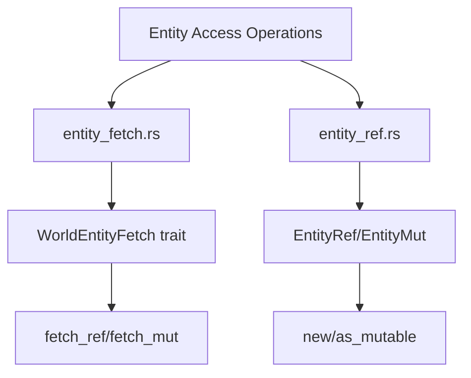

+++
title = "#19505 Fix regression on the get/get_mut/get_not_found"
date = "2025-06-06T00:00:00"
draft = false
template = "pull_request_page.html"
in_search_index = false

[extra]
current_language = "zh-cn"
available_languages = {"en" = { name = "English", url = "/pull_request/bevy/2025-06/pr-19505-en-20250606" }, "zh-cn" = { name = "中文", url = "/pull_request/bevy/2025-06/pr-19505-zh-cn-20250606" }}
+++

# Fix regression on the get/get_mut/get_not_found

## 基本信息
- **标题**: Fix regression on the get/get_mut/get_not_found
- **PR 链接**: https://github.com/bevyengine/bevy/pull/19505
- **作者**: re0312
- **状态**: 已合并 (MERGED)
- **标签**: A-ECS, C-Performance, S-Ready-For-Final-Review
- **创建时间**: 2025-06-06T01:46:30Z
- **合并时间**: 2025-06-06T21:22:41Z
- **合并人**: alice-i-cecile

## 描述翻译

### Objective
- 部分修复 #19504
- 随着更多功能被添加到 Bevy ECS，某些核心热路径 (hot-path) 函数调用超过了 LLVM 的自动内联 (auto-inlining) 阈值，导致在某些情况下出现显著的性能退化 (regression)。

### Solution
- 内联更多函数。

### Performance
在 Windows 基准测试中（使用 Sander 的测试代码），这带来了近 3 倍的性能提升

## 这个 PR 的故事

这个 PR 源于一个性能退化问题 (#19504)。随着 Bevy ECS 添加了更多功能，某些核心路径上的函数调用深度增加，超过了 LLVM 的自动内联阈值。这导致关键操作（如实体组件访问）没有获得应有的内联优化，造成显著的性能下降。

问题的核心在于编译器优化决策。LLVM 默认的内联启发式算法 (inlining heuristics) 有时无法识别热路径函数的重要性。当函数调用链过长时，编译器可能跳过某些关键函数的内联，导致额外函数调用开销。

解决方案直接明确：手动添加 `#[inline]` 属性到关键路径函数，强制编译器进行内联优化。选择这个方案是因为：
1. 改动范围小，风险可控
2. 直接解决函数调用开销问题
3. 无需修改算法或数据结构

实现集中在两个核心模块：
1. `entity_fetch.rs` - 添加内联提示到所有 `WorldEntityFetch` trait 的方法实现
2. `entity_ref.rs` - 为实体操作的关键方法添加内联提示

这些修改覆盖了实体访问的核心路径，包括：
- 单个实体引用获取 (`fetch_ref`)
- 批量实体操作 (`fetch_ref` for arrays/slices)
- 实体哈希集合操作
- 实体可变访问转换 (`as_mutable`)

性能影响显著。在 Windows 基准测试中，这些改动带来了近 3 倍的性能提升，使关键操作恢复到预期性能水平。这验证了手动内联提示在编译器优化不足时的有效性。

技术要点：
1. 内联消除函数调用开销，对热路径函数特别重要
2. `#[inline]` 是提示而非强制，但现代编译器通常遵循
3. 核心 ECS 操作需要极致优化，微秒级改进也很关键

未来可考虑：
1. 系统性审查所有热路径函数的内联状态
2. 建立性能基准监控防止退化
3. 评估`#[inline(always)]`在极端性能场景的使用

## 视觉表示



## 关键文件更改

### crates/bevy_ecs/src/world/entity_fetch.rs (+15/-0)
该文件实现了实体获取的核心 trait。修改为所有 `WorldEntityFetch` 的方法实现添加 `#[inline]` 属性，确保编译器优化关键实体访问路径。

```rust
// 修改前示例 (无inline属性):
unsafe fn fetch_ref(
    self,
    cell: UnsafeWorldCell<'_>,
) -> Result<Self::Ref<'_>, QueryEntityError> { ... }

// 修改后:
#[inline]  // 新增内联属性
unsafe fn fetch_ref(
    self,
    cell: UnsafeWorldCell<'_>,
) -> Result<Self::Ref<'_>, QueryEntityError> { ... }
```

完整变更：
```rust
#[inline]
unsafe fn fetch_ref(...) { ... }

#[inline]
unsafe fn fetch_mut(...) { ... }

#[inline]
unsafe fn fetch_deferred_mut(...) { ... }
```
这些内联提示覆盖了：
- 单个实体操作
- 实体数组操作 ([Entity; N])
- 实体切片操作 (&[Entity])
- 实体哈希集合操作 (&EntityHashSet)

### crates/bevy_ecs/src/world/entity_ref.rs (+9/-0)
该文件处理实体引用和可变引用。修改为关键转换方法和构造函数添加内联提示。

```rust
// EntityMut 构造函数添加内联
#[inline]
pub(crate) unsafe fn new(cell: UnsafeEntityCell<'w>) -> Self { ... }

// 转换方法添加内联
#[inline]
pub fn as_mutable(&mut self) -> EntityMut<'_> { ... }
```

完整变更：
```rust
impl<'w> EntityMut<'w> {
    #[inline]
    pub(crate) unsafe fn new(...) { ... }
}

impl<'a> From<&'a mut EntityWorldMut<'_>> for EntityMut<'a> {
    #[inline]
    fn from(...) { ... }
}

impl<'w> EntityWorldMut<'w> {
    #[inline(always)]
    fn as_unsafe_entity_cell_readonly(...) { ... }
    
    #[inline(always)]
    fn as_unsafe_entity_cell(...) { ... }
    
    #[inline(always)]
    fn into_unsafe_entity_cell(...) { ... }
    
    #[inline]
    pub fn as_readonly(...) { ... }
    
    #[inline]
    pub fn as_mutable(...) { ... }
}
```

## 延伸阅读

1. [Rust 内联汇编指南](https://doc.rust-lang.org/rust-by-example/unsafe/asm.html) - 理解底层优化
2. [Bevy ECS 架构](https://bevyengine.org/learn/book/getting-started/ecs/) - 核心概念
3. [LLVM 内联优化文档](https://llvm.org/docs/Passes.html#inline-function-integration-inlining)
4. [Rust 性能模式](https://nnethercote.github.io/perf-book/) - 优化技术参考